# [Day 5]如何知道最佳化演算法的優劣？測試函數介紹

- Day: 5
- Date: 2024-09-11 00:13:28
- Author: golucky_sir
- Source: https://ithelp.ithome.com.tw/articles/10349247
- Series: https://ithelp.ithome.com.tw/2020-12th-ironman/articles/7610
- Series Title: 調整AI超參數好煩躁？來試試看最佳化演算法吧！

## 前言

今天要來介紹測試函數(testing function)，這類型的測試函數顧名思義基本上是用來測試優化算法的能力的。今天會來向各位介紹測試函數的一些基本知識，各位可以使用這些測試函數搭配之後介紹的最佳化演算法來體驗看看最佳化過程是如何的。

## 全局最佳解與局部最佳解

首先，在最佳化過程中有時候會遇到全局最佳解，有時候會遇到局部最佳解。而有些演算法找到局部最佳解時就會陷入其中導致找不到全局最佳的解，於是比較先進的最佳化演算法通常也都會著重於探索全局最佳的位置。

下圖是全局最佳解與局部最佳解的示意圖(以最小化為目標)，在局部最佳解那個位置可以看到值是明顯小於左右兩側的，有些演算法在找到局部最佳解就會「自滿」而收斂。但綜觀全局來說還是有明顯更低的點存在，但要從局部最佳點找到全局最佳點勢必要經過一個陡峭的上坡探索，有許多演算法就是致力於提升探索的能力，而根據他們的研究成果這些做法都能夠進一步找出更優秀的結果。

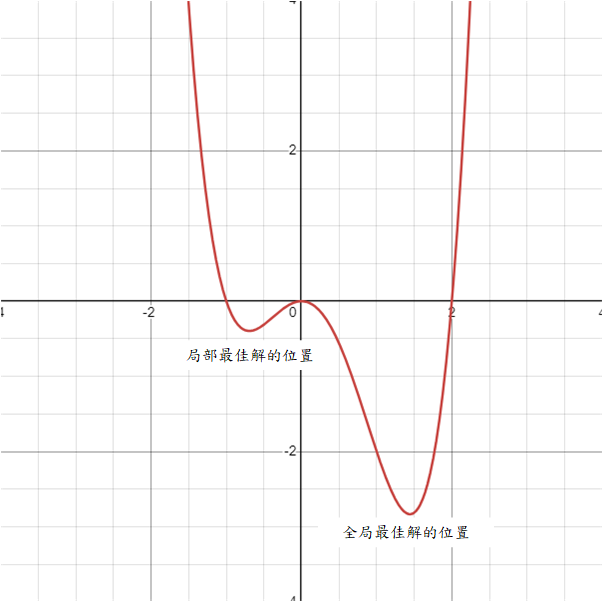

不過實際運用問題一定會更複雜，之後的AI模型甚至很難列出解空間與適應值之間的關係(舉例來說就是學習率+模型參數量與預測誤差或準確率之間的關係)，所以演算法的能力就更重要了！要確保啟發式演算法的能力通常會使用測試函數做非常多的測試保證它們的性能。

## 測試函數

接下來要來討論測試函數了，目前有許多經典的測試函數可以很好的評估演算法的能力，目前提出的測試函數非常多，數以千計的測試函數也是介紹不完，所以我會介紹一些常見的，並附上[參考資料](https://www.sfu.ca/~ssurjano/optimization.html)讓各位可以再進一步的去認識這些函數！  
其實這些函數非常多種，而且可能同樣函數在不同地方會有些微差別或者會有變種函數存在，在使用時要特別注意這些方程式的細節喔。

> 若各位有興趣可以去看看[CEC2022](https://arxiv.org/pdf/2201.00523)，CEC是IEEE的國際進化計算會議(Congress on Evolutionary Computation)，每年都會有舉辦比賽並提供各種測試函數給參賽者想辦法求最佳解。不過本系列並不是著重於演算法的開發所以就不過多介紹了，有興趣可以去看看每年IEEE CEC出了甚麼難題喔。

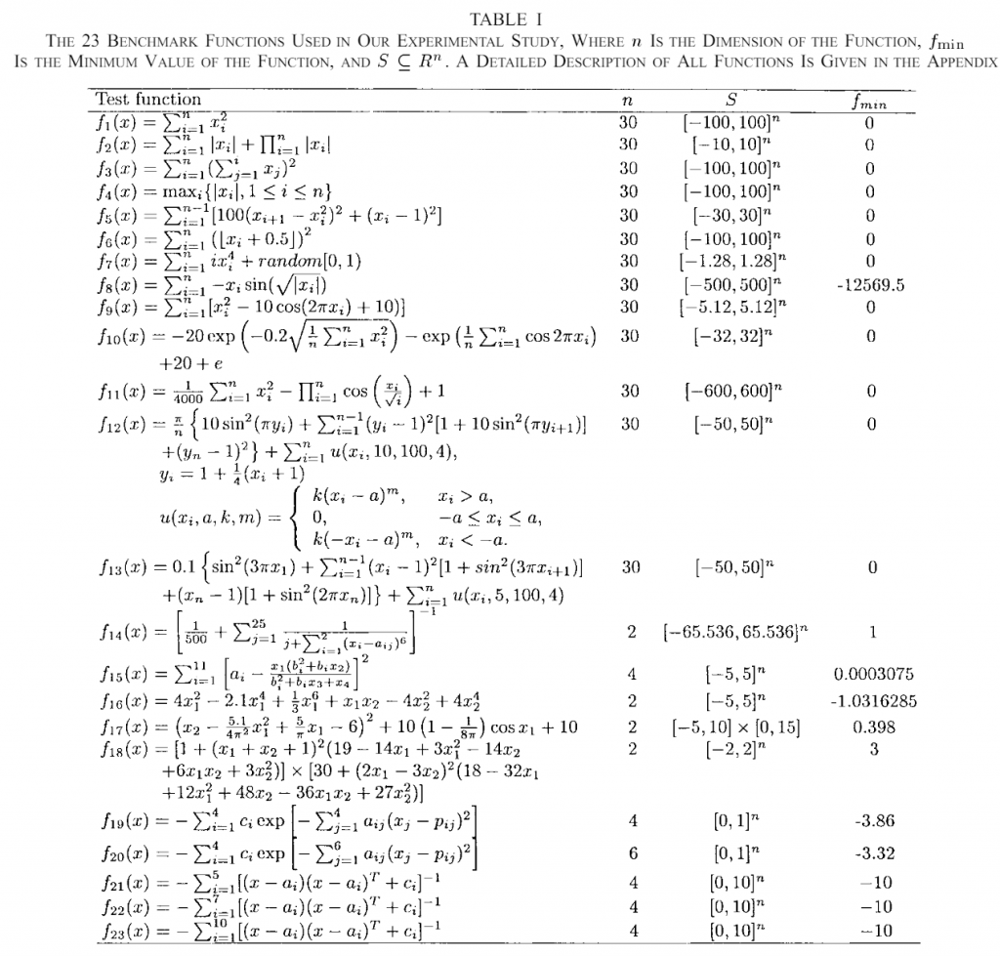  
圖. CEC 2005的23種不同的測試函數，[資料來源](https://doi-org.ezproxy.nptu.edu.tw:8443/10.1109/4235.771163)

1.  Sphere Function：這是一個很單純的方程式，公式也出乎意料的簡單這個方程式中的x就是解的組合、**d是解空間中的未知數數量(重要，後面都會看到)**，如果d=2那就代表演算法會找出兩個解x1跟x2並輸入至方程式中計算他們平方的總和。原則上最佳解就是解空間中所有x都等於0，這樣可以求得最小值x。若函數輸入2個未知數的話函數圖如下圖。

    (高維度空間基本上畫不出來，所以都以2維輸入為範例)

    > Sphere Function輸入未知數數量不限；解空間元素值建議範圍為-5.12~5.12；最佳解為解空間元素皆為0；此時最佳適應值為0。

    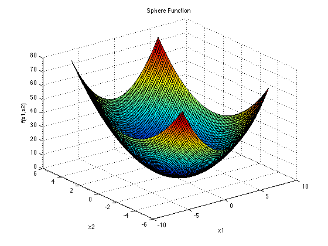

2.  Ackley Function：這個方程式就起伏不定了，包含很多局部最佳值和一個全局最佳值。公式為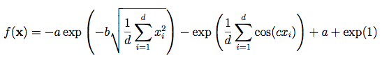。一樣二維輸入的函數圖如下圖。其中一些參數a=20，b=0.2，c=2π。

    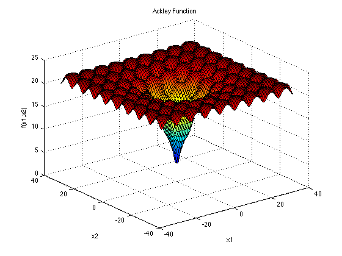

    > Ackley Function輸入的未知數數量不限；解空間元素值建議範圍為-32768~32768；最佳解為解空間元素皆為0；此時最佳適應值為0。

3.  Levy Function：這個函數更讓人看不懂了，看起來有點像波浪。他的公式長這樣，有點複雜。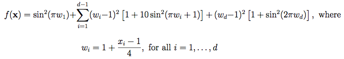  
    不過之後幾天我也會帶各位根據這些公式把方程式化為程式，所以請不用擔心！

    > Levy Function輸入的未知數數量不限；解空間元素值建議範圍為-10~10；最佳解為解空間元素皆為1；此時最佳適應值為0。

4.  Cross-in-tray Function：這個方程式只接受二維輸入，他看起來是有很多最大值，而且峰值之間都存在局部最小值，有一個全局最小值。公式為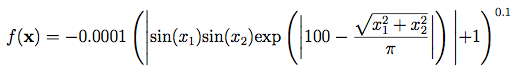  
    他的函數圖長這個樣子，左邊是很多峰值的樣子(解空間範圍較廣)，右邊是將部分放大以更好的觀測一個峰值的樣子(解空間範圍較窄)：  
    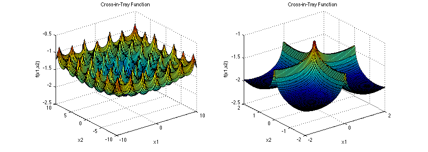

    > Cross-in-tray Function輸入的未知數數量限制2個；解空間元素值建議範圍為-10~10；最佳解為解空間元素有四種組合為(±1.3491,±1.3491)；此時最佳適應值為-2.06261。雖然數字很難看但這樣也可以更精確地確認演算法的能力。

5.  Bukin Function：這個方程式的外觀長得很酷，像高科技科幻片會出現的飛機一樣XD，這個方程式也是有許多局部最小值的方程式。公式為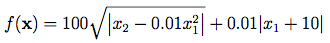  
    那他的方程式圖片長這樣(真的很酷)：  
    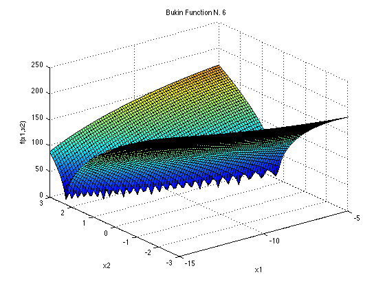

    > Bukin Function輸入的未知數數量限制2個；解空間元素值建議範圍x1為-15~-5、x2為-3~3；最佳解為解空間元素為(-10,1)；此時最佳適應值為0。

6.  Rastrigin Function：這方程式感覺有點像鐘乳石洞反過來的樣子，同樣有許多局部最小值，公式為  
    他的方程式圖形長這樣  
    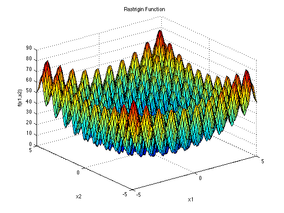  
    真的很像鐘乳石洞吧(圖片貼上來後才覺得好像一點都不像TT)。  
    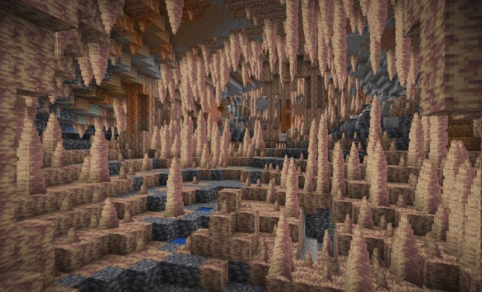  
    \[[圖片來源](https://www.google.com/url?sa=i&url=https%3A%2F%2Fblog.shockbyte.com%2Fminecraft-caves-and-cliffs-part-2%2F&psig=AOvVaw3w_Tj_rOyt_K5qRGKX_F14&ust=1714721118890000&source=images&cd=vfe&opi=89978449&ved=0CBIQjRxqFwoTCLC8no-47oUDFQAAAAAdAAAAABAI)\]

    > Rastrigin Function輸入的未知數數量不限；解空間元素值建議範圍為-5.12~5.12；最佳解為解空間元素皆為0；此時最佳適應值為0。

7.  Bohachevsky Function：這個方程式跟Sphere看起來長得很像，不過它只能接受兩個未知數的輸入，同時他一共有三種型式，雖然函數圖形可能會有一點差異不過不大！方程式如下。  
      
    在實務上基本上應該可以任選一個使用，這個方程式的圖形如下。  
    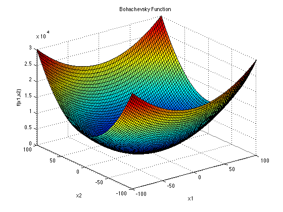  
    這個就是很漂亮的圖形了！就是一個穩定下滑的圖形，像碗一樣。

    > Rastrigin Function輸入的未知數數量限制2個；解空間元素值建議範圍為-100~100；最佳解為解空間元素皆為0；此時最佳適應值為0(三個方程式都相同)。

8.  Griewank Function：這也是我在論文中也很常看到的方程式，方程式圖乍看之下很像一個碗狀，但放大看了之後才發現他是很多局部最大最小值合成的。是非常凹凸不平的方程式，並不是表面上看起來那樣光滑。它的公式為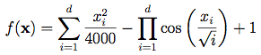 看起來並不複雜，不過有一個連加符號跟連乘符號，在寫程式上需要注意一下。這個方程式的圖長這樣：  
    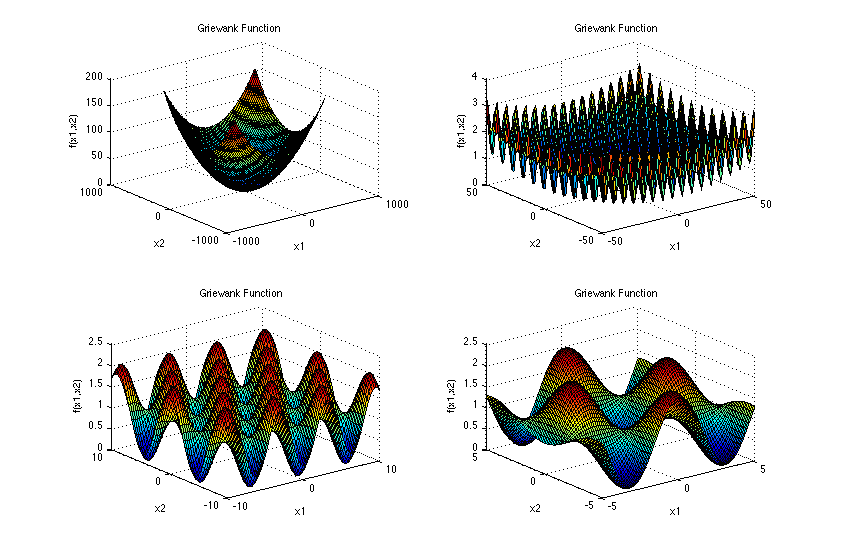 可以看到它乍看之下像碗狀，但放大之後那個凹凸不平的樣子！

    > Griewank Function輸入的未知數數量不限；解空間元素值建議範圍為-600~600；最佳解為解空間元素皆為0；此時最佳適應值為0。

9.  Schaffer Function N.2：怎麼說呢...這方程式長得確實有個性。極度不平滑的外表，乍看之下是非常複雜的方程式，但其實也還好，它的公式只是長這樣而已 看起來很簡單吧！  
    而它的圖片卻長得很...特殊？各位可以看看，我實在想不出甚麼好的形容詞可以形容它。一樣左邊為範圍較大看起來的樣子，右邊是只畫出將原點附近的範圍將方程式放大後的樣子。  
    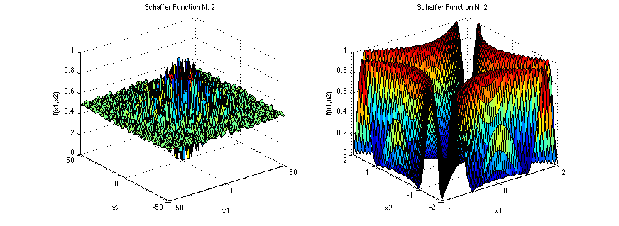

    > Schaffer Function N.2輸入的未知數數量限制2個；解空間元素值建議範圍為-100~100；最佳解為解空間元素皆為0；此時最佳適應值為0。

以上是我今天想向各位介紹的幾種測試函數，接下來幾天我會帶各位實作這些函數，視情況我會再增加更多其他五花八門的函數進去！不過有很多函數我並未能找到容易理解的函數圖形orz。所以就之後就再視情況追加其他內容囉。

> 雖然上述都有說到解空間建議的範圍，不過其實沒有硬性規定，那個規定是因為有一個會議為[IEEE CEC](https://en.wikipedia.org/wiki/IEEE_Congress_on_Evolutionary_Computation)，它們會舉辦賽事來比最佳化演算法的優劣，為了統一條件才會限制其範圍，各位也可以根據自己的需要設定解空間的輸入範圍。  
> 另外今天所提供的公式方程式與函數圖形都來源於\[[這裡](https://www.sfu.ca/~ssurjano/optimization.html)\]

## 結語

今天介紹了9個測試函數，之後三天會來將這些測試函數寫成python code (偷水三天來寫學校的作業TT)並讓各位看看這些測試函數寫成程式後的一些注意事項以及建議。花了幾天終於要進入最期待的程式部份了！希望這幾天的介紹不會因為文字太多導致大家都懶得看了XD
