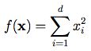
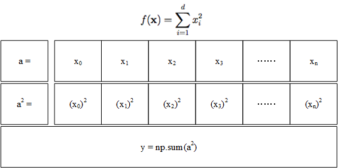
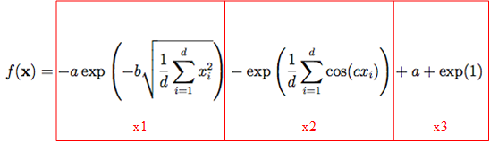
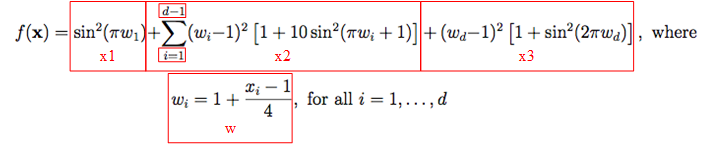

# [Day 6]根據方程式來寫出測試函數的程式吧！(1/3)

- Day: 6
- Date: 2024-09-12 00:01:15
- Author: golucky_sir
- Source: https://ithelp.ithome.com.tw/articles/10349553
- Series: https://ithelp.ithome.com.tw/2020-12th-ironman/articles/7610
- Series Title: 調整AI超參數好煩躁？來試試看最佳化演算法吧！

## 前言

昨天介紹了9種不同的測試函數，今天想帶各位來實作這些函數的程式設計，這三天我會分享一下我的思路以及撰寫程式的方式，希望各位能理解，若有問題等也都歡迎和我討論！

## [Sphere Function](https://www.sfu.ca/~ssurjano/spheref.html)

我們先來從簡單的Sphere Function開始，複習一下昨天講到的公式。  
  
首先遇到連加符號我都會使用numpy功能將連加符號中的元素用成`np.ndarray`，再使用`np.sum()`計算結果。具體思路如下圖：  
  
基本上就是將輸入的解組合變成一段np array向量，接著同時對array中所有元素進行平方的計算最後再計算總合即為公式所要求得的結果。這樣子就不需要使用迴圈一個一個計算了，非常方便！照著概念圖我們就可以寫出程式如下：

    a = np.array([1, 2, 3]) #[1 2 3]
    a2 = a**2 #[1 4 9]
    y = np.sum(a2) #14

不過我會習慣將程式再簡化成一行，如果可以的話就用一行解決就好，雖然程式比較難懂但不會落落長，也不會因為多行程式使用許多變數而占用記憶體空間(雖然根本沒占多少XD)

    y = np.sum(np.array([1, 2, 3])**2)

接下來就要來建立副程式了，我們預期輸入會是一個`list`或者`np.ndarray`，所以就將輸入做上述的計算並輸出就是結果了，接下來來看看程式。

    import numpy as np
    from typing import Union 
    # 定義輸入的資料型態用而已，純粹是為了使程式可讀性提高而使用，沒用的話也不會怎樣。
    def sphere_function(x: Union[np.ndarray, list]):
        return np.sum(np.array(x) ** 2)

    if __name__ == '__main__':
        y = sphere_function([1.5, 2.4, 3.14])
        print(y) #17.8696

在程式中我使用type hints來提示輸入的資料型態要為`np.ndarray`或者`list`，不過沒有遵守輸入型態其實也不會噴錯誤，使用這個只是要使程式可讀性高，讓人一目了然輸入的東西是甚麼而已。`Union`代表輸入型態可以是符合其中元素的任一個型態。  
經過程式實作我們將Sphere Function做出來了，無論輸入多長的向量都可以計算結果。這段程式在之後也可以搭配最佳化演算法生成的解來計算適應值，接著來看看下一個方程式。

## [Ackley Function](https://www.sfu.ca/~ssurjano/ackley.html)

接下來這個方程式就有億點點複雜了，不過心法還是一樣，遇到連加符號就使用`np.sum()`就好了。先來複習一下公式，我把這個公式分成三個部分：  

1.  `x1`的部分：先來搞定括號內的程式部分吧，昨天有提到`d`為輸入的向量長度，把所有結果的平方相加在除以向量長度就是取算術平均的表示法，所以要用`np.mean()`來計算平均，接著將結果開根號使用`np.sqrt()`，接著乘上`-b`就是括號的結果了。接下來括號內容要來經過exp函數計算，使用`np.exp()`來計算結果，最後再乘上`-a`就是`x1`的結果了。  
    程式寫法如下，記住昨天提到的`a`與`b`的值分別為*a=20*；*b=0.2*。

        x1 = -a * np.exp(-b * np.sqrt(np.mean(np.array(x) ** 2)))

2.  `x2`的部分：這裡和`x1`其實差不多，我們先來處理括號內部，括號內部是先將解中的所有元素計算`cos(cx)`並取平均，昨天也有提到*c=2π*。接著括號內部再進行exp函數計算接著加上負號即可！程式如下：

        x2 = -np.exp(np.mean(np.cos(c * np.array(x))))

3.  `x3`的部分：最後就是最簡單的部分了XD直接上程式碼

        x3 = a + np.exp(1)

最後程式的回傳值就是`x1+x2+x3`了，完整的程式如下，因為`a、b、c`可以根據自己的意思更改(不過建議使用預設值就好了)所以我也將`a、b、c`作為可傳遞的參數並定義預設值，np.pi就是圓周率π：

    import numpy as np
    from typing import Union

    def ackley_function(x: Union[np.ndarray, list],
                        a: float = 20.0,
                        b: float = 0.2,
                        c: float = 2*np.pi):
        x1 = -a * np.exp(-b * np.sqrt(np.mean(np.array(x) ** 2)))
        x2 = -np.exp(np.mean(np.cos(c * np.array(x))))
        x3 = a + np.exp(1)

        return x1+x2+x3

    if __name__ == '__main__':
        y = ackley_function([0, 0, 0])
        print(y) #0

## [Levy Function](https://www.sfu.ca/~ssurjano/levy.html)

最後要來講Levy Function了，作為今天的大魔王，我們要來解析它的弱點了，將裡面的項目拆分後就會發現沒有甚麼好怕的了，拆分後的公式如下，各位也可以按照自己的想法來拆分方程式並撰寫程式：  
  
接著一樣來分項看看，首先要注意輸入的每個元素x都會經過計算換成w！所以先建立一個副程式w(x)吧

    def w(xi: Union[np.ndarray, list, float]):
        return 1 + (np.array(xi)-1)/4

接著來分段看看`x1`、`x2`、`x3`：

1.  `x1`的部分：這裡比較簡單，將第一個元素作sin計算並平方而已，程式如下，要注意公式中元素從1開始標號，但python索引值是從0開始：

        x1 = np.sin(np.pi * w(x[0]))**2

2.  `x2`的部分：這裡很複雜，因為連加符號裡面有一大坨東西，希望各位不要看到這裡就被勸退了！我們來慢慢處理這項的內容，要特別特別注意連加符號的起始值是1(對應到python的索引值是0)，而終止值是**d-1(對應到索引值是倒數第二個元素-2)**，這裡需要注意一下可以用切片搜尋來找出符合的向量也就是`x[:-1]`(要包含到倒數第二個元素所以等同於切片到最後一個元素`:-1`)。  
    寫成程式會變成：

        x2 = np.sum((w(x[:-1])-1)**2 * (1+10*np.sin(np.pi*w(x[:-1])+1)**2))

    若有不懂的話可以耐心把括號慢慢拆開並對照一下數學公式！如果還是無法理解可以底下留言告訴我喔~

3.  `x3`的部分：最後就是這個部份了，只將解的最後一個元素獨立出來運算，結果如下：

        x3 = (w(x[-1])-1)**2 * (1+np.sin(2*np.pi*w(x[-1]))**2)

最後一樣將所有結果相加(`x1+x2+x3`)就是方程式的結果了！完整程式碼如下：

    import numpy as np
    from typing import Union

    def levy_function(x: Union[np.ndarray, list]):
        def w(xi: Union[np.ndarray, list, float]):
            return 1 + (np.array(xi)-1)/4

        x1 = np.sin(np.pi * w(x[0]))**2
        x2 = np.sum((w(x[:-1])-1)**2 * (1+10*np.sin(np.pi*w(x[:-1])+1)**2))
        x3 = (w(x[-1])-1)**2 * (1+np.sin(2*np.pi*w(x[-1]))**2)
        return x1+x2+x3

    if __name__ == '__main__':
        y = levy_function([0, 0, 0])
        print(y) #0.806689108233949
        y = levy_function([1, 1, 1])
        print(y) #1.4997597826618576e-32

將理論最小值的解帶入發現答案是1.4997597826618576e-32，這代表答案約等於1.5\*10^-32，但其實10^-32次方是非常小的數字，可以直接視為0了，有可能是運算較複雜所以殘留了一些雜質，但這幾乎不影響結果。

> 程式寫完後可以將預期的最小值解組合帶入並確認輸出是否正常，或者將其他值輸入看看結果有沒有錯誤，也可以將函數圖畫出來比對看看。

## 結語

今天帶各位使用程式實作了三種測試函數，原本以為將公式化為程式很簡單的說，但文章寫完後給身邊的人看看發現沒幾個人看得懂我的寫法QQ於是花了一些時間更深入的將方程式拆開處理，最後寫出來的結果以及教學才能讓身邊的人看得懂。希望各位可以理解我的做法以及面對此類問題的思路，若有不懂也歡迎於底下留言。  
本來想說應該不會花太多時間的，沒想到整個晚上就被寫文章以及反覆修改這樣消磨掉了，但如果可以使各位更理解程式在幹嘛的話也值得了~
