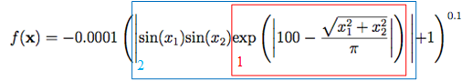
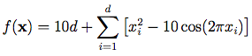

# [Day 7]根據方程式來寫出測試函數的程式吧！(2/3)

- Day: 7
- Date: 2024-09-13 00:06:44
- Author: golucky_sir
- Source: https://ithelp.ithome.com.tw/articles/10349865
- Series: https://ithelp.ithome.com.tw/2020-12th-ironman/articles/7610
- Series Title: 調整AI超參數好煩躁？來試試看最佳化演算法吧！

## 前言

昨天帶各位實作了三個測試函數，不知道有沒有被嚇到，說實在的其實要將數學公式簡潔的化為程式是有一點難度的，所以希望各位還能繼續保持下去！當方程式成功被解析並化為程式寫出來的時候我常常會有一種超強烈的成就感襲來。今天會繼續和各位一起實作三個測試函數，請各位繼續鼓起勇氣直面這些方程式吧！

## [Cross-in-tray Function](https://www.sfu.ca/~ssurjano/crossit.html)

這個函數只接受兩個變數輸入，要特別注意，所以在程式上我會習慣使用assert斷言，確保輸入是有兩個元素的向量`assert len(x) == 2, 'x的長度必須為2!'`，接著就可以來處理輸入的程式了，因為只有兩個輸入變數需要處理所以程式寫起來不會比昨天還困難，公式拆解如下：  
  
先把紅色框框的第一步寫出來，先處理絕對值內的東西(`np.abs(100 - np.sqrt(x[0]**2 + x[1]**2)/np.pi)`)再把這個結果進行exp運算(`np.exp(np.abs(100 - np.sqrt(x[0]**2 + x[1]**2)/np.pi))`)。  
很輕鬆吧，然後要來處理第二部藍色框框的東東，也就是兩個變數的sin值和第一步的結果相乘並取絕對值，程式碼如下(包括第一步的結果)：  
`np.abs(np.sin(x[0]) * np.sin(x[1]) * np.exp(np.abs(100 - np.sqrt(x[0]**2 + x[1]**2)/np.pi)))`  
接著就是處理剩下的小東西了，剛剛的結果先+1接著算0.1次方最後乘以-0.0001就是結果了！  
`-0.0001*(np.abs(np.sin(x[0]) * np.sin(x[1]) * np.exp(np.abs(100 - np.sqrt(x[0]**2 + x[1]**2)/np.pi))) + 1)**0.1`

建立起來並不複雜，接下來就要確認一下帶入最佳解能不能得到全局最小值了。完整程式如下：

    import numpy as np
    from typing import Union

    def cross_in_tray_function(x: Union[np.ndarray, list]):
        assert len(x) == 2, 'x的長度必須為2!'
        return -0.0001*(np.abs(np.sin(x[0]) * np.sin(x[1]) * np.exp(np.abs(100 - np.sqrt(x[0]**2 + x[1]**2)/np.pi))) + 1)**0.1

    if __name__ == '__main__':
        y = cross_in_tray_function([1.3491, 1.3491])
        print(y) #-2.0626118504479614

## [Bukin Function](https://www.sfu.ca/~ssurjano/bukin6.html)

接下來要來介紹酷酷函數了，它也是一樣接受兩個輸入，所以程式寫起來相當容易而且公式也沒有很長，我們就一股作氣把它寫出來吧！首先先來複習一下公式長怎樣：  
接著就來根據公式寫出程式吧！  
`100*np.sqrt(np.abs(x[1]-0.01*x[0]**2)) + 0.01*np.abs(x[0]+10)`  
接著完整程式如下：

    import numpy as np
    from typing import Union

    def bukin_function(x: Union[np.ndarray, list]):
        assert len(x) == 2, 'x的長度必須為2!'
        return 100*np.sqrt(np.abs(x[1]-0.01*x[0]**2)) + 0.01*np.abs(x[0]+10)

    if __name__ == '__main__':
        y = bukin_function([-10, 1])
        print(y) #0.0

很容易吧！若被昨天的Levy Function打擊到信心的朋友們希望這能重振你的信心~接下來就來講今天最後一個函數吧。

## [Rastrigin Function](https://www.sfu.ca/~ssurjano/rastr.html)

這個函數就是昨天提到很像鐘乳石洞窟的函數，它是不限制輸入長度的，所以各位要先看一下公式：  
  
應該不用我多說了吧，先來處理連加符號裡面的東東吧`np.sum(x**2 - 10*np.cos(2*np.pi*x))`，然後就是前面的`10d`了，這單純就是10乘以向量長度`len(x)`而已，非常簡單。  
完整程式如下：

    import numpy as np
    from typing import Union

    def rastrigin_function(x: Union[np.ndarray, list]):
        x = np.array(x)
        return 10*len(x) + np.sum(x**2 - 10*np.cos(2*np.pi*x))

    if __name__ == '__main__':
        y = rastrigin_function([0, 0, 0, 0, 0])
        print(y) #0.0

## 結語

以上就是今天帶各位介紹的另外三種測試函數，今天的內容比較簡單，希望各位可以快速消化完畢，對這些函數有問題的不妨參考看看我[第五天](https://ithelp.ithome.com.tw/articles/10349247)的資料喔！也可以看看[昨天](https://ithelp.ithome.com.tw/articles/10349553)的另外三個測試函數的實作。明天會把最後三個測試函數講完，接著就要正式進入最佳化演算法的介紹了，萬歲✌️

> 寫這種程式實需要非常注意四則運算，以及算數的優先級！程式太長不妨分段、劃分好要處理的步驟等，再一步一步把程式寫出來就好了喔！
