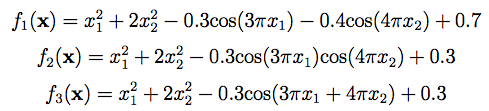
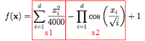
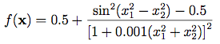

# [Day 8]根據方程式來寫出測試函數的程式吧！(3/3)

- Day: 8
- Date: 2024-09-14 00:45:04
- Author: golucky_sir
- Source: https://ithelp.ithome.com.tw/articles/10350219
- Series: https://ithelp.ithome.com.tw/2020-12th-ironman/articles/7610
- Series Title: 調整AI超參數好煩躁？來試試看最佳化演算法吧！

## 前言

今天是介紹測試函數的最後一天，雖然花了三天介紹9個測試函數但我覺得還是遠遠不夠，有趣的測試函數實在太多了。在此先許願若這次有順利完賽且之後幾天還有空閒時間的話，我會再來繼續分享測試函數的一些程式化。方程式轉程式有點寫上癮了，從中獲得了很多成就感哈哈(怪人)。

## [Bohachevsky Function](https://www.sfu.ca/~ssurjano/boha.html)

這個方程式有三種型態(聽起來很像遊戲的最終Boss例如惡靈古堡3的追跡者之類的XD)，總之，它的公式其實也相當的簡單：  
  
接著就來撰寫程式吧，我們將三條方程式分開來看看。

1.  f1(x)：這個就是很多項目加加減減而已，只需要一項一項建立並把它加減之後就會得到結果了XD，具體程式就像這樣`x[0]**2 + 2*x[1]**2 - 0.3*np.cos(3*np.pi*x[0]) - 0.4*np.cos(4*np.pi*x[1]) + 0.7`。沒什麼難度。
2.  f2(x)：同上，一樣加加減減而已，直接上程式碼：`x[0]**2 + 2*x[1]**2 - 0.3*np.cos(3*np.pi*x[0])*np.cos(4*np.pi*x[1]) + 0.3`，中間有一段兩個變數經過cos函數計算那裡要注意是相乘。
3.  f3(x)：一樣難度兩顆星，注意cos函數裡面的計算，也是一樣直接上程式`x[0]**2 + 2*x[1]**2 - 0.3*np.cos(3*np.pi*x[0] + 4*np.pi*x[1]) + 0.3`。  
    最後我們把三種型態都寫出來了，接著只要在定義副程式時加上條件控制的參數`function_type`就好了，要注意這個參數只能為1、2、3其中之一，分別代表f1(x)、f2(x)、f3(x)。其完整程式碼如下：

<!-- -->

    import numpy as np
    from typing import Union

    def bohachevsky_function(x: Union[np.ndarray, list],
                             function_type: int = 1):
        
        assert len(x) == 2, 'x的長度必須為2!'
        if function_type==1:
            return x[0]**2 + 2*x[1]**2 - 0.3*np.cos(3*np.pi*x[0]) - 0.4*np.cos(4*np.pi*x[1]) + 0.7
        elif function_type == 2:
            return x[0]**2 + 2*x[1]**2 - 0.3*np.cos(3*np.pi*x[0])*np.cos(4*np.pi*x[1]) + 0.3
        elif function_type == 3:
            return x[0]**2 + 2*x[1]**2 - 0.3*np.cos(3*np.pi*x[0] + 4*np.pi*x[1]) + 0.3
        else:
            # 若選擇錯誤則拋出例外提醒使用者function_type的輸入有誤需要注意
            raise ValueError('參數function_type必須為1、2、3其中之一!')
    if __name__ == '__main__':
        y = bohachevsky_function([0, 0], function_type=1)
        print(y) # 0.0
        y = bohachevsky_function([0, 0], function_type=2)
        print(y)  # 0.0
        y = bohachevsky_function([0, 0], function_type=3)
        print(y)  # 0.0

## [Griewank Function](https://www.sfu.ca/~ssurjano/griewank.html)

換這個論文常見的測試函數了，其中要注意兩個東東，第一個是**連加符號和連乘符號**；第二個是在連乘計算中有出現將**索引值*i*直接也加入運算**的情況，此時需要再建立一個包含1~d的向量，要注意公式中索引是從1開始，在建立時需要特別特別注意！  
我們來一步一步處理這個方程式吧，首先先來複習一下方程式長怎樣： 。

1.  處理索引值*i*：這部分使用np.arange根據起始值跟結束值建立一個向量就好了，注意終止值是要設定`d+1`這樣向量中元素才會是`1~d`。`i = np.arange(1, len(x)+1)`
2.  處理連加符號跟連乘符號：  
    a. 連加符號使用`np.sum()`：裡面的計算只是解的所有元素平方摒除以4000而已，其實並不複雜。我們一樣以x1當作這項的名稱。程式長這樣：`x1 = np.sum(x**2 / 4000)`。  
    b. 連乘符號使用`np.prod()`：這邊就要注意也要將索引值也加進來運算了，方程式要計算解中的元素除以索引值的開根號並再進行連乘，最後要記得加負號喔！程式碼為：`x2 = -np.prod(np.cos(x/np.sqrt(i)))`
3.  最後就是輸出結果啦，最後要記得+1喔！`return x1 + x2 + 1`  
    Griewank Function的完整程式碼如下：

<!-- -->

    import numpy as np
    from typing import Union

    def griewank_function(x: Union[np.ndarray, list]):
        x = np.array(x)
        i = np.arange(1, len(x)+1)
        x1 = np.sum(x**2 / 4000)
        x2 = -np.prod(np.cos(x/np.sqrt(i)))
        return x1 + x2 + 1

    if __name__ == '__main__':
        y = griewank_function([1, 2, 3])
        print(y) # 1.0170279701835734
        y = griewank_function([0, 0, 0])
        print(y) # 0.0

## [Schaffer Function N.2](https://www.sfu.ca/~ssurjano/schaffer2.html)

今天最後一個測試函數就是這個長的很特殊的東西啦，可不要被它的外表嚇住囉，它的公式其實很簡單，就像下面這樣。  
  
它也是只限兩個變數輸入的函數，那我們就立刻來處理這個函數吧！首先先把分子分母都列出來，最後加上0.5就好了，非常簡單，程式碼就像這樣：`0.5 + (np.sin(x[0]**2-x[1]**2)**2 - 0.5) / (1+0.001*(x[0]**2+x[1]**2))**2`。  
接著加入限制條件(輸入長度必須為2)以及副程式定義就完成囉！

    import numpy as np
    from typing import Union

    def schaffer_function_N2(x: Union[np.ndarray, list]):
        assert len(x) == 2, 'x的長度必須為2!'
        return 0.5 + (np.sin(x[0]**2-x[1]**2)**2 - 0.5) / (1+0.001*(x[0]**2+x[1]**2))**2

    if __name__ == '__main__':
        y = schaffer_function_N2([1, 2])
        print(y)  # 0.02467994027357423
        y = schaffer_function_N2([0, 0])
        print(y)  # 0.0

## 結語

我們花了三天來介紹一些有趣的測試函數，雖然還有很多很多並未提及到，但本系列主軸並非是測試函數，所以就介紹幾個常用的。接下來就要正式進入最佳化演算法的篇章了，我會開始介紹各種基礎演算法的原理跟程式碼，接著就會進入主軸，模型最佳化的應用，接下來也敬請各位期待啦。
