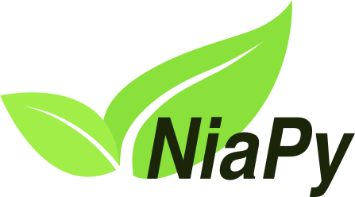

# [Day 9]目前Python最佳化演算法的函式庫有啥？

- Day: 9
- Date: 2024-09-15 00:09:41
- Author: golucky_sir
- Source: https://ithelp.ithome.com.tw/articles/10350696
- Series: https://ithelp.ithome.com.tw/2020-12th-ironman/articles/7610
- Series Title: 調整AI超參數好煩躁？來試試看最佳化演算法吧！

## 前言

這幾天一直在介紹進入最佳化演算法之前的種種，經過這幾天的鋪墊終於要進入主題了，今天要先介紹幾個常用的最佳化演算法的模組，這些模組都已經將功能包裝的很完整了，所以使用起來很方便。這些模組常常被用來進行各種類型的最佳化、線性規劃等等。而且上手難度不高，官方文檔的教學也很完整，所以學會使用這些模組對各位在調整參數或者其他應用時會有很大的幫助喔。

## 目前主流的模組

目前有許多最佳化的模組可以使用，我自己也用過許多模組，但是目前來說蠻多模組都有一些小瑕疵導致程式寫起來有點難度。目前在不同應用中我用過且認為比較好用的模組有以下幾個：

- NiaPy
- Optuna
- Mealpy
- GuRoBipy

## Niapy

Niapy是一個統合各種最佳化演算法的函式庫，它整理了很多受自然啟發的演算法並進行統整。該團隊在各種不同領域中不同的問題進行測試，經過測試後就完成了這個函式庫。NiaPy的意旨在可以簡單快速使用，避免我們需要重新開始時做那些演算法。  
  
NiaPy Logo(來源為[NiaPy官方文檔](https://niapy.org/en/stable/))

NiaPy在使用上有一些小缺點對於模型最佳化有些問題需要克服，例如在設定上它是一次設定解空間中所有解還有它們的範圍。所以例如今天要找最佳的學習率(0.0001~0.001)、中間隱藏層網路層數(1層~10層)、神經元數量(2、4、8、16、32、64...)。  
在設定上會設定解空間為3、範圍為1~10，此時演算法生成的解會是一個長度為3的向量`x=[x0, x1, x2]`，三個元素範圍都是1~10，此時就要在程式中先自行換算，例如學習率的轉換就是`x[0] *= 0.001`；網路層數量就不用轉換；神經元數量為2^n次方，所以轉換就是`x[2] = 2**x[2]`，轉換完成再帶入程式中。  
因為設定要帶入的值還需要經過轉換所以在使用上也挺麻煩的，有時候或許有從幾個類別中選擇的變數要處理就要寫一堆if...else，會非常麻煩。這個模組在其他最佳化的問題中確實很好用，但是在模型最佳化的使用上我覺得NiaPy並不是最優秀的選擇，所以未來應用中我就不會對NiaPy有更多的介紹了~

## Optuna

Optuna 是一個專門為機器學習中各種應用(包括深度學習、強化學習)等設計的超參數最佳化函式庫，與NiaPy不同的是Optuna是專門用於最佳化機器學習的API，使用這個模組進行開發的話在程式的撰寫上會非常容易，之後幾天我會帶各位進行程式的實作，使用Optuna也可以更有彈性的定義各種要最佳化變數的搜索空間。  
  
Optuna Logo(來源為[Optuna官方中文文檔](https://optuna.readthedocs.io/zh-cn/latest/))

Optuna的幾個特點有：

- 輕量級：只需要安裝後就可以直接使用了，上手速度也非常快。
- 可以方便的建立所有各種最佳化因素的設定，並不用像NiaPy一樣還需要換算。
- 使用的演算法能夠高效率的進行最佳化，並有效處理掉對最佳化沒效的組合。
- 對程式碼的修改從範例程式修改少量部分就可以應用到其他任務中。
- 可視化功能做得很好，也可以查詢最佳化紀錄。  
  小缺點只有最佳化使用的演算法較少(因為使用的演算法挺強大的)，所以要多方比較的話會需要搭配其他模組。  
  接下來幾天我會帶各位實做這些內容用於AI模型最佳化的應用，Optuna之前也有大佬寫過[文章](https://ithelp.ithome.com.tw/articles/10276835?sc=hot)介紹，各位也可以去看看！

## MealPy

MealPy是我最近發現的發現的函式庫，用起來也很順手，它也包括非常大量的啟發式演算法，也實現了很多功能，包含視覺化、高級設定(提早結束最佳化、有約束條件的最佳化、多目標最佳化等)，甚至可以使用MealPy的功能代替傳統梯度下降來進行模型的訓練參數更新，非常強大。  
這個模組建立的目的為

- 讓各種研究人員、工程師可以接觸到各種啟發是演算法的知識
- 幫助研究人員可以快速接觸這些演算法並實作
- 實現各類經典的啟發式演算法
- 幫助使用者分析演算法的參數、對演算法進行分析(收斂速度、可擴展性和穩定性等)

MealPy在未來我也會向各位進行程式上的實作，MealPy可以實作的東西很多，各位也可以去[官方文檔](https://mealpy.readthedocs.io/en/latest/index.html)挖寶喔。

## 結語

今天介紹了幾個不同的函式庫，除了NiaPy與GuRoBipy以外其他兩個函式庫用於模型最佳化都非常方便(GuRoBipy我比較不熟悉就先暫時不介紹了)，也很好上手。往後幾天我會詳細介紹這兩個模組，希望可以快速幫助各位理解這些演算法的應用以及造成的影響！不過在這之前我想先介紹一些經典的最佳化演算法，希望各位可以更理解這些基礎算法的思路以及最佳化的原理。
