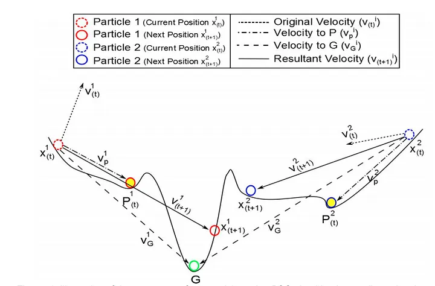
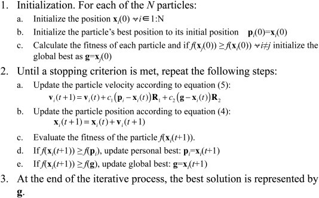
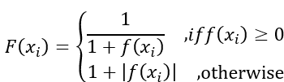
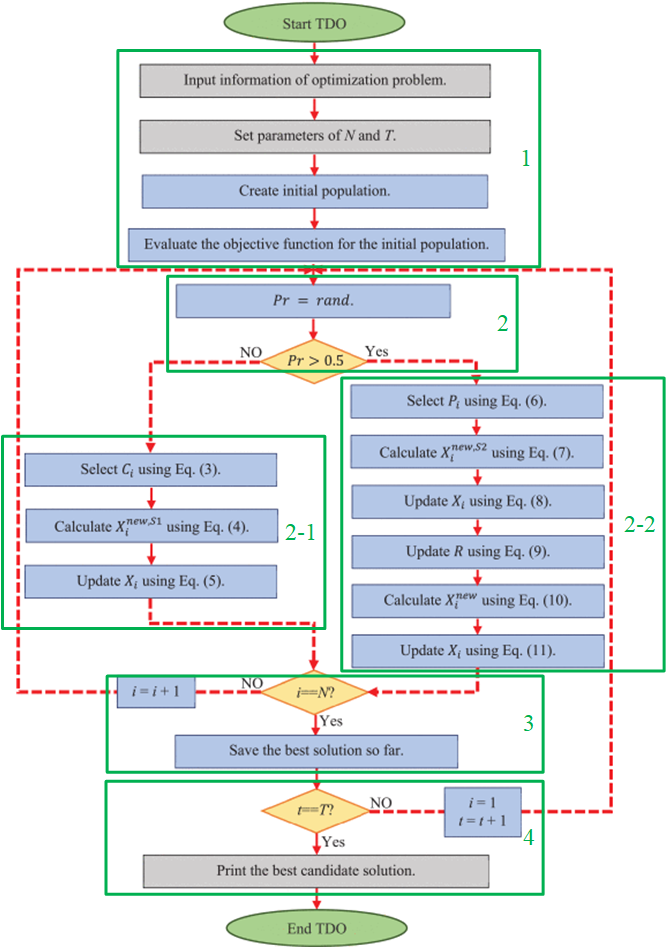

# [Day 10]基於粒子(swarm-based)的啟發式演算法是甚麼？

- Day: 10
- Date: 2024-09-16 00:03:36
- Author: golucky_sir
- Source: https://ithelp.ithome.com.tw/articles/10351664
- Series: https://ithelp.ithome.com.tw/2020-12th-ironman/articles/7610
- Series Title: 調整AI超參數好煩躁？來試試看最佳化演算法吧！

## 前言

昨天介紹了一些好用的函式庫，今天我想來介紹幾個基礎的啟發式演算法，讓各位先理解這些演算法運作的方式，之後在來使用這些演算法進行實作，實作上使用昨天介紹的這些模組會非常容易實現。

## 粒子群演算法(Particle Swarm Optimization, PSO)

PSO是最廣為人知的演算法了，因為它是基於粒子中最最最基本的演算法，接下來我們來看看PSO是如何運作的吧。

> 網路上有很多PSO的原理介紹以及變種演算法，各位也可以搭配服用喔！

### 概念與原理

PSO的概念是將各種解當成粒子，並觀察這些粒子在問題中的適應值並根據粒子的速度等更新解的位置再去求適應值，透過位置變化跟速度變化而進行問題的最佳化。  
  
PSO的優化思路圖([圖源](https://roger010620.medium.com/%E6%9C%80%E4%BD%B3%E5%8C%96%E6%BC%94%E7%AE%97%E6%B3%95-%E7%B2%92%E5%AD%90%E7%BE%A4%E6%BC%94%E7%AE%97%E6%B3%95particle-swarm-optimization-pso-904d11043cb7))  
從上圖可以知道PSO最佳化時的流程有一些步驟，那我會盡量以較少艱深的數學來描述，確保各位可以快速理解這個演算法，PSO可以根據粒子自己的經驗和群體共同的經驗找出最佳解，以下是PSO的步驟。

1.  **建立很多粒子**(因為演算法就叫粒子**群**了)，每個粒子都是一個在N維空間中的點，每個粒子都可以用一個向量來表示，這個向量就是最佳化問題時要帶入的參數了。
2.  **計算適應值(fitness value)**
3.  **更新位置**，粒子位置更新的方式為原本的位置加上速度分量`x(t+1)=x(t)+v(t+1)`。每個粒子的速度也不相同，至於速度是甚麼呢？速度就是用於控制粒子在搜尋空間中移動的方式，也會隨著迭代更新，速度為以下項目組成。  
    a. 慣性或者動量：它會透過追蹤先前的流動方向來防止粒子急劇改變方向。  
    b. 認知成分(cognitive component)：它可以解釋粒子返回到自己之前曾找到的最佳位置的趨勢  
    c. 社會成分(social component)：它確定單一粒子向整個粒子群體的最佳位置移動的傾向，不過也有可能是一定範圍內的局部粒子，要根據演算法設定決定。這樣就可以讓單一粒子集結一起去較佳解附近搜索，看能不能找到最佳解。
4.  **更新速度**，PSO主要最佳化在運算的部分就在這裡，這裡也包含較複雜的公式，因為要考慮上述a、b、c項目的內容而進行速度的更新。
5.  重複第3.步跟第4.步直到最佳化完成。  
    一些參考論文中也有提到PSO的優化步驟，如下圖，圖源來自於[這篇論文](https://doi.org/10.1016/j.chemolab.2015.08.020)。  
      
    從這張圖中我們可以發現：

- 第1步就是初始化所有粒子(1步驟中的a & b項目)並計算初始化粒子的適應值(1步驟中的c項目)
- 第2步為不斷更新粒子嘗試找到最佳解，其中a&b項目分別對應到速度的更新與粒子的更新；c項目為計算新的適應值；d跟e項目分別為更新粒子個人的歷史最佳值與整個粒子群的歷史最佳值。
  - 速度更新公式中c1跟c2為加速度常數，通常c1會設定負數；c2設定小於等於4。用於調節粒子往個人最佳點與粒子往粒子群最佳點移動的發展。但經過研究認為設定c1與c2都為2可以是用大多數應用。
  - R1跟R2為隨機產生的，用於讓更新規劃有一些隨機性。
  - Pi跟g分別為第i個粒子的目前最佳解、g為目前整個群體最佳解。
  - vi(t)就是第i個粒子的當前速度；xi(t)為第i個粒子的當前位置，vi(t+1)跟xi(t+1)就是第i個粒子更新後的新速度、位置。
- 第3步為找到最佳值或者迭代結束。

### 總評

粒子群的原理大概就這樣，感覺很複雜但實際上只有兩條方程式呢，在實作上很容易。但也因為這樣所以PSO作為基礎的演算法也有一些不足例如單純考量上述因素導致PSO優化基本上容易陷入局部最佳，接下來來看看下一位選手。

## 人工蜂群演算法(Artificial Bee Colony, ABC)

ABC演算法也是很有名的演算法，當時學者觀察了蜜蜂社會的習性並將之開發成了現在這個演算法，真的是腦洞大開，非常厲害。將蜜蜂作為粒子並根據不同種類的蜜蜂會有不同的行為，這些粒子各司其職進而找出最佳解。

### 概念

ABC是由一個蜜蜂社會中不同工作的蜜蜂組成，其中分為雇佣蜂(employed bees)、觀察蜂(on-looker bees)和偵查蜂(scout bees)。以下是這些蜜蜂們的分工表：

- 雇佣蜂：它會和特定的候選適應值(有些[教學](https://medium.com/hunter-cheng/python-%E4%BA%BA%E5%B7%A5%E8%9C%82%E7%BE%A4%E6%BC%94%E7%AE%97%E6%B3%95-artificial-bee-colony-abc-%E6%B1%82%E8%A7%A3%E6%9C%80%E4%BD%B3%E5%8C%96%E5%95%8F%E9%A1%8C-2f7d61bce47b)會將之稱為蜜源，比較貼切，在ABC中我也會使用蜜源來稱呼)聯繫，該蜜源如果已經發掘完畢後**沒有更好的解**之後該雇佣蜂就會變成偵查蜂去尋找更多蜜源。
- 觀察蜂：這些蜜蜂它們會觀察雇佣蜂收集到的資訊並依據這些資訊選擇其中一個蜜源進行後續計算。主要是**根據找到的蜜源去選擇要在哪個蜜源附近採蜜**，有點指揮官的感覺。選擇蜜源的方式是使用**輪盤法(Roulette Wheel Selection)**，簡單來說就是蜜源越大，則選擇去那個蜜源採蜜的機率會越高，這也是為探索增加一點隨機性。
- 偵查蜂：就是剛剛提到的雇佣蜂探索的蜜源如果被發掘完畢的話就會轉為偵查蜂，接著開始隨機的區搜索新的蜜源。

### ABC原理

ABC在最佳化時也有幾個步驟要進行，以下為演算法的流程。

1.  初始化蜜蜂：這步驟會初始化雇佣蜂和觀察蜂的數量(它們數量一樣多)、以及先隨機標出幾個蜜源位置(也就是隨機生成初始化的解)、以及要在蜜源附近採蜜幾次(超過採蜜次數沒有找到滿意的結果就當作該蜜源以發掘完畢)。
2.  雇佣蜂工作階段：在這個階段也有一些小事情需要處理。  
    a. 首先要注意一下蜜源的好壞會將問題的目標函數*f(x)*再進行進一步的計算，公式如下，其中*F(xi)*為第*i*個雇佣蜂負責的蜜源*f(xi)*，其蜜源的豐富程度。  
      
    b. 進行採蜜，就是更新出新的蜜源位置並計算新蜜源的值跟豐富程度。如果新的蜜源位置更好那會予以保存，如果是最佳蜜源則紀錄為當前最佳解；如果是不好的蜜源則整體迭代以及採蜜次數+1。更新方式會隨機挑選蜜源附近的一個位置來作為新的解並帶入目標函數計算出適應值並作後續計算。  
    c. 根據剛剛的那些計算得到結果，並「報告」給觀察蜂。
3.  觀察蜂工作階段：這裡觀察蜂的工作就是每個觀察蜂各挑出一個蜜源讓蜜蜂在這附近採蜜，決策中也有一些流程要走。  
    a. 根據剛剛得到的蜜源豐富程度*F(x)*，為所有的蜜源\*(F(x1),F(x2)...,F(xn))\*建立一個機率表，根據機率表選擇一個蜜源。  
    b. 和雇傭蜂一樣，觀察蜂也會根據被選擇的蜜源去搜尋新的可能解，也就是進行採蜜。
4.  決定是否有採集完畢的蜜源，如果有的話就負責該蜜源的僱傭蜂轉為偵查蜂接著找出新蜜源以代替舊的蜜源。
5.  紀錄最佳解，並重複2~5步驟值到迭代結束或者達成停止條件。

### 總評

ABC的流程大致上來說就是如此，因為會隨機偵查蜜源，所以有時候可以避免掉局部最佳的位置，進而提升找到全局最佳解的可能性。實務應用中ABC的複雜度也不算高，我之前一些研究中使用ABC的效果也很不錯，所以實作上可以考慮使用看看ABC。  
ABC也發展出很多變體，針對尋找新蜜源中提出了各種不同策略，使ABC可以更貼合不同種類的應用。總之ABC我認為是一個不錯的演算法，所以我才特別介紹他XD。

不然我本來一天預估只會講兩個演算法哈哈(偷偷抱怨)，因為統整資料並寫成文章出來還是花了挺多時間，再加上記憶中也只是大概知道流程，所以還得確認一下印象是否正確orz。

## 袋獾演算法(Tasmanian Devil Optimization, TDO)

[袋獾](https://zh.wikipedia.org/zh-tw/%E8%A2%8B%E7%8D%BE)也被稱作塔斯馬尼亞惡魔(Tasmanian Devil)，外表挺可愛的，但行為就不太可愛了。  
受到袋獾行為啟發的演算法就稱為袋獾演算法，他是2022年提出來的最佳化演算法([原始論文](https://doi.org/10.1109/ACCESS.2022.3151641)，論文中還有放上袋獾的圖片XD)，主要透過模擬袋獾獵食行為來進行最佳化，將適應值當成食物的演算法還有灰狼演算法(Gray Wolf Optimization, GWO)等，也是很有趣的概念。

### 概念與原理

這個演算法的概念是模擬袋獾獵食的一個演算法，袋獾有時會狩獵而有時是吃其他食肉動物狩獵過後的腐肉。作者認為袋獾在棲息地搜尋食物時的行為跟從搜尋空間中找出最佳解的行為類似，TDO主要就是會搜尋很多地區並找出最佳區域接著再去狩獵。

### TDO原理

袋獾進食會有狩獵跟直接吃腐肉，狩獵跟吃腐肉被當成不同進食方式而有不同算法，而TDO中選擇的方式是根據隨機數判斷的，兩者機率都為50%，換句話說就是投擲硬幣決定要吃腐肉或是狩獵。

- **吃腐肉策略**：吃腐肉會根據三個步驟來當作進食過程，每隻袋獾的進食會獨立進行。
  1.  每個袋獾會根據其他袋獾的位置當作有腐肉的位置，接著會隨機選擇一個袋獾當作目標腐肉位置。就是假設其他袋獾那邊有腐肉，接著當前的袋獾就會去找他一起分享腐肉的概念。
  2.  選好腐肉位置後，如果該位置的適應值(fitness value)更好，袋獾就會向腐肉移動；如果更差的話就會往反方向遠離不好的腐肉位置，移動的方式會有一點隨機的成分在。
  3.  在移動後的新位置後如果fitness value比原本的好則留在這個位置，否則會維持在原本的舊位置上(不移動)。有時候可能靠近或者遠離腐肉的路上移動，難免會踩到雷區，若可能會踩雷那就不移動了，等下次的策略再決定行為。
- **狩獵策略**：袋獾在攻擊時會有兩個階段，首先是要**選擇獵物並攻擊該獵物**，其次是**接近獵物後追趕、狩獵並進食**。具體為以下步驟所示。
  1.  選擇獵物：選擇獵物類似吃腐肉的方式，也是隨機選擇其他袋獾位置為獵物位置(流程類似於吃腐肉策略的三步驟)，應該是假設其他袋獾附近都有獵物可以合作狩獵，畢竟袋獾狩獵袋獾聽起來挺獵奇的，但這只是演算法而已所以不用想太多~
  2.  狩獵獵物：與吃腐肉不同的點在於多了狩獵獵物並進食的步驟，在預定發動攻擊的地點追逐獵物的概念為在該空間中進行局部搜索，因為這個部分讓TDO有了能夠利用它來收斂到更優秀的候選位置。要模擬追逐過程袋獾會有一些行為產生。
  3.  定義跟隨獵物的範圍，並基於該獵物的範圍來計算袋獾的新位置，如果新位置的適應值更好則留在新位置，否則留在原本位置。

整個TDO的流程大致上就是幾個部分組成，這邊可以配合[論文](https://doi-org.ezproxy.nptu.edu.tw:8443/10.1109/ACCESS.2022.3151641)中的流程圖來解釋，我將論文中的流程圖標示上了綠色框框跟步驟，各位可以搭配以下說明理解，方程式的部分我就先省略了，大致上就是將這些行為模擬寫成公式而已。

1.  初始化演算法(迭代次數*T*、袋獾數量*N*等)、袋獾位置、計算袋獾位置的適應值。
2.  開始進食，隨機選擇腐肉進食(2-1步驟)或是狩獵進食(2-2步驟)。
3.  讓每隻袋獾(*i*)都進行一次進食動作，重複第2步直到所有袋獾都移動進食完畢，所有袋獾都進食完畢後(*i=N*)紀錄當前最佳解。
4.  迭代次數加1次(*t+1*)，若還沒完成迭代則重複2~3步驟(設定*i=1*代表從第1隻袋獾再度開始覓食)，整個TDO迭代完成後(*t=T*)就輸出整個歷史紀錄中的最佳解。

  
圖. TDO演算法流程圖。

### 總評

TDO是一個相當新穎的演算法，概念也很有趣，透過兩種進食機制來進行最佳化，不過目前應用還不像PSO那些那麼多，所以演算法的優缺點並沒有一個完整的調查與實驗。未來根據不同實驗結果可能也會發展出TDO的各種變體版本，無論如何都期許這個演算法會有一些其他完整應用，各位也可以實際應用看看並確認效果喔(之後會有實作的文章，敬請期待)~

## 結語

今天介紹了3個最佳化演算法，包括最常見的PSO、曾經拯救過我研究的ABC、以及2022年才提出的新穎的演算法TDO，這些演算法之後會在MealPy中出現，所以不用擔心理解了原理但卻實作不出來。明天會介紹一些基於演化的啟發式演算法，最有名的就是基因演算法了，作為教科書式的演算法應該大多數人都有聽過，除基因演算法以外我也會介紹一些新穎的演算法給各位。
