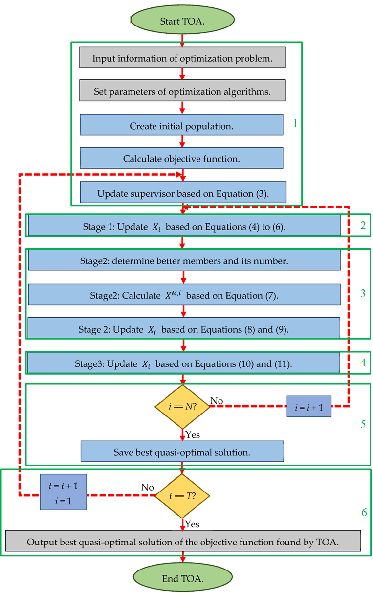
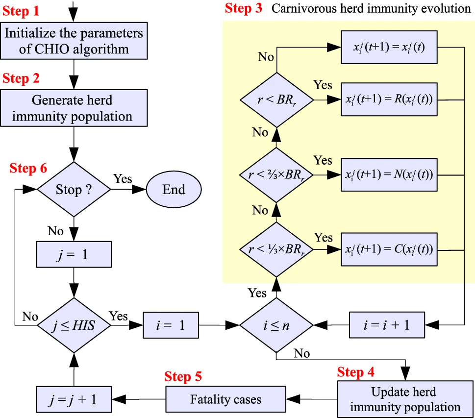

# [Day 12]基於人類行為(human_based)的啟發式演算法是甚麼？

- Day: 12
- Date: 2024-09-18 00:09:16
- Author: golucky_sir
- Source: https://ithelp.ithome.com.tw/articles/10353227
- Series: https://ithelp.ithome.com.tw/2020-12th-ironman/articles/7610
- Series Title: 調整AI超參數好煩躁？來試試看最佳化演算法吧！

## 前言

前兩天分別介紹了以粒子為基礎跟以進化為基礎的幾個演算法，今天要介紹的演算法比較困難也比較新穎，同時也很冷門，是以人類行為為基礎的演算法。目前我在網路上搜尋有許多演算法都沒有經過太嚴謹、全面的研究。且也極少中文的解說，那就讓我來開疆闢土吧！希望我的不專業解釋也能讓各位更理解演算法，我會盡可能將演算法的核心思路表達出來的。

## Teamwork Optimization Algorithm (TOA)

這個最佳化演算法直接翻譯的話為**團隊合作最佳化演算法**，目前我還尚未找到正式的中文翻譯名稱，網路上目前似乎也沒什麼中文網站等有在分享這個演算法的，所以今天的內容大多來自於[原始論文](https://doi.org/10.3390/s21134567)。

### TOA概念與原理

這個演算法的主要思路為透過模擬一個團隊的合作行為，以實現這個團隊的合作目標。TOA透過這些行為的模擬，以數學建模建立出此演算法，用於解決最佳化問題。  
原理上，TOA模擬了一個團隊合作，所以角色分為了**主管**跟**團隊成員**。

- **主管(supervisor)**：基本上所有團隊成員中適應值(fitness value)最高的人就會當上主管，挺現實的，主管會負責領導和指導團隊。
- **團隊成員(members)**：基本上除了主管以外其他人就都是團隊成員了。

在這個團隊中總共會有三個會彼此影響的形式存在，TOA基本上也根據這三個影響作為演算法的流程來進行最佳化：

> 其中TOA中每個成員所擁有的資訊就是要代入問題的解，在PSO中以粒子位置形容要代入問題的解，在TOA中以團隊成員擁有的資訊形容要代入問題的解。

1.  **初始化TOA**：一樣會隨機產生所有團隊成員的資訊並根據
2.  **主管對團隊成員的影響**：每個團隊成員都依照主管的指導和指示努力提升自己的適應值。此階段主管會將自身的資訊(代入問題的解跟代入後得到的適應值)分享出來，給其他團隊成員參考並指導團隊成員創造目標。
3.  **資訊共享階段，好的團員對差的團員的影響**：所有的團隊成員都會想辦法透過利用比自己表現更好的其他團隊成員的經驗來提升自身的適應值。這階段每個團隊成員會根據其他更優秀團員的資訊來提高自身的適應值，他們會參考其他優秀成員的資訊來更新自身的資訊。
4.  **團隊成員的個人活動**：每個團隊成員基於自身的活動，會「努力」的為整個團隊的適應值(成果)做出更多貢獻。雖說是努力但以數學建模來說還是以**隨機數**來更新每個團隊成員的資訊(怎麼有點現實阿QQ做研究沒方向都瞎闖一番QQ)，若是努力過後的「結晶(適應值)」有比較好則更新個人資訊，若沒有比較好則不更新個人資訊。
5.  針對每個團隊成員進行更新，重複執行步驟2.到步驟4.，若所有團隊成員都更新完畢就儲存該次迭代中群體的最佳解，也就是儲存主管的資訊。
6.  若迭代尚未完成則返回到第1步驟結尾**重新選出一個主管**來，並重複執行步驟2.到步驟5.完成後迭代次數+1，若迭代完成則輸出整個團隊找到的歷史最佳解。  
    各位也可以搭配下面的流程圖服用，也是一樣我幫各位標好上述每個步驟中對應的框框了~公式的部分各位可以去看看原始論文，這邊就先大致提及演算法的流程而已。  
      
    圖. TOA演算流程圖。

### TOA總評

根據論文所述，TOA目前在23個不同的測試函數上測試過它的性能了，除此之外也使用另外8種最佳化演算法比較。研究成果的分析表示TOA演算法與其他演算法在最佳化上有著不錯的優越性。  
不過在其他領域上的應用則必須要再更加深入的做探討，希望未來能有更多這種演算法的應用，我個人認為用團隊合作是一個很好的想法。但總有感覺是抹滅了人性的高效率團隊XD，不過這只是演算法而已，不知道為甚麼都會過度聯想到現實生活TT尤其是這個演算法照流程好像更能體會到現實社畜的辛酸。

## Coronavirus Herd Immunity Optimizer (CHIO)

CHIO是2020年提出來的一個演算法，根據[原始論文](https://link.springer.com/article/10.1007/s00521-020-05296-6)介紹，CHIO是受到人類社會與病毒對抗，接著人們都獲得抗體，進而群體免疫的概念。群體免疫是指當大多數人口具有免疫力時的一個狀態，這個情況下病毒也不容易傳播，因為人類的抗體已經足以殺死病毒。

### CHIO概念與原理

CHIO靈感來自於COVID-19，先前各位應該都有所體驗，COVID-19感染的傳播速度會與感染者與其他人直接接觸的方式有很大的相關。為了保護未被感染的人們，醫學界的專家等會建議感染者「隔離」，其他人需要保持社交距離1.5公尺等等...  
CHIO模仿了群體免疫策略以及社交距離的概念，通常傳染病的建模會分成三種類型的人：**易感染者(susceptible)、感染者(infected)和免疫者(immuned)**。  
接下來我來根據論文提供的流程圖來解釋一下CHIO的演算過程吧，請看下圖。

1.  Step 1.初始化CHIO演算法：這部分應該不需要多說了吧，和其他演算法一樣都需要初始化演算法的設定等。CHIO除了基本的會設定**最大迭代次數**、**解的維度**以外還會設定**初始感染的病例數**、**人口規模**。

2.  Step 2.生成初始的群體：此步驟會產生免疫的群體，基本上也是隨機產生和人口規模一樣多的個案，在這演算法終究是以**人**來當作要帶入問題的解。

3.  Step 3.冠狀病毒群免疫進化(carnivorous herd immunity evolution)：這步驟就是CHIO主要用於最佳化演算的內容，如圖片中黃色的框框一樣。
    - 三個菱形格子是根據比例使用三個規則(菱形格子旁邊的矩形格子)來定義受到社交距離的影響。菱形格子中的r是隨機產生的亂數；BRr是基本繁殖率，用於透過在個體之間傳播病毒的比率，透過使用者設定。
    - 接著新的解等會受到一些社會因素的影響進而更新。下列三個就是因應不同規則所套用的更新方式，若三個條件都不符合的話則不會產生更新。
      - *C(x(t))*：這個是會受到一些**社會影響**之間的差異來實現的更新的。
      - *N(x(t))*：這個則是會受到**社交距離**的影響，這種社交距離是透過當前人與取自易感染各例的人之間的差異來實現更新的。
      - *R(x(t))*：這個則是透過目前的人與從免疫病例的人之間的差異來進行更新的。

4.  Step 4.更新新的解：此步驟會\*\*更新免疫群體中每位個案的免疫率(適應值)\*\*並會計算替換為新的情況，如果適應值更好的則個案的年齡會+1。如果這些更新後新的人它的免疫率比整個群體的平均免疫率更好的話，則人群中那個人的免疫率會根據先前計算的社交距離而產生變化。

    > 這意味著CHIO開始擁有免疫力更好的人群，對病毒的免疫能力更強。換句話說就是這群人的解所產生的適應值都會變得更好了，不斷進步就會完全抵抗病毒(找到最佳化的解)。

5.  Step 5.產生死亡病例：簡單來說就是如果經過一定次數的迭代之後適應值沒有變更好的話，該個案就會死亡，藉此來捨棄掉那些適應值不高的解，除此之外重頭開始產生新的解也能幫助演算法的多樣性。

6.  Step 6.判斷是否要結束演算法：接著CHIO就是重複步驟3.到步驟5.值到迭代次數達到設定的上限則視為最佳化完畢，這時候就會輸出整個群體歷史的最佳解啦~  
      
    圖. CHIO演算法流程。

### CHIO總評

根據論文的結果CHIO使用了不同的方式去測試演算法的敏感性，敏感性通常是用來判斷演算法參數變化所造成的影響，越敏感則越容易出現更多變化。另外也使用了IEEE CEC 2011的一些實際工程類型最佳化問題來測試，目前根據他們的研究成果表示CHIO是一個蠻強大的演算法，之後有機會我也會帶各位來實作這個演算法！

## 結語

今天的演算法介紹難度比較高，因為參考資料少，所以我花了蠻多時間在慢慢閱讀論文的方法，處理了很久終於端出這盤菜了。希望各位能夠咀嚼得津津有味。  
這兩個演算法都是比較新穎的演算法，但也因為這樣所以資訊目前不夠多，之後也會帶各位實作看看這些演算法，希望我們可以從這些演算法中挖出不錯的寶藏。  
明天預計會講最後的演算法分類，講完後就差不多要進入程式，實作的部分了，好期待阿。
