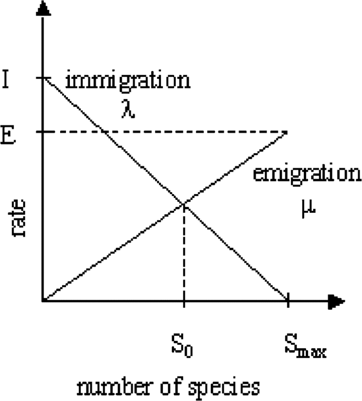
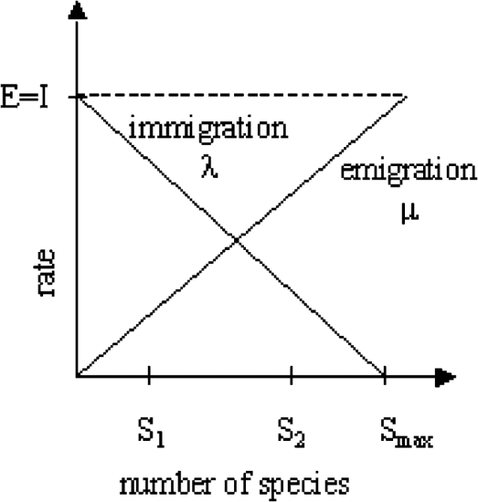
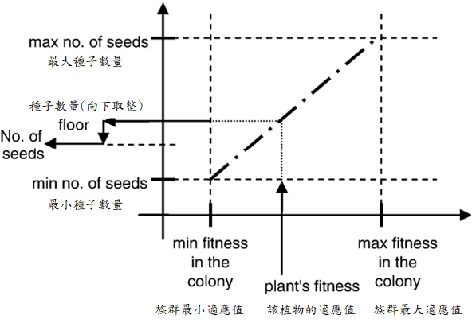

# [Day 13]基於生物學(biology-based)的啟發式演算法是甚麼？

- Day: 13
- Date: 2024-09-19 00:08:47
- Author: golucky_sir
- Source: https://ithelp.ithome.com.tw/articles/10353999
- Series: https://ithelp.ithome.com.tw/2020-12th-ironman/articles/7610
- Series Title: 調整AI超參數好煩躁？來試試看最佳化演算法吧！

## 前言

[昨天](https://ithelp.ithome.com.tw/articles/10353227)介紹了基於人類行為的最佳化演算法，這些演算法基本上都是模擬人類社會中有的群體行為，無論是對抗疫情(CHIO)或是團隊合作(TOA)都一樣。今天要來介紹的是基於生物學的幾個演算法，和[基於粒子](https://ithelp.ithome.com.tw/articles/10351664)的演算法不同，基於粒子的演算法著重探討「個體」的行為；今天介紹的基於生物學的演算法更著重於整個生物群集和環境、生態系等的不同交互，不過廣義來說它們可以視為相同分類的啟發式演算法。  
無論如何，這些演算法都能夠對之後我們實作的模型最佳化有著很好的幫助！

## 生物地理學演算法(Biogeography-Based Optimization, BBO)

BBO是一個討論自然生物地理學及其數學的演算法，在2008年提出，根據[原始論文](https://doi.org/10.1109/TEVC.2008.919004)介紹研究者的心態是「我們可以向大自然學習」。BBO和其他演算法例如PSO、GA等有共同的特徵，所以BBO也適用於PSO、GA等相同類型的問題。

### BBO概念與原理

BBO描述了生物物種如何進行遷移、新的物種是如何演化出現的、以及物種為何滅絕、如何滅絕，看起來就是更廣義的GA+PSO等演算法加起來。  
在生物地理學中，適合生物居住的區域可以說是有很高的**棲息地適宜度指標(Habitat Suitability Index, HSI)**另外可以用來評估該地區是否可居住的指標為**適宜性指標變數(Suitability Index Variable, SIV)**。

- 和HSI相關的有植物、物種、地形多樣性，以及降雨量、溫度、濕度等因素，這些因素也會影響SIV的變化。

下圖是論文中提出的生物地理學的數學建模，從遷入率(immigration)和遷出率(emigration)反映該地區的物種數量，一般來說HSI高代表物種可能會越多，當該地區物種飽和後，物種就會傾向遷出去尋找新的資源肥沃的地區；反之亦然，HSI低代表物種數量少，所以來自其他地方流浪的物種就會傾向於入住該地區。  
但如果該地區的HSI一直很低代表那裏根本不適合居住，所以久而久之那邊的物種就有可能會滅絕。  
  
圖. 單一棲息地的物種模型關係，圖源為[原始論文](https://doi.org/10.1109/TEVC.2008.919004)。

> 觀念上來說，BBO中將要帶入問題的整個解比喻為**一個地區**，解中的不同因素、特徵比喻為**該地區的物種**，而適應值(fitness value)比作為**HSI**。

高HSI的地區會比較穩定，而低HSI的地區會受到高HSI的地區分享的物種，從而提升該地區的品質。  
對照來說就是：高適應值的解會比較穩定，解與適應值不容易有大幅度的變化，而低適應值的解會受到高適應值的解分享的特徵，從而提升解的品質。

理解了概念之後就要來介紹BBO的演算法原理了，圍繞著**遷入率、遷出率、HSI等**概念，接下來讓我來介紹BBO的流程吧。

1.  **初始化BBO的演算法跟參數**：老樣子，BBO要初始化的東西有**最大的物種數量**、**最大遷入率**、**最大遷出率**、**最大變異率**、以及一個**菁英主義參數(elitism parameter)**。
2.  **隨機初始化各地區**：隨機給所有地區一些物種(隨機初始化解的值)，並計算出所有地區的HSI(適應值)。其中最高HSI的地區會被作為**菁英地區**，論文中也使用這種方式來保留最佳的地區，**避免這個最佳地區受到遷移的破壞**。
3.  **計算地區資訊**：接著對於所有地區的HSI來計算該地區的物種數量、遷入率跟遷出率。如下圖，其中S1是比較差的地區、S2是比較好的地區，它們之間的遷入率*λ*跟遷出率*μ*就如圖所示。
4.  **地區物種遷移**：根據遷入率跟遷出率的機率，隨機的更新每個**非菁英地區**的物種(解的特徵)，並計算出每個地區新的HSI。
5.  **棲地隨機突變**：對每個地區隨機更新物種數量，然後再隨機對每個非菁英地區進行變異，概念是模擬災難性的事件，通常一場災難等原因會導致該地區的物種、HSI等發生重大改變，變異完成後並重新計算HSI，這邊也會重新選擇新的**菁英地區**。並讓演算法的迭代次數+1。
6.  **是否迭代完成**：循環步驟3.到步驟5.直到迭代結束，當迭代結束後就輸出BBO的最佳解。

  
圖. 地區物種數量與遷移率的關係圖，圖源為[原始論文](https://doi.org/10.1109/TEVC.2008.919004)。

### BBO總評

BBO是一個很有趣的演算法，透過模擬很多地區的生態來尋求解，並考慮了許多因素來模擬自然環境中的演化。為此我也查閱了一些生物地理的相關文獻，發現作者確實有很好的從大自然中汲取靈感，並將之與個人的專業研究進行融合。  
BBO研究據作者所述並沒有特別驗證過，來獲得普遍優秀於其他方法的結論，所以未來也可以嘗試以此為方向去比較看看其他演算法再來討論看看BBO有沒有可以改良的部分。

## 雜草演算法(Invasive Weed Optimization, IWO))

雜草演算法應該也是有一段時間的演算法了，它是一種受到野外雜草互相侵略、殖民、生長的啟發而成的演算法。根據一些研究顯示雜草再殖民、侵略時的生長穩定性較高、適應性佳、又具備隨機性，所以這個以雜草為基準的演算法也能表現出上述特性。

### IWO概念與原理

IWO來自於一群野草的繁殖，這些野草可以透過有性生殖與無性生殖來繁殖，不過IWO著重探討有性生殖的開化結果，產生種子，生出種子後就會透過各種形式向外傳播，並找到其他適合生存的空間，不斷循環。通常IWO會歷經6個步驟來進行最佳化，以下是IWO的演算步驟。

> IWO是將不同雜草族群當作要代入問題的解，而適應值就是適應值，似乎沒有特別的比喻，若有錯誤再麻煩糾正了\>\<

1.  **初始化IWO**：這步驟會確定**族群和群集數量、大小**(群集是會包含很多族群的概念，例如草原群集中會有斑馬族群、獅子族群等)，以及**最大迭代次數**，**代入解的維度**，**一次生成種子數的最大值與最小值**，**區間步長的起始值跟最終值**。
2.  **初始化雜草們**：這步驟會隨機生成所有雜草族群的解，並計算所有雜草族群的適應值。
3.  **雜草開始繁殖**：群集中的各種雜草族群能夠散波的種子數量是**根據該族群的適應值決定**的，具體如下圖所示，至於為何向下取整的原因舉例來說，基本上雜草不會生出2.3個種子，所以向下取整變成生成2個種子。
4.  **計算空間分布**：IWO的種子會被隨機播種在求解空間中，這些種子會成長成新的雜草。至於如何播撒根據現實環境，通常一顆果實中的種子會在距離該族群不會太遠的地方播種對吧，如果是完全隨機的話代表在夏威夷的種子，播種於夏威夷跟播種於非洲埃及的機率會是相同的，這樣太不合理了。  
    所以基本上會根據初始會設定的**區間步長的起始值跟最終值**來決定距離原本族群特定步長距離**被播種種子的機率高低**。因此，高適應值且良好的雜草會生出比較多種子，也會有比較大的機會能夠播種在高適應值附近的空間中，也有可能會遠離較佳區域去遠方闖蕩；反之，低適應值劣勢的雜草會生成較少種子，藉此漸漸淘汰劣勢族群。
5.  **競爭生存機會**：若各位有小花圃或者院子等，透過觀察這些地方我們可以知道，如果一種植物沒有產生種子，將會漸漸滅亡；而如果植物產生的種子很多，它很快就會遍佈整個花圃。  
    同理，IWO中的雜草們會透過互相競爭求得生存的機會，且為了**維持平衡**也要確保族群的大小在合理的範圍內。在種子播種之後他們會成長為雜草，也就是**多了很多新的解**，此時這些解會計算適應值，並將群集中所有雜草的適應值進行排列，並直接淘汰刪除掉後面劣勢的雜草，**使整個雜草數量不會大於最大的雜草數量上限**。完成後算一次迭代，將迭代次數+1。
6.  **是否迭代完成**：重複步驟3.到步驟5.直到迭代結束，當迭代結束後就輸出IWO的族群歷史最佳解。

  
圖. 一群雜草群的種子生產關係，圖源於其[論文](https://pdfs.semanticscholar.org/734c/66e3757620d3d4016410057ee92f72a9853d.pdf)。

### IWO總評

IWO也是一個不錯的演算法，與其它演算法不同的是一些演算法基本上族群數量會一直都是固定值，而IWO會透過播種來讓解的數量暫時變多，不過考量到平衡會再將劣勢的雜草淘汰。藉此可以更**大量的保留最佳解**，跟珊瑚礁演算法有點類似。這種做法還**讓原本劣勢的雜草有繁殖後代的機會**，說不定那些雜草的後代會一鳴驚人呢！所以這個機制基本上也是會鼓勵雜草們**不要陷於局部最佳位置**。  
總得來說IWO是一個相當穩定、且適應性佳又同時具備隨機性的演算法。

## 結語

這四天根據不同的基礎介紹了許多演算法，基本上還有許多雜七雜八的演算法，過於特殊導致在分類上比較少同性質的演算法，或是其他原因導致該演算法的特殊性，所以礙於篇幅就沒辦法在原理介紹中登場了，不過很多冷門的演算法都有包含在MealPy中，各位若有興趣在之後帶各位入門MealPy之後各位可以在嘗試使用更多不同的演算法來測試看看自己所應用到的問題喔！

> 我們可以向大自然學習 --Dan Simon(BBO論文作者)
