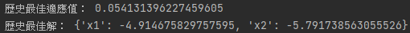
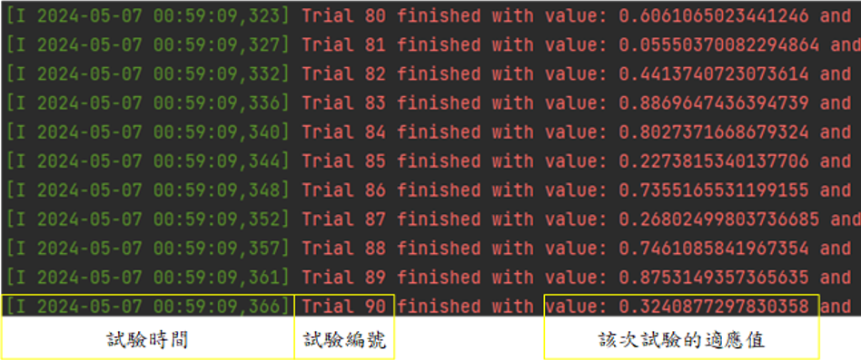
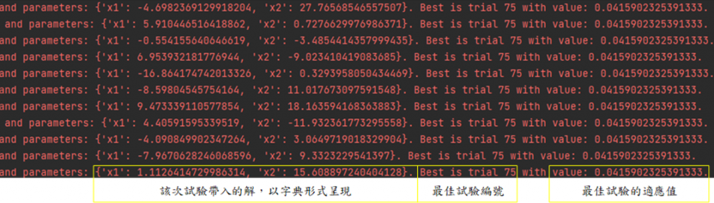

# [Day 14]無痛入門！淺談Optuna最佳化

- Day: 14
- Date: 2024-09-20 00:21:28
- Author: golucky_sir
- Source: https://ithelp.ithome.com.tw/articles/10354688
- Series: https://ithelp.ithome.com.tw/2020-12th-ironman/articles/7610
- Series Title: 調整AI超參數好煩躁？來試試看最佳化演算法吧！

## 前言

今天終於要來進入程式實作的部分了，今天要介紹的函式庫在[前幾天](https://ithelp.ithome.com.tw/articles/10350696)也有介紹過，Optuna是一個相當有名的套件，今天就來看看它可以幹嘛吧。

## 基本範例

[Optuna](https://optuna.org/)是一個專門用於深度學習模型或者機器學習模型超參數調整的套件，其背後的演算法基本上與啟發式演算法又有一些差別，這個套件使用的演算法我會在之後額外介紹。  
那接下來先來看看官網的範例程式吧，我有加上一些註解方便各位更理解程式！

    import optuna
    # 定義目標函數(或稱適應函數fitness function)的計算方式
    def objective(trial):
        # 新增帶入解中的元素，本例只有一個變數，所以只定義一個變數x。
        x = trial.suggest_float('x', -10, 10)
        # 回傳適應值(fitness value)
        return (x - 2) ** 2

    # 新增一個最佳化的「試驗」變數
    study = optuna.create_study()
    # 讓該試驗進行最佳化，目標函數為objective，試驗次數n_trials為100次
    study.optimize(objective, n_trials=100)

    # 將試驗中的最佳解print出來。
    print(study.best_params)  # E.g. {'x': 2.002108042}

以上是官方給出的基本範例，接下來我會來詳細說明這段程式碼在幹嘛，在這之前首先要安裝Optuna(`pip install optuna`)。

1.  **定義目標函數**：通常會寫`def objective(trial):`來代表定義的目標函數，`trial`要記得加上去，演算法要進行試驗時會使用到trail這個變數，也就是演算法後端會使用到，所以必須得加上去。

2.  **新增要帶入目標函數的變數**：本範例要求計算(x-2)^2的最小值，基本上這就是當x=2時會有最小值0。接著我們有了問題，接下來要考慮帶入問題的**因素**(之前提到的5W1H中的What)，以及這些因素的**範圍**(5W1H中的Where)。

    - 因素-資料型態：因為只有一個變數，所以我們可以定義為x，其中x為浮點數(`trial.suggest_float`)，定義浮點數之後，
    - 因素-名稱：接著要定義該變數的名稱`'x'`，這步驟是為了在之後可以確認這個變數代表的意思，要注意**變數名稱不能重複**！！否則程式會噴錯誤。
    - 因素-範圍：最後就是定義變數的範圍了，以本例子來說是-10~10的浮點數。

    > 這行程式的用法就是：`trial.suggest_float(變數名稱, 範圍最小值, 範圍最大值)`

3.  **定義回傳適應值**：此步驟就return一個浮點數數值就好了，本例是回傳(x-2)^2的值。

4.  **定義一個試驗**：`study = optuna.create_study()`就是新增一個試驗，`study`就是這次最佳化試驗的變數，所有資料都會儲存在此，後續要應用最佳化也是使用此變數的方法去實現。

5.  **執行最佳化**：此步驟會讓試驗`study`進行最佳化，程式碼為`study.optimize(要試驗的目標副程式, n_trials=試驗次數)`。試驗的目標副程式**不用**像以往調用方法那樣加上括號`objective()`以及輸入參數，只需要將副程式**名稱**當作`optimize`方法的參數輸入就好了。

6.  **將最佳解print出來**：此部分就沒什麼好說的了，直接把最佳解給print出來XD

## Optuna開發注意事項

接下來各位可能還想再更近一步去理解Optuna的其他事項，這邊我幫各位整理出一個開發流程，我接下來會跟著流程一步一步改掉範例程式並變成我們實際上會用到的程式。這個流程也可以幫助各位快速入門使用Optuna時需要注意的事項以及確認有沒有遺漏程式！  
基本上根據上個段落的流程已經差不多了，不過我們要再加入一些細節！以下為使用Optuna的開發流程。

這次任務我想來使用Optuna來尋找Schaffer Function N.2的最佳解，關於這個測試函數可以看看[第五天]()第9個介紹的測試函數。複習一下函數的資訊：

> Schaffer Function N.2輸入的未知數數量限制2個；解空間元素值建議範圍為-100~100；最佳解為解空間元素皆為0；此時最佳適應值為0。

1.  **定義目標函數**：`def objective(trial):`這部分不用變動，就是建立我們需要最佳化問題的副程式，所有計算都要在此副程式中完成。例如分類模型最佳化，就要在這個副程式中完成訓練並評估準確率等指標並作為適應值回傳。

2.  **新增要帶入目標函數的變數**：這個函數接受兩個變數輸入x1跟x2，所以接下來要來定義這些東東了。  
    2-1. 定義x1：要注意`x1`的變數名稱以及上下限，程式碼為：`x1 = trial.suggest_float('x1', -100, 100)`。  
    2-2. 定義x2：基本上條件相同，但要注意名稱不同，**千萬別複製貼上卻忘了改變數名稱！**，程式碼為`x2 = trial.suggest_float('x2', -100, 100)`。  
    2-3. 進行處理：有時候變數可能要先進行處理再帶入問題，這部分不一定需要進行。但在這例子我們要將兩個變數帶入Schaffer Function N.2中，所以可以將這兩個變數包成一個`list`後續再輸入至測試函數中。就像`x = [x1, x2]`。

    各位可能很好奇變數只能使用浮點數嗎？當然沒有Optuna支援多種輸入類型，整數、類別等，以下將介紹比較常用的變數類型，最常用的有三種，因為這三種足以處理幾乎所有問題了。

    - **整數變數**：通常使用`trial.suggest_int('整數變數名稱', 最小值, 最大值, step=步進值或公差值)`，`step`變數是選用的參數，預設值為1。他可以控制整數變數的公差(**只能設定為整數**)，例如設定`trial.suggest_int(f'int', 1, 5, step=2)`那試驗時會產生的數字就是從`1,3,5`中選一個。`trial.suggest_int(f'int', 1, 5)`那試驗時會產生的數字就是從`1,2,3,4,5`中選一個。
    - **浮點數變數**：之前介紹過了，使用`trial.suggest_float('浮點數變數名稱', 最小值, 最大值, step=步進值或公差值)`。功能和整數基本上相同，只是資料型態的差別而已，這個方法的`step`可以設定浮點數。
    - **類別變數**：通常我們可能在選用優化器或者特定功能時會有需要進行選擇的需求，但這些東西並非一個數字。所以此時我們可以用`trial.suggest_categorical("類別名稱", [類別1, 類別2, 類別3])`，此時試驗時就會從這三個類別中選一個出來帶入問題，類別的`list`中的資料型態沒有限制，可以是任何型態，只要帶入沒有問題就好。

3.  **新增其他功能**：通常在回傳結果前可以的話通常會將此次試驗的資料與結果等都進行儲存，儲存方式有很多，可以寫入csv檔案、使用txt檔案儲存資料、將結果進行plt繪圖並儲存圖片等。原則上為了更好分析實驗結果這步驟就會根據需求來儲存該次試驗的資料。  
    另外也可以根據使用者的需求去新增更多不同功能，就是比較彈性的部分~

4.  **定義回傳適應值**：此步驟只需要回傳Schaffer Function N.2的適應值就好了，不過有時候遇到比較難計算的情況就一步一步慢慢計算出結果最後再return吧。我們可以用[第8天]()介紹的程式碼來當作回傳，這段程式碼需要輸入一個`list`或者`np.ndarray`，此時剛剛第2-3步驟的處理就能派上用場了。  
    4-1. 處理計算的部分：這邊就直接把副程式拿來用了，將測試函數的副程式獨立定義。

        def schaffer_function_N2(x: Union[np.ndarray, list]):
        assert len(x) == 2, 'x的長度必須為2!'
        return 0.5 + (np.sin(x[0]**2-x[1]**2)**2 - 0.5) / (1+0.001*(x[0]**2+x[1]**2))**2

    4-2. 定義回傳值：在`objective`方法中我們要定義適應值回傳的功能，程式為`return schaffer_function_N2(x)`。

5.  **定義一個試驗**：新增一個試驗`study = optuna.create_study()`，這邊可以注意一下，**定義問題的目標**也是在這段程式碼中設定，沒有設定就會自動預設為最小化目標。

    - 如果今天是要最大化是應值的話可以這樣寫：`study = optuna.create_study(direction='maximize')`。
    - 如果今天是要最小化是應值的話可以這樣寫：`study = optuna.create_study(direction='minimize')`。

6.  **執行最佳化**：這部分不太需要更改，不過各位可以嘗試將試驗次數`n_trials`增加看看~要注意之後如果是深度學習模型最佳化等應用的話，通常試驗一次就會執行一次`objective`副程式，所以要注意**試驗次數上與時間消耗的問題**喔！這邊我給它試驗1000次：`study.optimize(objective, n_trials=1000)`。

7.  **將最佳解print出來**：我們可以使用`print(study.best_value)`來將歷史最佳適應值給列印出來；用`print(study.best_params)`將歷史最佳解print出來。結果就如下圖：  
    

8.  **查看程式執行過程**：在Optuna演算時各位會看到一些訊息，那是每次試驗時的適應值、帶入問題的解、出現目前最佳解的試驗編號、該最佳解的適應值。具體如下，因為圖片較長，完整放圖會使圖片字體變太小，所以分成左右兩張：  
      
    

    > 通常這步驟也會包含後續處理分析的部分，可以根據執行結果規劃第二次最佳化，並且再根據需求新增一些功能。

## 結語

今天介紹了Optuna跟介紹了基本建立程式的方式與流程，以及使用Optuna的一些注意事項，明天會更詳細的介紹Optuna的一些API(雖然今天講得差不多了XD)，並帶各位展示幾個範例，讓各位後續實驗測試的程式可以更加完整，掌握了這些功能後相信各位在最佳化應用中可以更加完整的撰寫程式。

## 附錄：求Schaffer Function N.2最佳解的完整程式

    import optuna
    import numpy as np
    from typing import Union

    def schaffer_function_N2(x: Union[np.ndarray, list]):
        assert len(x) == 2, 'x的長度必須為2!'
        return 0.5 + (np.sin(x[0]**2-x[1]**2)**2 - 0.5) / (1+0.001*(x[0]**2+x[1]**2))**2

    def objective(trial):
        x1 = trial.suggest_float('x1', -100, 100)
        x2 = trial.suggest_float('x2', -100, 100)
        x = [x1, x2]
        return schaffer_function_N2(x)

    study = optuna.create_study(direction='minimize')
    study.optimize(objective, n_trials=1000)

    print('歷史最佳適應值：',study.best_value)
    print('歷史最佳解：', study.best_params)
