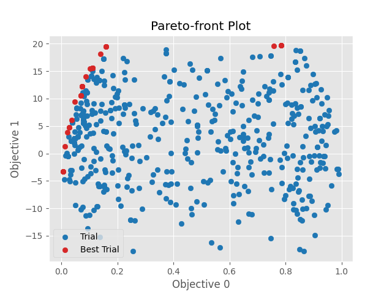
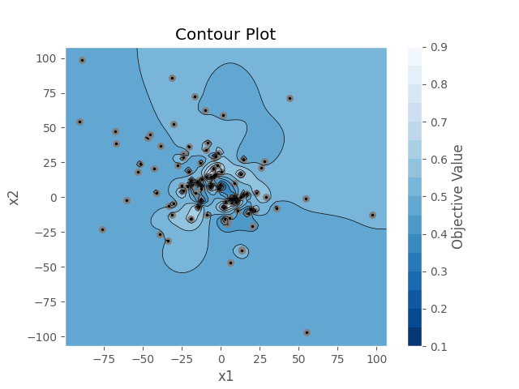
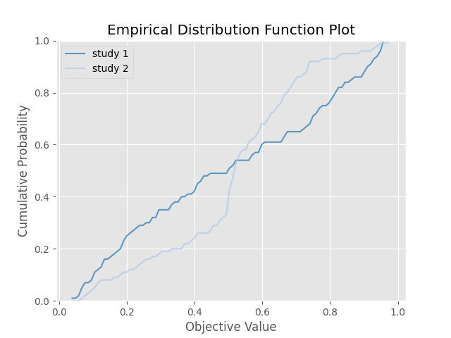
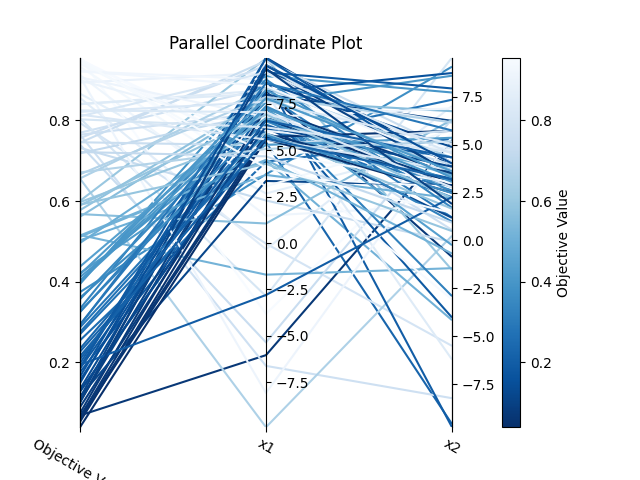
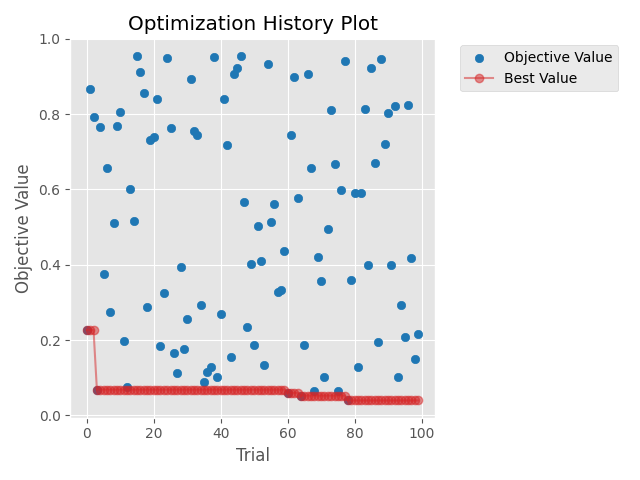
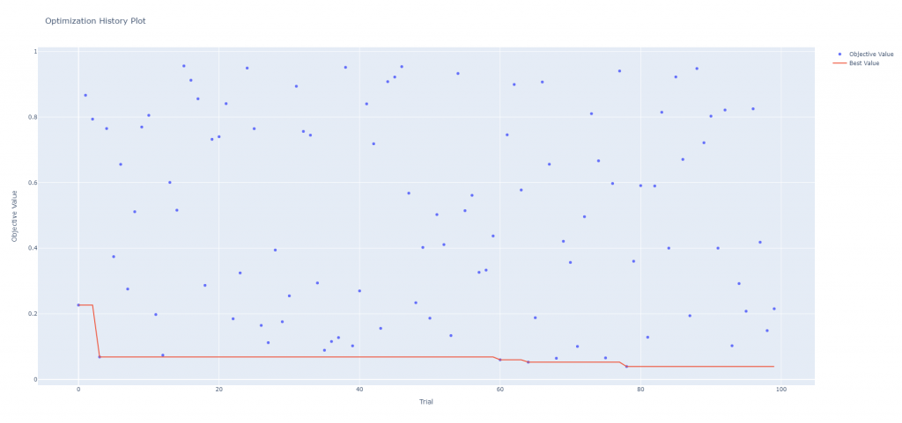
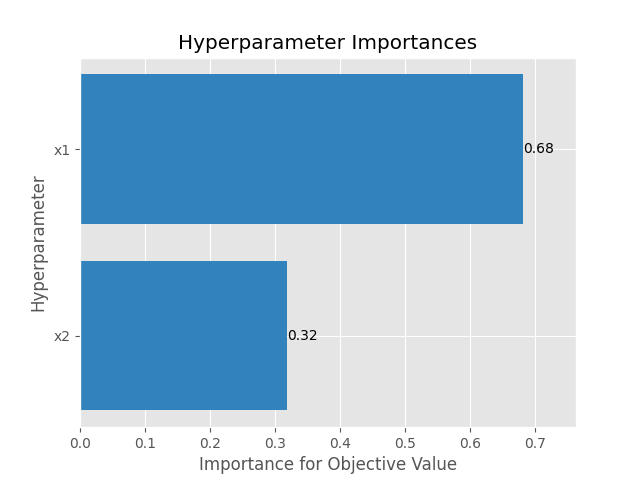

# [Day 15]由淺入深！介紹更多Optuna的API(1/2)

- Day: 15
- Date: 2024-09-21 00:03:04
- Author: golucky_sir
- Source: https://ithelp.ithome.com.tw/articles/10355312
- Series: https://ithelp.ithome.com.tw/2020-12th-ironman/articles/7610
- Series Title: 調整AI超參數好煩躁？來試試看最佳化演算法吧！

## 前言

真糟糕，[昨天](https://ithelp.ithome.com.tw/articles/10354688)把基礎的Optuna相關功能都介紹完了，昨天本來想真的「淺談」這個套件的，介紹完那天就可以比較輕鬆XD。今天本來想說把基礎功能補齊，然後介紹視覺化部分就好了，不過既然有時間那多介紹一些也無妨。  
昨天寫文章整個寫上頭了之後就把大部分我最常用的東西都介紹完了TT 好吧，那今天就要更用力的展現我的*畢生所學*了，基本上Optuna的功能還很多，不過基本上通常像昨天介紹的程式就可以應付一部分的實務應用了。  
今天就來聊聊更多Optuna的功能吧！各位有興趣可以用昨天介紹的程式範例並加上今天的內容實作看看，或多或少可以增加程式執行的效率喔。

## Optuna其他進階功能

今天要來介紹更多進階功能，一起來看看Optuna還可以幹嘛吧，若對基本功能還不熟悉的歡迎看看我[昨天]()的文章喔！

### 初始化試驗的更多方式

Optuna初始化時會有一個固定寫法：`study = optuna.create_study()`，昨天有介紹到如果要設定最佳化目標時可以使用`direction`參數來定義演算法藥最大化適應值或是最小化適應值。除此之外也有一些其他功能可以設定，這些功能可以讓試驗變得更完整，也比較容易分析結果。

- `study_name`參數：用於針對試驗取名稱，可以更加清楚這個試驗是在幹嘛的。

- `sampler`參數：用於定義演算法 **從搜索空間採樣(sample)** 的方式，這個參數預設是使用`TPESampler`，Tree-structured Parzen Estimator (TPE)這個演算法我們之後會來討論到原理，[官方文檔](https://optuna.readthedocs.io/en/stable/reference/samplers/index.html)也有詳細介紹這些採樣方式。其他採樣方式還有，每個採樣器適合的任務以及一些限制條件需要看[官方文檔](https://optuna.readthedocs.io/en/stable/reference/samplers/index.html)的說明比較好：

  - optuna.samplers.GridSampler(seed=42)：較常用的
  - optuna.samplers.RandomSampler(seed=42)：較常用的
  - optuna.samplers.TPESampler(seed=42)：較常用的，妹特別設定則預設使用這個
  - optuna.samplers.CmaEsSampler(seed=42)
  - optuna.samplers.GPSampler(seed=42)
  - optuna.samplers.PartialFixedSampler(seed=42)
  - optuna.samplers.NSGAIISampler(seed=42)
  - optuna.samplers.NSGAIIISampler(seed=42)
  - optuna.samplers.QMCSampler(seed=42)
  - optuna.samplers.BruteForceSampler(seed=42)

  > 所有採樣方式都有`seed`參數可以定義亂數種子，使亂數結果會固定住。

  `sampler`與`study_name`參數使用的用法如下：

      study = optuna.create_study(study_name='試驗名稱',
                                  sampler=optuna.samplers.TPESampler(seed=10))

### objective副程式傳遞更多參數

昨天有提到建立objective的寫法是`def objective(trial):`，但是實際應用上可能會需要進行更多複雜的應用，導致此副程式需要定義其他參數用於傳遞。現在就來介紹一下如果要傳遞其他參數的話要如何改寫程式吧。  
我們來寫個程式，讓變數的最大值跟最小值變得可以在試驗時自己定義，接著定義2組試驗分別測試不同的帶入解範圍再看看效果，我們使用[昨天](https://ithelp.ithome.com.tw/articles/10354688)提到的程式去修改。

1.  **定義副程式**：這邊一樣的定義副程式，但是可以新增其他傳遞參數。  
    `def objective(trial, high, low):`。

2.  **定義副程式內容**：這個部份我們會重新定義要帶入解的定義域範圍，也就是x1跟x2的範圍，其他都不用更動。

        x1 = trial.suggest_float('x1', low, high)
        x2 = trial.suggest_float('x2', low, high)

3.  **定義2組試驗**：昨天有提到，在定義Optuna的試驗時我們只需要將副程式的名稱作為參數傳入即可，但是這樣的壞處就是無法傳遞自定義的參數。為了解決這個問題我們要使用匿名函數`lambda`來解決，這樣就可以在傳遞參數(`objective`)的時候直接再定義一個匿名函數並直接執行`objective`副程式並傳遞自訂參數進去，具體用法如下：

        study1 = optuna.create_study(direction='minimize')
        study1.optimize(lambda trial: objective(trial, 10, -10), n_trials=100)

        study2 = optuna.create_study(direction='minimize')
        study2.optimize(lambda trial: objective(trial, 100, -100), n_trials=100)

這個部分的完整程式如下：

    import optuna
    import numpy as np
    from typing import Union

    def schaffer_function_N2(x: Union[np.ndarray, list]):
        assert len(x) == 2, 'x的長度必須為2!'
        return 0.5 + (np.sin(x[0]**2-x[1]**2)**2 - 0.5) / (1+0.001*(x[0]**2+x[1]**2))**2

    def objective(trial, high, low):
        x1 = trial.suggest_float('x1', low, high)
        x2 = trial.suggest_float('x2', low, high)

        x = [x1, x2]
        return schaffer_function_N2(x)

    study1 = optuna.create_study(direction='minimize')
    study1.optimize(lambda trial: objective(trial, 10, -10), n_trials=100)

    study2 = optuna.create_study(direction='minimize')
    study2.optimize(lambda trial: objective(trial, 100, -100), n_trials=100)

    print('第一組試驗歷史最佳適應值：', study1.best_value)
    print('第一組試驗歷史最佳解：', study1.best_params)
    print('第二組試驗歷史最佳適應值：', study2.best_value)
    print('第二組試驗歷史最佳解：', study2.best_params)

### 定義多目標最佳化

有時候要考慮深度學習模型的**效能**，以及模型計算的**時間**。一般來說，效能越好模型參數量就會多，理所當然地計算時間就會拉長，基本上這兩個目標是會**有衝突**的，所以在這之中要找到一個平衡的因素就很重要。  
通常要定義多目標問題會在`return`的部分直接定義所有回傳結果，這次我們來定義回傳`x1`和`x2`的`schaffer_function_N2`結果(要最小化)，當這個最小化時`x1`和`x2`都會趨近於0；所以我們可以再定義另一組回傳為`x1+x2`(要最大化)，當這個最大化時`x1`和`x2`都會趨近於上限，如此一來這兩個目標就會出現衝突，作為訓練模型**效能**與**時間**衝突的模擬，實際問題之後有機會再來實作看看~

1.  **設定objective副程式適應值回傳**：只需要把要回傳的目標一一回傳就好了，程式撰寫為`return schaffer_function_N2(x), x1+x2`。

2.  **設定兩個不同目標的最佳化方向**：剛剛有說到一個目標要最小化(`schaffer_function_N2(x1,x2)`)，另一個目標要最大化`x1+x2`，在初始化定義試驗時就要先設定兩個目標的最佳化方向了。程式為：`study = optuna.create_study(directions=['minimize', 'maximize'])`，注意原本的`direction`參數後面要加s變成`directions`參數，後面傳遞進去的參數為一個`list`分別代表不同目標的最佳化目標。

3.  **print出歷史較佳解**：這部分有些需要更改，因為現在有多個目標且彼此衝突，所以程式會將比較優秀的幾個結果，有**兩個目標的最佳值**跟一些**平衡兩個目標的較佳值**都會print出來，跟等等介紹的**帕雷托前沿**會有一點關係，這些解就是在帕雷托前沿上，這步驟的程式碼如下：

        for i in range(len(study.best_trials)):
            print(f'試驗歷史較佳解-{i}：', study.best_trials[i].params)
            print(f'試驗歷史較佳適應值-{i}：', study.best_trials[i].values)
            print('---我是分隔線---')

4.  **繪製帕雷托前沿(Pareto Front)結果圖**：[帕雷托效率](https://zh.wikipedia.org/zh-tw/%E5%B8%95%E7%B4%AF%E6%89%98%E6%95%88%E7%8E%87)是一個經濟學中的概念，它是指分配中的一個理想狀態，當無法同時滿足多個目標時，能夠採取的最佳解。  
    關於視覺化會在下個段落提到，但是下個段落所使用的範例都是單目標最佳化，所以在此先提到多目標可以使用的結果圖，程式碼如下。

        import matplotlib.pyplot as plt
        optuna.visualization.matplotlib.plot_pareto_front(study)
        plt.show()

    結果圖片如下圖，可以看到兩個不同目標**個別**的最佳值，以及求多目標最佳的一些前沿值。  
    

### 視覺化試驗過程

如果可以把試驗過程進行視覺化的話那就可以很方便地觀察到試驗的過程並加以分析，Optuna基本上也幫各位把這部分給做好了，Optuna有將Matplotlib做為後端，使各位可以進一步用Matplotlib來對圖片再進行修飾(但圖片原則上已經很完整了)，也可以用Matplotlib的功能儲存圖片等，相當方便。  
以下是一些視覺化過程的範例，各位若想完整了解也可以去看看[官方文檔](https://optuna.readthedocs.io/en/stable/reference/visualization/matplotlib.html)關於這部分的說明。

- **繪製參數關係等高線圖**：可以使用`optuna.visualization.matplotlib.plot_contour(study)`達成，這個圖片可以更清楚的看到不同參數之間的搭配是如何影響適應值的，我們來繪製上面應用中x1和x2的關係對應吧。

      import matplotlib.pyplot as plt
      optuna.visualization.matplotlib.plot_contour(study)
      plt.show() # 要記得把圖片顯示出來喔！

  結果如下，如果有更多試驗變數的話，會以矩陣的方式來繪製出兩兩特徵之間的關係：  
  

- **繪製目標經驗分布函數(EDF)圖**：這可以繪製不同試驗中不同的EDF結果，我們可以拿上面實作的兩組試驗來當作範例，具體用法如下，要注意**定義試驗的名稱，試驗名稱會成為圖表的線條label**：

      import matplotlib.pyplot as plt
      optuna.visualization.matplotlib.plot_edf([study1, study2])
      plt.show()

  結果如下：  
  

- **繪製高維度參數關係圖**：如果輸入變數很多的話可以使用這個來觀察每個參數的對照關係圖，多個參數搭配之間會造成的適應值。程式如下：

      import matplotlib.pyplot as plt
      optuna.visualization.matplotlib.plot_parallel_coordinate(study1)
      plt.tight_layout() # 把所有內容塞進圖表，否則有些內容會超出圖表。
      plt.show()

  結果如下，只有兩個參數的話會比較建議使用**參數關係等高線圖**，如果有更多變數的話就可以使用這個方式繪製圖片。  
  

- **繪製試驗的最佳化過程**：這個就很重要了！他可以將每次試驗的結果都繪製出來，並使用一條曲線來視覺化最佳化的過程，這樣就可以不用看著互動視窗回傳的結果，然後被數字淹沒了。程式如下：

      import matplotlib.pyplot as plt
      optuna.visualization.matplotlib.plot_optimization_history(study1)
      plt.tight_layout() # 把所有內容塞進圖表，否則有些內容會超出圖表。
      plt.show()

  結果如下，可以看到最佳化的收斂過程(紅線)，以及每次試驗的值(藍點)：  
    
  另外也有另一種快速入門的方式可以繪製，程式如下：

      fig = optuna.visualization.plot_optimization_history(study1)
      fig.show()

  執行時會開啟一個視窗，並可以提供使用者使用右上角的工具列對繪圖結果進行編輯例如放大縮小，或者特定區域放大還有儲存成圖片等功能，儲存後的圖片如下。  
  

  下圖為程式開啟視窗後會出現於右上角的工具列以及儲存圖片的功能鈕。  
  

- **繪製超參數因素重要性**：隨著試驗次數增加，可以更準確的計算出試驗中不同因素對最佳值搜索的重要性，若該因素重要性低就可以在之後實驗捨棄掉該因素，讓最佳化可以更簡便。程式碼如下：

      import matplotlib.pyplot as plt
      optuna.visualization.matplotlib.plot_param_importances(study1)
      plt.show()

  結果如下，因為使用測試函數所以基本上每個參數都是必不可缺的，不過在之後深度學習模型最佳化就可以用這種方式刪除掉不重要的因素。  
  

## 結語

今天花了蠻多時間介紹Optuna的其他功能，基本上官方的說明文件裡面還有許多功能可以開發，不過我覺得在目前階段這些功能應該就足夠了。明天會來帶各位用這兩天學習到的內容來進行更多的演練，使各位可以更加清楚這個套件的功能，與程式開發時的一些技巧與步驟等。

## 附錄：完整程式(多目標最佳化)

    import matplotlib.pyplot as plt
    import optuna
    import numpy as np
    from typing import Union

    def schaffer_function_N2(x: Union[np.ndarray, list]):
        assert len(x) == 2, 'x的長度必須為2!'
        return 0.5 + (np.sin(x[0]**2-x[1]**2)**2 - 0.5) / (1+0.001*(x[0]**2+x[1]**2))**2

    def objective(trial, high, low):
        x1 = trial.suggest_float('x1', low, high)
        x2 = trial.suggest_float('x2', low, high)
        x = [x1, x2]
        return schaffer_function_N2(x), x1+x2

    study = optuna.create_study(directions=['minimize', 'maximize'])
    study.optimize(lambda trial: objective(trial, 10, -10), n_trials=500)

    # print出歷史較佳解
    for i in range(len(study.best_trials)):
        print(f'試驗歷史較佳解-{i}：', study.best_trials[i].params)
        print(f'試驗歷史較佳適應值-{i}：', study.best_trials[i].values)
        print('---我是分隔線---')

    # 繪製帕雷托前沿(Pareto Front)結果圖
    optuna.visualization.matplotlib.plot_pareto_front(study)
    plt.show()

## 附錄：完整程式(繪圖部分)

    import matplotlib.pyplot as plt
    import optuna
    import numpy as np
    from typing import Union

    def schaffer_function_N2(x: Union[np.ndarray, list]):
        assert len(x) == 2, 'x的長度必須為2!'
        return 0.5 + (np.sin(x[0]**2-x[1]**2)**2 - 0.5) / (1+0.001*(x[0]**2+x[1]**2))**2

    def objective(trial, high, low):
        x1 = trial.suggest_float('x1', low, high)
        x2 = trial.suggest_float('x2', low, high)
        x = [x1, x2]
        return schaffer_function_N2(x)

    sampler = optuna.samplers.TPESampler(seed=10)
    study1 = optuna.create_study(study_name='study 1', direction='minimize', sampler=sampler)
    study1.optimize(lambda trial: objective(trial, 10, -10), n_trials=100)
    study2 = optuna.create_study(study_name='study 2', direction='minimize', sampler=sampler)
    study2.optimize(lambda trial: objective(trial, 100, -100), n_trials=100)

    print('第一組試驗歷史最佳適應值：', study1.best_value)
    print('第一組試驗歷史最佳解：', study1.best_params)
    print('第二組試驗歷史最佳適應值：', study2.best_value)
    print('第二組試驗歷史最佳解：', study2.best_params)

    # 繪製參數關係等高線圖
    optuna.visualization.matplotlib.plot_contour(study1)
    plt.show()
    # 繪製目標經驗分布函數(EDF)圖
    optuna.visualization.matplotlib.plot_edf([study1, study2])
    plt.show()
    # 繪製高維度參數關係圖
    optuna.visualization.matplotlib.plot_parallel_coordinate(study1)
    plt.show()
    # 繪製試驗的最佳化過程
    optuna.visualization.matplotlib.plot_optimization_history(study1)
    plt.tight_layout()
    plt.show()
    # 繪製試驗的最佳化過程(另一種開啟視窗並編輯&儲存的方式)
    fig = optuna.visualization.plot_optimization_history(study1)
    fig.show()
    # 繪製超參數因素重要性
    optuna.visualization.matplotlib.plot_param_importances(study1)
    plt.show()
