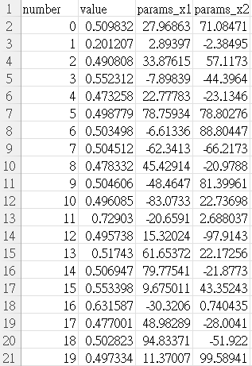

# [Day 16]由淺入深！介紹更多Optuna的API (2/2)

- Day: 16
- Date: 2024-09-22 00:01:56
- Author: golucky_sir
- Source: https://ithelp.ithome.com.tw/articles/10355939
- Series: https://ithelp.ithome.com.tw/2020-12th-ironman/articles/7610
- Series Title: 調整AI超參數好煩躁？來試試看最佳化演算法吧！

## 前言

[昨天](https://ithelp.ithome.com.tw/articles/10355312)和[前天](https://ithelp.ithome.com.tw/articles/10354688)分別介紹了Optuna的基礎功能、程式開發步驟以及一些進階的功能，例如多目標最佳化、最佳化試驗視覺化。在進入實作之前我想再最後分享一下幾個技巧，這些技巧對之後專案開發一定有很大的幫助，事不宜遲趕快來看看吧。

## 查看該次試驗的資訊

在最佳化試驗全部結束後使用`print(study.trials)`可以看到一大串東西，他主要是一個`list`，裡面有很多`FrozenTrial`物件，這個物件會儲存每一次試驗的資訊，這裡面會包含所有**試驗的屬性**以及它們的**值**，接下來我們來看看這些資料裡面包含甚麼吧。  
另外也可以使用`print(study.best_trials)`來輸出所有試驗中成果最佳的試驗，該次試驗會包含的資料也如下列所示。

- number：該次試驗的編號。
- state：試驗的狀態，通常有成功回傳的話狀態就會是「完成」，像這樣`TrialState.COMPLETE`。
- values：該次試驗的適應值(fitness value)，或者是說目標函數的值。
- datetime_start：試驗開始的時間，時間是2024年5月7號21時14分39秒，這段程式是我在幾個月前的學習的時候跑的。
- datetime_complete：試驗結束的時間。
- params：該次試驗帶入目標函數的所有參數以及它們的值。
- user_attrs：使用者可以在目標函數計算中自定義屬性，用於記錄一些特殊資訊用的，這個等等會提到。
- system_attrs：系統的屬性，目前我使用的版本似乎沒辦法隨便更改內容。
- intermediate_values：這個我目前還不確定實際功能是幹嘛的，再麻煩知道的大大賜教了~
- distribution：所有帶入參數的資訊，基本上就是目標函數中設定的形式，Optuna會把它紀錄下來。
- trial_id：試驗的ID，具體用途在基本的實務上應該不會用到。
- value：這也是適應值，但通常會回傳在values中，且values和value不能同時被使用。

<!-- -->

    FrozenTrial(number=0, 
                state=TrialState.COMPLETE, 
                values=[0.4626360994149012], 
                datetime_start=datetime.datetime(2024, 5, 7, 21, 14, 39, 63780), 
                datetime_complete=datetime.datetime(2024, 5, 7, 21, 14, 39, 338758), 
                params={'x1': 35.92214190366306, 'x2': 25.7225766159348}, 
                user_attrs={'hello attribute': 'hello!'}, 
                system_attrs={}, 
                intermediate_values={}, 
                distributions={'x1': FloatDistribution(high=100.0, log=False, 
                                                       low=-100.0, step=None), 
                               'x2': FloatDistribution(high=100.0, log=False, 
                                                       low=-100.0, step=None)}, 
                trial_id=1, 
                value=None)

以上就是一個試驗中會有的所有屬性，若要輸出特定屬性的話，可以使用`print(study.trials[索引值].屬性名稱)`。例如要輸出第3次試驗的`values`屬性就可以這樣寫`print(study.trials[2].values)`。

## 新增用戶屬性

剛剛討論到每次試驗的內容都有`user_attrs`屬性，這個屬性是可以在`objective`副程式中新增的，新增的方法為`trial.set_user_attr('屬性名稱', 屬性內容)`，`屬性名稱`是唯一的不可重複，`屬性內容`可以是任何形式的資料。  
例如要新增一個`'hello attribute'`屬性，內容是`'hello!'`的話可以寫`trial.set_user_attr('hello attribute', 'hello!')`，那就會像上一個段落一樣`user_attrs`屬性中有我們新增的自定義屬性。  
完整程式如下：

    def objective(trial):
        x1 = trial.suggest_float('x1', -100, 100)
        x2 = trial.suggest_float('x2', -100, 100)
        x = [x1, x2]
        # 新增用戶屬性
        trial.set_user_attr('hello attribute', 'hello!')
        return schaffer_function_N2(x)

## 自定義停止條件

有時候實驗在很早期就找到了很不錯的數值，經過權衡利弊考量決定停止實驗(早點結束實驗早點召喚峽谷見XD)，或是無論怎麼調總是差臨門一腳，於是鐵了心要跑幾千幾萬次試驗，直到找到滿意的值才要**停下**，那要如何停下呢？接下來就要來教各位如何自定義停止條件，通常步驟有4個。

> 情境範例：今天我要來找schaffer_function_N2的最佳值，目標是要找到**適應值低於0.001**的解組合就好了。但我跑很多次都沒有成功(這只是舉例)，所以希望試驗100,000次，如果有**成功找到2組可以達標的解**就停下來。

1.  **定義停止的Callback類別**：在Optuna中通常會定義一個類別，當作callback的設定，以及條件的判斷，這個類別不需要繼承甚麼，直接定義即可。`class StopWhenFitnessValueLowerThanThresholdCallback:`

2.  **定義初始化的方法跟類別屬性**：接著要來定義初始化的方法，剛剛有說到我們的目標有兩個：1.找到適應值低於**0.001**的解組合；2.成功找到**2**組可以達標的解。  
    **適應值閥值**與**達標次數**這兩個就可以做為類別的屬性，可以讓使用者在後續再根據情況修改。其中`self._stop_count`是達標的次數，會用在類別中的判斷，如果達標一次就會+1，達標次數等於`stop_times`的話就可以讓試驗停止了。

        def __init__(self,
                 threshold: float,
                 stop_times: int):
        '''

        Args:
            threshold: 適應值低於閥值threshold就算達標一次。
            stop_times: 要達標的次數，完成達標的次數後就可以停止試驗了。
        '''
        self.threshold = threshold
        self.stop_times = stop_times
        self._stop_count = 0  # 達標次數

3.  **定義\_\_call\_\_方法**：當試驗執行時，在回傳適應值後如果有設定callback的話就會執行該callback的`__call__`方法，該方法的參數傳遞內容是不可更動的，要注意一下。`def __call__(self, study: optuna.study.Study, trial: optuna.trial.FrozenTrial) -> None:`  
    接下來就可以定義該方法中實際要執行甚麼事情了，剛剛說到首先試驗的適應值屬性(`values`屬性，前兩個段落有提到)低於閥值(`self.threshold`)時就可以讓達標次數+1(`self._stop_count += 1`)。  
    另外如果達標次數有超過我們設定的達標次數的話就可以讓試驗終止了，終止之後就視為最佳化完成，接著就可以進行後續的處理了，後續的處理方式可以看看我[第13天](https://ithelp.ithome.com.tw/articles/10353999)的介紹喔。  
    總之`__call__`方法定義的完整程式如下：

        def __call__(self, study: optuna.study.Study, trial: optuna.trial.FrozenTrial) -> None:
            # 試驗的適應值屬性低於閥值讓達標次數+1
            if trial.values[0] <= self.threshold:
                self._stop_count += 1
            # 如果達標次數有超過設定的達標次數，就可以讓試驗終止
            if self._stop_count >= self.stop_times:
                # 終止試驗
                study.stop()

4.  **主程式中調用定義的callback**：接著要在主程式中定義要調用的callback，另外在最佳化的時候記得要使用該callback喔。執行最佳化的方法可以透過指定參數`callbacks`來傳遞callback的調用，記得要用`list`來包所有callback，可以傳遞許多callback，callback的用途跟內容也可以不一樣。

        # 定義要調用的callback，閥值為0.001，成功次數為2
        stop_callback = StopWhenFitnessValueLowerThanThresholdCallback(threshold=0.001, stop_times=2)
        study = optuna.create_study(direction='minimize')
        # 在最佳化方法optimize中使用參數callbacks傳遞我們定義的callback進去，可以指定許多callback
        study.optimize(lambda trial: objective(trial, high=100, low=-100), n_trials=100000, callbacks=[stop_callback])

    我設定100000次試驗，但我執行的時候運氣很好，跑了163次就停了(省了不少時間呢)，停止時的適應值只有0.0008058220229104629，每台電腦跑出來可能都不相同，不過自定義的callback大概就是這個概念，各位可以根據需求來自定義自己的callback！

    > callback通常是在回傳適應值之後會呼叫的方法，功能是可以自定義的，不一定只會用在停止條件的設定中，各位可以根據需求來決定要不要使用callback。

## 儲存試驗與採樣器、調用試驗與採樣器

有時候試驗跑完了之後，但發覺**仍然不夠優**，想要再接著之前的進度最佳化，或是其他原因等有需要儲存試驗結果時就可以使用等等要分享的東西了，通常試驗會儲存成**db資料庫**的形式。另外試驗所使用的採樣方式也可以透過儲存成**pkl檔案**的形式來保留。  

### 儲存該次試驗

儲存試驗時首先要**定義試驗的名稱**，接著定義**資料庫名稱**，最後就依據以往的方式進行最佳化即可，建立起來很簡單。

    # 定義試驗的名稱，相同試驗名稱相同，不同試驗名稱不可相同
    study_name = "ithome-Day16-study"
    # 定義要儲存的資料庫名稱
    storage_name = f"sqlite:///{study_name}.db"
    # 建立一個新的試驗並儲存試驗
    study = optuna.create_study(study_name=study_name,  # 試驗名稱
                                storage=storage_name)  # 資料庫名稱
    study.optimize(objective, n_trials=10)
    # 跑完最佳化就會自動儲存該次試驗成資料庫囉

> 要注意一下若資料庫已經存在後就**不可以再重複儲存了**，否則會噴錯誤，切記！

### 調用已儲存的試驗

調用試驗其實也很簡單，還是一樣就是使用`create_study`就好，只是要定義**資料庫名稱**跟**試驗名稱**，並且指定參數`load_if_exists`為`True`就好，其他部分都跟以往的方式相同。

    # 調用已經儲存的試驗
    study = optuna.create_study(study_name=study_name, storage=storage_name, load_if_exists=True)
    study.optimize(objective, n_trials=10)

> 每次調用已儲存的試驗並跑完最佳化後都會把歷史紀錄儲存起來，舊的資料並不會消失喔。

### 儲存採樣器

儲存採樣器也是非常簡單，可以秒殺的部分，使用pickle模組就可以將採樣器儲存成pkl檔案了。

    import pickle
    # 儲存採樣器
    with open("sampler.pkl", "wb") as f:
        pickle.dump(study.sampler, f)

### 調用儲存的採樣器

這部分也很簡單，首先使用pickle模組**載入剛剛儲存的採樣器pkl檔案**，接著在定義試驗時(`optuna.create_study()`)指定參數`sampler`為剛剛載入的檔案就好了，其他操作都沒有變。

    # 載入已儲存的採樣器
    my_sampler = pickle.load(open("sampler.pkl", "rb"))
    # 使用已儲存的採樣器(跟已儲存的試驗，只指定sampler也可以)。
    study = optuna.create_study(study_name=study_name, storage=storage_name, load_if_exists=True, sampler=my_sampler)
    study.optimize(objective, n_trials=3)

## 將試驗內容儲存成csv檔案

這個技巧也是很重要的部分，儲存成csv檔案後在後續分析或者確認實驗過程都會非常非常方便。我們可以使用`study.trials_dataframe()`方法來將試驗的資料輸出成pandas的`DataFrame`形式。接著處理就是比照pandas模組就好了~  
`study.trials_dataframe()`方法中只有一個參數要填，那就是`attrs`參數，這個參數接受元組`Tuple`輸入，`Tuple`中的元素就是今天一開始提到的**試驗屬性**喔。例如要儲存**試驗編號**、**試驗的適應值**、**試驗的輸入參數**的話就可以使用`df = study.trials_dataframe(attrs=("number", "value", "params"))`。  
接著儲存後就可以看到試驗的csv檔案囉，這部分的完整程式如下！

    # study是要執行最佳化的試驗
    df = study.trials_dataframe(attrs=("number", "value", "params"))
    df.to_csv('study_history.csv', index=False)  # 不儲存索引值，因為已經儲存"number"了。

接著看相同路徑下就可以找到csv檔案了，檔案內容如下圖，需要儲存的資料都整理得乾乾淨淨。  

## 結語

今天介紹了幾個實用功能的實作方式，希望各位都有理解，若沒有理解或者有問題都可以在底下問我喔~因為Optuna版本更迭之後有些功能都會修改，所以造成有時候需要上官網或者相關論壇去看看有沒有解決辦法。  
另外明天開始我會帶各位用Optuna來實作一些常用的任務，各位可以趁熱將這個套件用得更加熟練，掌握了這個套件之後我相信未來做類似應用都會幫上忙的。

## 附錄：完整程式(自定義停止條件)

    import optuna
    import numpy as np
    from typing import Union

    class StopWhenFitnessValueLowerThanThresholdCallback:
        def __init__(self,
                     threshold: float,
                     stop_times: int):
            '''

            Args:
                threshold: 適應值低於閥值threshold就算達標一次。
                stop_times: 要達標的次數，完成達標的次數後就可以停止試驗了。
            '''
            self.threshold = threshold
            self.stop_times = stop_times
            self._stop_count = 0

        def __call__(self, study: optuna.study.Study, trial: optuna.trial.FrozenTrial) -> None:
            # 試驗的適應值屬性低於閥值讓達標次數+1
            if trial.values[0] <= self.threshold:
                self._stop_count += 1
                
            # 如果達標次數有超過設定的達標次數，就可以讓試驗終止
            if self._stop_count >= self.stop_times:
                # 終止試驗
                study.stop()

    def schaffer_function_N2(x: Union[np.ndarray, list]):
        assert len(x) == 2, 'x的長度必須為2!'
        return 0.5 + (np.sin(x[0]**2-x[1]**2)**2 - 0.5) / (1+0.001*(x[0]**2+x[1]**2))**2

    def objective(trial, high, low):
        x1 = trial.suggest_float('x1', low, high)
        x2 = trial.suggest_float('x2', low, high)
        x = [x1, x2]
        return schaffer_function_N2(x)

    # 定義要調用的callback，閥值為0.001，成功次數為2
    stop_callback = StopWhenFitnessValueLowerThanThresholdCallback(threshold=0.001, stop_times=2)
    study = optuna.create_study(direction='minimize')
    # 在最佳化方法optimize中使用參數callbacks傳遞我們定義的callback進去，可以指定許多callback
    study.optimize(lambda trial: objective(trial, high=100, low=-100), n_trials=100000, callbacks=[stop_callback])

## 附錄：完整程式(檔案操作)

    import optuna
    import numpy as np
    from typing import Union

    def schaffer_function_N2(x: Union[np.ndarray, list]):
        assert len(x) == 2, 'x的長度必須為2!'
        return 0.5 + (np.sin(x[0]**2-x[1]**2)**2 - 0.5) / (1+0.001*(x[0]**2+x[1]**2))**2

    def objective(trial):
        x1 = trial.suggest_float('x1', -100, 100)
        x2 = trial.suggest_float('x2', -100, 100)
        x = [x1, x2]
        return schaffer_function_N2(x)

    # 儲存該次試驗 & 調用已儲存的試驗
    # 定義試驗的名稱，相同試驗名稱相同，不同試驗名稱不可相同
    study_name = "ithome-Day16-study"
    # 定義要儲存的資料庫名稱
    storage_name = f"sqlite:///{study_name}.db"

    # 建立一個新的試驗並儲存試驗
    study = optuna.create_study(study_name=study_name,  # 試驗名稱
                                storage=storage_name)  # 資料庫名稱
    study.optimize(objective, n_trials=10)
    # 跑完最佳化就會自動儲存該次試驗成資料庫囉

    # 調用已經儲存的試驗
    study = optuna.create_study(study_name=study_name, storage=storage_name, load_if_exists=True)
    study.optimize(objective, n_trials=10)

    # 儲存採樣器 & 調用儲存的採樣器
    import pickle
    # 儲存採樣器
    with open("sampler.pkl", "wb") as f:
        pickle.dump(study.sampler, f)

    # 載入已儲存的採樣器
    my_sampler = pickle.load(open("sampler.pkl", "rb"))
    # 使用已儲存的採樣器，跟已儲存的試驗。
    study = optuna.create_study(study_name=study_name, storage=storage_name, load_if_exists=True, sampler=my_sampler)
    study.optimize(objective, n_trials=3)

    # 將試驗內容儲存成csv檔案
    df = study.trials_dataframe(attrs=("number", "value", "params"))
    df.to_csv('study_history.csv', index=False)
