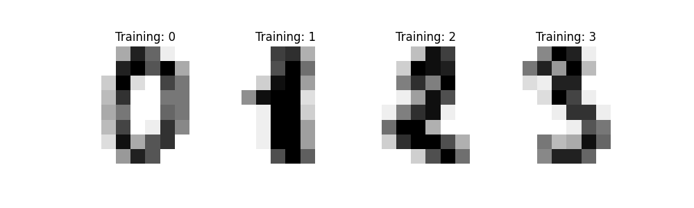
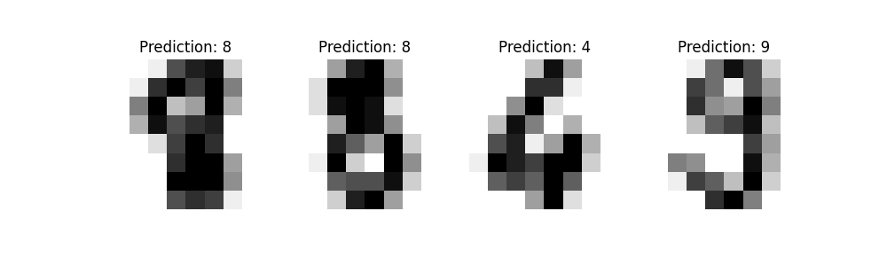
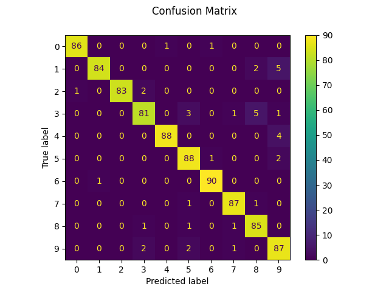
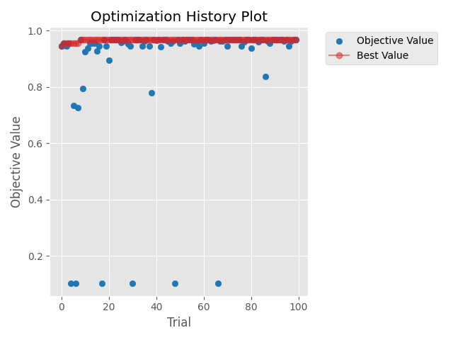

# [Day 17]打鐵趁熱！來試著使用Optuna解決問題吧

- Day: 17
- Date: 2024-09-23 00:23:29
- Author: golucky_sir
- Source: https://ithelp.ithome.com.tw/articles/10355938
- Series: https://ithelp.ithome.com.tw/2020-12th-ironman/articles/7610
- Series Title: 調整AI超參數好煩躁？來試試看最佳化演算法吧！

## 前言

前三天花了許多時間來向各位介紹Optuna的一些基本功能還有進階的實作，希望各位都有確實學會，如果還不清楚那三天在幹嘛的話歡迎來複習我在[D14](https://ithelp.ithome.com.tw/articles/10354688)、[D15](https://ithelp.ithome.com.tw/articles/10355312)、[D16](https://ithelp.ithome.com.tw/articles/10355939)介紹的內容喔。  
今天來帶各位實作一些簡單的相關應用，就是帶各位來實作`sk-learn`機器學習模型的最佳化，過了快一半了終於進入到模型最佳化的部分了，好感動QQ

## 最佳化機器學習模型

我們先來做個情境假設，今天需要做的任務是：使用機器學習的**SVC模型**，進行**手寫數字辨識**的任務，目標是**準確率有超過97%**。接下來就來構思問題跟釐清思路吧。

### 構思問題

接下來我們來構思一下這次程式要有甚麼功能，可以看看我[之前](https://ithelp.ithome.com.tw/articles/10348507)的介紹，這是我在規劃這類型程式會思考的一些心法，每個人或多或少都會有一些不同，這部分內容見仁見智，若沒有特別想法也可以參考看看那些我會思考的要點喔。

| 5W1H  | 規劃內容                                                                                                    |
|-------|-------------------------------------------------------------------------------------------------------------|
| Why   | 最佳化ML的SVC模型，目標為準確率超過97%                                                                      |
| What  | 最佳化問題是手寫數字辨識的分類任務，以準確率作為適應值                                                      |
| Who   | 預計對SVC中的kernel選擇與gamma參數進行最佳化                                                                |
| Where | 預計SVC的gamma參數設定值為0.0001 ~ 0.01；將所有可用的kernel都拿來使用看看(`kernel='precomputed'`是不可用的) |
| When  | 實現混淆矩陣、分類報告以及計算準確率後進行最佳化                                                            |
| How   | 使用Optuna                                                                                                  |

### 撰寫程式

首先我們來撰寫機器學習的部分，這部分因為與本系列主題較無相關，所以就直接上程式碼了，主要流程就是載入資料集、定義SVC以及超參數(我們這個例子探討核函數的使用與gamma值，對SVC不熟悉可以看看[這篇教學](https://ithelp.ithome.com.tw/m/articles/10270447))、訓練SVC、預測並將結果可視化、最後將混淆矩陣跟準確率等都輸出。這段程式我使用sklearn的範例來進行修改，各位若對程式不熟也不妨去該篇[教學範例](https://scikit-learn.org/stable/auto_examples/classification/plot_digits_classification.html#sphx-glr-auto-examples-classification-plot-digits-classification-py)看看喔。

> 這個範例所跑出來的結果目前是最優秀的結果，為了讓最佳化有意義。所以我們來嘗試看看在完全不知道參數咬使用多少的情況下，先隨便帶入一組參數，就用`gamma=0.05`和`kernel='poly'`看看吧。

    import numpy as np
    import matplotlib.pyplot as plt
    from sklearn import datasets, metrics, svm
    from sklearn.model_selection import train_test_split

    def plot_data(img: np.ndarray, 
                  target: np.ndarray, 
                  title: str):
        """
        將圖片、類別、圖表標題輸入並繪製出圖片資料的預覽圖片。
        
        :param img: 輸入的圖片資料
        :param target: 輸入的類別(真實類別或者預測類別)
        :param title: 圖片的標題(訓練資料或者預測資料)
        :return: None
        """
        _, axes = plt.subplots(nrows=1, ncols=4, figsize=(10, 3))
        for ax, image, label in zip(axes, img, target):
            ax.set_axis_off()
            image = image.reshape(8, 8)
            ax.imshow(image, cmap=plt.cm.gray_r, interpolation="nearest")
            ax.set_title(f"{title}: %i" % label)
    def plot_confusion_matrix(true_label: np.ndarray, 
                              predict_label: np.ndarray):
        """
        取得混淆矩陣中的資料，並繪製混淆矩陣圖繪製出來。

        :param true_label: 真實的類別
        :param predict_label: 預測的類別
        :return: None
        """

        disp = metrics.ConfusionMatrixDisplay.from_predictions(true_label, predict_label)
        disp.figure_.suptitle("Confusion Matrix")
        print(f"Confusion matrix:\n{disp.confusion_matrix}")
        plt.show()

    def print_classfication_report(true_label: np.ndarray, 
                                   predict_label: np.ndarray):
        """
        將混淆矩陣資料作為輸入，並進一步計算準確率作為回傳值。

        :param true_label: 真實的類別
        :param predict_label: 預測的類別
        :return: 預測資料的準確率。
        """

        print("Classification report rebuilt from confusion matrix:\n"
              f"{metrics.classification_report(true_label, predict_label)}\n")
        accuracy = metrics.accuracy_score(true_label, predict_label)
        return accuracy

    # 載入訓練資料
    digits = datasets.load_digits()
    # 將資料內容進行可視化，每張圖片都是8*8大小的，共1797張圖片
    plot_data(digits.images, digits.target, 'Training')

    # 將二維圖片資料展開為一維度的向量
    n_samples = len(digits.images)
    data = digits.images.reshape((n_samples, -1))  # shape=(1797, 64)

    # 把資料拆成一半訓練集一半測試集
    X_train, X_test, y_train, y_test = train_test_split(data, digits.target, test_size=0.5, shuffle=False)

    # 建立SVC模型
    clf = svm.SVC(gamma=0.05, kernel='poly')

    # 訓練SVC模型
    clf.fit(X_train, y_train)
    # 用測試集來預測資料
    predicted = clf.predict(X_test)

    # 將測試資料與預測的類別畫出來
    plot_data(X_test, predicted, 'Prediction')

    # 建立混淆矩陣並輸出圖片
    plot_confusion_matrix(y_test, predicted)

    # 產生分類報告，包含每個類別各自預測的情況以及各項指標
    acc = print_classfication_report(y_test, predicted)

可以看到以下結果：

- 資料集預覽圖：  
  
- 預測資料預覽圖：  
  
- 混淆矩陣圖:  
  
- 測試資料預測準確率：`0.9555061179087876`，四捨五入約為95.55%。

### 實現Optuna最佳化

將原本的程式進行了一些整理，整理完成後的上述程式接下來就要拿來修改並進行最佳化啦，首先我們根據之前介紹的流程來進行程式的開發：

1.  **定義目標函數**：新增一個副程式作為最佳化時要執行的副程式吧，在訓練時因為訓練與測試資料都是固定的，所以希望可以把這些資料都作為參數帶進去，程式撰寫為：

        def objective(trial,
                      X_train: np.ndarray,
                      X_test: np.ndarray,
                      y_train: np.ndarray,
                      y_test: np.ndarray):

2.  **新增要帶入目標函數的變數**：根據剛剛構思的內容，這次我們要帶入SVC的gamma值和核函數的選擇，gamma的範圍設定在0.0001~0.01之間；核函數的選擇有`"linear"`, `"poly"`, `"rbf"`, `"sigmoid"`這四個，程式的撰寫如下。

        gamma = trial.suggest_float('gamma', 0.0001, 0.01)
        kernel = trial.suggest_categorical('kernel', ["linear", "poly", "rbf", "sigmoid"])
        # 建立SVC模型
        clf = svm.SVC(gamma=gamma, kernel=kernel)

3.  **新增其他功能**：這部分我們可以根據剛剛教學的範例程式新增繪製預測類別的圖、輸出混淆矩陣圖片等功能，但因為這樣每次試驗都會產生圖片，有時候圖片就會變得太多。這部分各位可以根據自己的需求改為儲存圖片，或者儲存成csv等格式等等。

        # 將測試資料與預測的類別畫出來
        plot_data(X_test, predicted, 'Prediction')  #可以根據需求不使用或者更改
        # 建立混淆矩陣並輸出圖片
        plot_confusion_matrix(y_test, predicted)  #可以根據需求不使用或者更改
        # 產生分類報告，包含每個類別各自預測的情況以及各項指標
        acc = print_classfication_report(y_test, predicted)

4.  **定義回傳適應值**：接著要回傳準確率作為我們最佳化的目標適應值，這部分就直接回傳就好了，我們可以使用`metrics.accuracy_score(真實類別, 預測類別)`將正確的類別與預測的類別輸入並得到預測的準確率。  
    所以在目標函數執行的副程式會變成這樣，主要就是把剛剛範例的片段直接變成副程式就好了：

        def objective(trial,
                  X_train: np.ndarray,
                  X_test: np.ndarray,
                  y_train: np.ndarray,
                  y_test: np.ndarray):

            gamma = trial.suggest_float('gamma', 0.0001, 0.01)
            kernel = trial.suggest_categorical('kernel', ["linear", "poly", "rbf", "sigmoid"])
            # 建立SVC模型
            clf = svm.SVC(gamma=gamma, kernel=kernel)
            # 訓練SVC模型
            clf.fit(X_train, y_train)
            # 用測試集來預測資料
            predicted = clf.predict(X_test)
            # 將測試資料與預測的類別畫出來
            # plot_data(X_test, predicted, 'Prediction')  #可以根據需求不使用或者更改
            # 建立混淆矩陣並輸出圖片
            # plot_confusion_matrix(y_test, predicted)  #可以根據需求不使用或者更改
            # 產生分類報告，包含每個類別各自預測的情況以及各項指標
            acc = print_classfication_report(y_test, predicted)
            return acc

5.  **定義一個試驗**：接著定義最佳化試驗，最佳化目標是要讓**準確率最大化**，另外希望可以讓每次結果都相同，所以在採樣(sample)的部分設定一下亂數種子，所以程式撰寫就會變成：

        study = optuna.create_study(direction='maximize', sampler=optuna.samplers.TPESampler(seed=42))

6.  **執行最佳化**：接著就執行最佳化就好了，最佳化試驗次數我們設定100。

        study.optimize(lambda trial: objective(trial, X_train, X_test, y_train, y_test), n_trials=100)

7.  **將最佳解print出來**：最後試驗完成後將最佳解組合與該組合下的最高準確率給print出來，最佳參數組合與執行過後的最高準確率如下表，準確率接近97%已經比剛剛設定的96.55%高了一些，這也跟官方範例給的準確率相同，我猜可能這相關研究也有使用最佳化應用來找出適合的參數組合。

    > 不過因為資料都已經處理得很完善，所以準確率基本上不會差太多，但使用自己的資料或者沒有經過完整處理的資料在訓練上就會出現參數設定不同導致準確率差異大的情況了。

        print(study.best_params)
        print(study.best_value)

| 參數名稱   | 參數數值              |
|------------|-----------------------|
| gamma      | 0.0008376340032534458 |
| kernel     | `'rbf'`               |
| **準確率** | **96.89%**            |

1.  **查看程式執行過程**：這部分可以將最佳化的收斂方式給畫出來，或者做一些其他的繪圖分析，以本例來說我繪製了試驗過程的收斂曲線，各位可以根據本身的需求去新增其他相關功能。

        optuna.visualization.matplotlib.plot_optimization_history(study)
        plt.tight_layout()  
        plt.show()

    收斂圖如下，看的出來在最佳化初期就找到最佳解了，如果用更複雜的模型、調整更多參數的話，收斂圖就不會看起來哪麼順利了。  
    

## 結語

今天帶各位實作了機器學習最佳化模型的應用，希望各位可以趁這次練習將Optuna用得更上手，Optuna中採樣方式預設是使用Tree-structured Parzen Estimator (TPE)。在進入其他應用前我認為應該先開個新視窗來講解一下TPE演算法，希望各位不會被數學給淹沒，也希望各位看完明天的文章後可以對TPE以及Optuna的一些後端原理能有一些認識。

## 附錄：完整程式(最佳化機器學習模型)

    import optuna
    import numpy as np
    from typing import Union
    import matplotlib.pyplot as plt
    from sklearn import datasets, metrics, svm
    from sklearn.model_selection import train_test_split

    def plot_data(img: np.ndarray,
                  target: np.ndarray,
                  title: str):
        """
        將圖片、類別、圖表標題輸入並繪製出圖片資料的預覽圖片。

        :param img: 輸入的圖片資料
        :param target: 輸入的類別(真實類別或者預測類別)
        :param title: 圖片的標題(訓練資料或者預測資料)
        :return: None
        """
        _, axes = plt.subplots(nrows=1, ncols=4, figsize=(10, 3))
        for ax, image, label in zip(axes, img, target):
            ax.set_axis_off()
            image = image.reshape(8, 8)
            ax.imshow(image, cmap=plt.cm.gray_r, interpolation="nearest")
            ax.set_title(f"{title}: %i" % label)
    def plot_confusion_matrix(true_label: np.ndarray,
                              predict_label: np.ndarray):
        """
        取得混淆矩陣中的資料，並繪製混淆矩陣圖繪製出來。

        :param true_label: 真實的類別
        :param predict_label: 預測的類別
        :return: None
        """

        disp = metrics.ConfusionMatrixDisplay.from_predictions(true_label, predict_label)
        disp.figure_.suptitle("Confusion Matrix")
        print(f"Confusion matrix:\n{disp.confusion_matrix}")
        plt.show()

    def print_classfication_report(true_label: np.ndarray,
                                   predict_label: np.ndarray):
        """
        將混淆矩陣資料作為輸入，並進一步計算準確率作為回傳值。

        :param true_label: 真實的類別
        :param predict_label: 預測的類別
        :return: 預測資料的準確率。
        """

        print("Classification report rebuilt from confusion matrix:\n"
              f"{metrics.classification_report(true_label, predict_label)}\n")
        accuracy = metrics.accuracy_score(true_label, predict_label)
        return accuracy

    def objective(trial,
                  X_train: np.ndarray,
                  X_test: np.ndarray,
                  y_train: np.ndarray,
                  y_test: np.ndarray):

        gamma = trial.suggest_float('gamma', 0.0001, 0.01)
        kernel = trial.suggest_categorical('kernel', ["linear", "poly", "rbf", "sigmoid"])
        # 建立SVC模型
        clf = svm.SVC(gamma=gamma, kernel=kernel)
        # 訓練SVC模型
        clf.fit(X_train, y_train)
        # 用測試集來預測資料
        predicted = clf.predict(X_test)
        # 將測試資料與預測的類別畫出來
        # plot_data(X_test, predicted, 'Prediction')  #可以根據需求不使用或者更改
        # 建立混淆矩陣並輸出圖片
        # plot_confusion_matrix(y_test, predicted)  #可以根據需求不使用或者更改
        # 產生分類報告，包含每個類別各自預測的情況以及各項指標
        acc = print_classfication_report(y_test, predicted)
        return acc

    if __name__ == '__main__':
        # 載入訓練資料
        digits = datasets.load_digits()
        # 將資料內容進行可視化，每張圖片都是8*8大小的，共1797張圖片
        # plot_data(digits.images, digits.target, 'Training')

        # 將二維圖片資料展開為一維度的向量
        n_samples = len(digits.images)
        data = digits.images.reshape((n_samples, -1))  # shape=(1797, 64)

        # 把資料拆成一半訓練集一半測試集
        X_train, X_test, y_train, y_test = train_test_split(data, digits.target, test_size=0.5, shuffle=False)

        # 新增最佳化試驗
        study = optuna.create_study(direction='maximize', sampler=optuna.samplers.TPESampler(seed=42))
        study.optimize(lambda trial: objective(trial, X_train, X_test, y_train, y_test), n_trials=100)
        # 將試驗中的最佳解print出來。
        print(study.best_params)
        print(study.best_value)
        optuna.visualization.matplotlib.plot_optimization_history(study)
        plt.tight_layout()
        plt.show()
