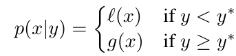
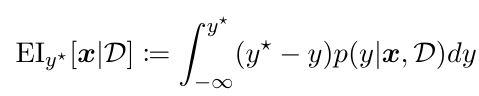
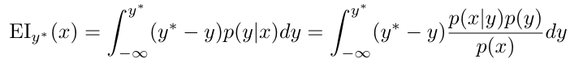
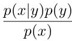
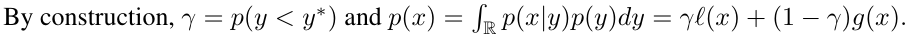
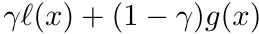
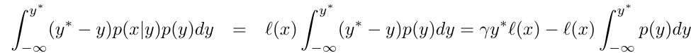
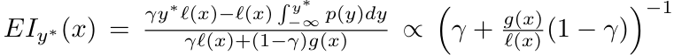
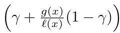

# [Day 18]Optuna的背後演算法，TPE介紹

- Day: 18
- Date: 2024-09-24 00:00:44
- Author: golucky_sir
- Source: https://ithelp.ithome.com.tw/articles/10357248
- Series: https://ithelp.ithome.com.tw/2020-12th-ironman/articles/7610
- Series Title: 調整AI超參數好煩躁？來試試看最佳化演算法吧！

## 前言

昨天帶各位使用了Optuna進行機器學習的最佳化，算是先讓各位見識一下Optuna在機器學習模型參數調整上的結果。不過再進入其他模型最佳化的應用時我想先跳出來向各位介紹一下Optuna中預設的採樣器(sampler)，也就是Tree-structured Parzen Estimator (TPE)演算法。  
接下來就來介紹TPE演算法的背後原理~

## TPE介紹

TPE演算法是基於**貝葉斯最佳化**的一種專門用於「超參數調校」的演算法，既然是用於超參數最佳化的演算法，那他就是用於在大量參數的搜索空間中找出最佳的參數組合。  
TPE演算法主要使用**機率密度估計**的方式來從搜索空間中採樣，藉此在較短的時間中找到能帶來最佳適應值的參數組合。

> 若對演算法有興趣也歡迎直接去看看[TPE的原始論文](https://proceedings.neurips.cc/paper_files/paper/2011/file/86e8f7ab32cfd12577bc2619bc635690-Paper.pdf)喔！

## TPE概念

TPE的主要概念是使用**兩個機率密度函數(Probability Density Function, PDF)**來對超參數的**條件機率分布**進行建模，[機率密度函數](https://zh.wikipedia.org/zh-tw/%E6%A9%9F%E7%8E%87%E5%AF%86%E5%BA%A6%E5%87%BD%E6%95%B8)是用於描述隨機變數值在某個確定的點附近機率的函數。

這兩個機率密度函數有不同的功能，其中一條用來針對適應值佳的超參數組合(better group)的機率密度函數進行建模，另一條就是用來針對較差的超參數組合(worse group)的機率密度函數，透過計算來不斷的更新這兩條機率密度函數的樣子。後續採樣方式就會靠近較佳參數組合那端，遠離較差組合那端。

## TPE適用場景

TPE因為該演算法可以自適應兩個機率密度函數的樣子並從中採樣，所以可以快速的找到全局最佳解，演算法主要適用的情形為：

1.  尋解的超參數組合並不多，通常會限制在20個以內。
2.  最佳化的目標很難透過求梯度去進行最佳化，例如很難探討模型學習率與誤差之間的關係，基本上也不可能將這輛兩個關係進行建模並求導數。
3.  最佳化目標是要花類大量時間求得的函數，例如訓練完模型再去計算模型測試資料的準確率。

## TPE原理

接下來要來討論TPE的原理了，首先根據原始論文的定義我們可以從以下公式看到兩個組合的部分，l(x)是較佳組；g(x)是較差組；x為帶入的解；y為根據此帶入解計算出的適應值；y\*為一個閥值，計算出來的結果為p(x\|y)。  

TPE使用\*\*期望改進(Expected Improvement，EI)\*\*作為採樣的方式，EI在TPE論文中被使用的公式如下：  

不過我們並無法取得p(y\|x)，所以只能使用[貝氏定理](https://zh.wikipedia.org/zh-tw/%E8%B4%9D%E5%8F%B6%E6%96%AF%E5%AE%9A%E7%90%86)進行轉換，根據原式轉換後的結果為：  

經過貝式定理轉換後我們得到了 之後可以發現，p(x\|y)為一開始的結果，然後p(x)與p(y)也可以經過建模取得。

- **p(x)(分母)的建構**：根據論文中的說明(4.1章節中方程式3的下一行)  
    
  可以知道作者新設定了一個變數*γ*，作為TPE中的一個分界的概念，這個變數可以用來將l(x)與g(x)分開，也就是說剛剛p(x\|y)的公式可以使用*γ*來簡化成一個公式： 。  
  另外機率分布p(y)的積分會等於1，所以結果就會變成如上公式。  
  *γ*的值在0~1之間。這句話的最後一個表示式就代表今天如果有100個解帶入並取得了相應的結果，而*γ*設定成0.05的話，那就會使用最好的5個結果構建分布l(x)；另外95個不好的結果構建分布g(x)。
- **P(y)(分子)的建構**：根據論文的說明如下，分子的部分可以得到如此的結果，這部分比較不重要。  
  

建構完分子與分母後我們可以將他們帶入到採樣方式EI，接著就會變成如下的樣子。  
剛剛求到的分母部分若同除以l(x)就會得到 ，接著剛剛帶入後的EI結果會與分母部分的倒數成正比，所以就可以寫成如上的表達式。

為了最大化這個EI我們可以看到剛剛成正比的分母倒數，倒數完之後可以看到其中有一個部分l(x)/g(x)，從直觀的想法我們希望**帶入解x會出現在較佳組l(x)的機率高，在較差組g(x)的機率低**，所以l(x)/g(x)要最大化，這樣採樣出來的結果出現較佳情況的可能性才會高。

不過昨天跑的程式會發現就算收斂了偶爾還是會有幾個效果很差的結果，那就是難免會有一些較差組的解被帶入，雖然機率可能比較低但還是無法避免的，所以各位不需要擔心TPE沒有好好的最佳化喔~  
從下圖來看出現較差解的機率似乎是有變低了啦，所以TPE應該還是有效果的。  

## 結語

TPE的大致流程與原理基本上就是這樣，當然還有一些更細節的概念，但這些概念會稍微偏離主軸，今天的部分參考了許多資料，我將這些資料都附在最後的參考資料區，有需要的人可以再去這些參考資料中看看。  
不過希望各位在認識了TPE背後的原理之後，能夠對Optuna最佳化的方式能又更深的理解。明天會繼續使用Optuna來進行其他模型最佳化的應用，理解了一些背後的原理，相信各位應該能對自己所寫的程式有更全面的認識，在解釋程式的演算過程也會比較輕鬆，若要進行修改也會更容易從正確的方向進行修改~

## 參考資料

[原始論文](https://proceedings.neurips.cc/paper_files/paper/2011/file/86e8f7ab32cfd12577bc2619bc635690-Paper.pdf)  
[參考的其他論文1](https://arxiv.org/pdf/2304.11127)  
[參考的其他論文2](https://www.cs.ox.ac.uk/people/nando.defreitas/publications/BayesOptLoop.pdf)  
[參考資料1](https://towardsdatascience.com/a-conceptual-explanation-of-bayesian-model-based-hyperparameter-optimization-for-machine-learning-b8172278050f)  
[參考資料2](https://www.jianshu.com/p/d73649b83722)  
[參考資料3](https://zh.wikipedia.org/zh-tw/%E6%A0%B8%E5%AF%86%E5%BA%A6%E4%BC%B0%E8%AE%A1)
