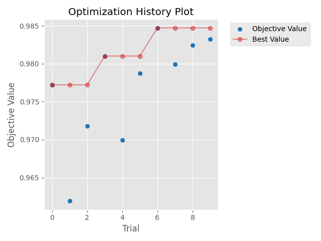
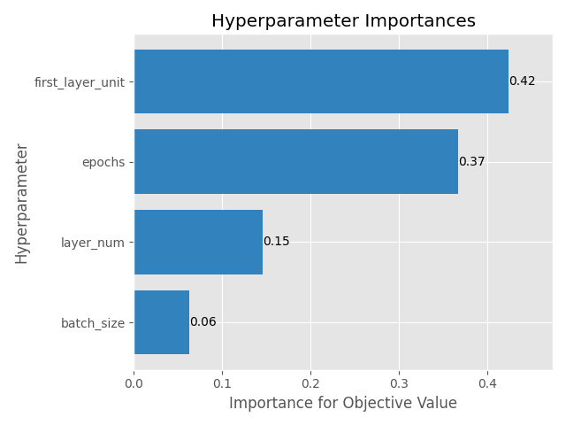
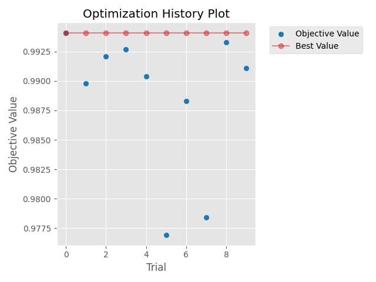
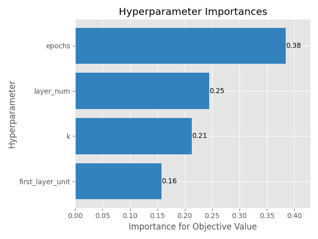

# [Day 19]Optuna的更多應用，最佳化MLP與CNN網路

- Day: 19
- Date: 2024-09-25 00:06:24
- Author: golucky_sir
- Source: https://ithelp.ithome.com.tw/articles/10357912
- Series: https://ithelp.ithome.com.tw/2020-12th-ironman/articles/7610
- Series Title: 調整AI超參數好煩躁？來試試看最佳化演算法吧！

## 前言

[昨天](https://ithelp.ithome.com.tw/articles/10357248)向各位介紹了TPE的背後原理，希望各位有更理解TPE運作的方式以及期望的目標，今天又要來繼續帶各位實作最佳化的一些應用了。  
今天要來最最佳化的模型為多層感知器(MLP)與卷積神經網路(CNN)模型，這兩個模型作為AI入門必定會學習到的模型，也是最常見的幾個模型，常常在完成模型後希望讓性能更好，但手動調整參數又很累，這時就輪到最佳化登場啦。

## 問題假設

今天的問題假設我們使用MLP和CNN來進行MNIST的手寫數字辨識，並且設定目標是測試資料的準確率超過97%，關於模型建立與訓練的部分就不細講，各位可以去看相關教學。

## 最佳化MLP

首先要來最佳化MLP，MLP作為最簡單也最基礎的模型，透過疊加許多密集連接層來建立模型。使用MLP進行MNIST手寫數字的辨識有非常多的教學文章，各位若不熟悉可以先去參考看看，接下來我會帶各位一步一步最佳化MLP模型。

### MLP程式碼

一樣不過多介紹深度學習模型訓練的部分，主要分為資料前處理，模型建立，訓練模型，最後回傳測試資料集的準確率。

    from tensorflow.keras.datasets.mnist import load_data
    from tensorflow.keras.models import Sequential
    from tensorflow.keras.layers import Input, Conv2D, MaxPooling2D, Flatten, Dropout, Dense
    from tensorflow.keras.utils import to_categorical
    import numpy as np

    def get_MLP_model(layer_num:int = 2,
                      first_layer_unit:int = 128):
        """
        中間隱藏層數量建議設定在2~4層
        第一層神經元數量為first_layer_unit / 2^0=128
        第二層神經元數量為first_layer_unit / 2^1=64
        以此類推，到第四層只剩16個神經元。
        Args:
            layer_num: 模型的中間隱藏層數
            first_layer_unit: 第一層的神經元數量

        Returns: keras的模型。
        """
        model = Sequential()
        model.add(Input(shape=(28, 28, 1)))
        model.add(Flatten())
        for i in range(layer_num):
            model.add(Dense(int(first_layer_unit / 2**i), activation="relu"))
        model.add(Dense(10, activation="softmax"))
        # model.summary()
        model.compile(loss="categorical_crossentropy", optimizer="adam", metrics=["accuracy"])
        return model

    def training_and_evaluating_model(model, X_train, y_train, X_test, y_test,
                       batch_size:int = 128,
                       epochs:int = 10):
        """
        訓練模型並將測試資料集的準確率作為輸出。
        Args:
            batch_size: 每次訓練一批的資料量
            epochs: 訓練次數

        Returns: 測試資料集的準確率，作為適應值回傳。
        """
        model.fit(X_train, y_train, batch_size=batch_size, epochs=epochs, validation_split=0.1)
        score = model.evaluate(X_test, y_test, verbose=0)
        return score[1]

    if __name__ == '__main__':
        (X_train, y_train), (X_test, y_test) = load_data()
        # shape = (60000, 28, 28) 標準化圖片像素到0~1之間
        X_train = X_train.astype("float32") / 255
        X_test = X_test.astype("float32") / 255
        # shape = (60000, 28, 28, 1) 加入通道維度
        X_train = np.expand_dims(X_train, -1)
        X_test = np.expand_dims(X_test, -1)
        # 將類別進行one-hot轉換
        y_train = to_categorical(y_train, 10)
        y_test = to_categorical(y_test, 10)

        # 取得模型
        model = get_MLP_model(layer_num=3, first_layer_unit=64)
        # 訓練模型
        acc = training_and_evaluating_model(model, X_train, y_train, X_test, y_test, batch_size=64, epochs=5)
        print(acc) # 0.9684000015258789

### 構思問題

首先先來構思問題，執行了以上程式碼會發現測試集準確率大約為96.84%左右，執行上或多或少都有誤差，所以結果不一樣是正常的。  
我們的目標是希望能夠再將準確率提高一些，接著來稍微規劃一下接下來程式的大方向吧。

| 5W1H  | 規劃內容                                                                                                                         |
|-------|----------------------------------------------------------------------------------------------------------------------------------|
| Why   | 最佳化MLP模型，目標為準確率超過97%                                                                                               |
| What  | 最佳化問題是手寫數字辨識的分類任務，以準確率作為適應值                                                                           |
| Who   | 預計對MLP中的**隱藏層數量**、第一層隱藏層的**神經元數量**、**訓練批次量**、**訓練次數**進行最佳化                                |
| Where | 隱藏層數量為2~4層、第一層神經元數量從\[64, 128, 256, 512\]中選擇，批次量從\[32, 64, 128\]中選擇，訓練次數為5~50次(次數為5的倍數) |
| When  | 計算完測試資料準確率後進行最佳化                                                                                                 |
| How   | 使用Optuna                                                                                                                       |

這次為了節省篇幅就將任務還有原始程式設定的簡單點吧，目前規劃大概這樣，若各位對超參數的範圍拿捏不定的話，可以**先將範圍設定廣一點**，經過幾次試驗後再從中**挑出效果比較好的範圍**，最後從這個範圍中尋求最佳解。

> 因為每次訓練結果不同，所以建議各位每次試驗都可以把模型權重檔案儲存起來！訓練完成後再把效果差的刪除就好了~

### 實現Optuna最佳化

接下來來照著[第14天提到SOP](https://ithelp.ithome.com.tw/articles/10354688)來建立最佳化試驗吧，有不理解的內容歡迎回去複習一下那天提到的東西喔。

1.  **定義目標函數**：和昨天提到的一樣，我們的目標函數為了避免每次執行試驗都要重新載入資料集，所以需要定義輸入資料集的部分。

        def objective_MLP(trial,
                          X_train: np.ndarray,
                          X_test: np.ndarray,
                          y_train: np.ndarray,
                          y_test: np.ndarray):

2.  **新增要帶入目標函數的變數**：剛剛提到我們要來針對**隱藏層數量**、第一層隱藏層的**神經元數量**、**訓練批次量**、**訓練次數**進行最佳化，所以就來新增這些變數吧，上面也有提到這些超參數的定義範圍。

        layer_num = trial.suggest_int('layer_num', 2, 4)
        epochs = trial.suggest_int('epochs', 5, 50, 5)
        first_layer_unit = trial.suggest_categorical('first_layer_unit', [64, 128, 256, 512])
        batch_size = trial.suggest_categorical('batch_size', [32, 64, 128])

3.  **新增其他功能**：因為篇幅關係，就不提及其他的功能了。不過各位可以將每次訓練的history等都都進行儲存、或者新增儲存模型權重等功能。

4.  **定義回傳適應值**：接著就要來進行訓練並針對測試資料進行評估，最後回傳測試資料集的準確率，作為適應值。

        # 取得模型
        model = get_MLP_model(layer_num=layer_num, first_layer_unit=first_layer_unit)
        # 訓練模型
        acc = training_and_evaluating_model(model, X_train, y_train, X_test, y_test, batch_size=batch_size, epochs=epochs)
        print(acc)

        return acc

5.  **定義一個試驗**：這部分也並沒有太多需要修改的內容，程式碼如下：

        study = optuna.create_study(direction='maximize', sampler=optuna.samplers.TPESampler(seed=42))

6.  **執行最佳化**：這部分也和昨天介紹的一樣，不過為了節省程式執行的總時間，我的試驗次數只設定10次，實際上會建議再使用多一點次數，程式碼如下：

        study.optimize(lambda trial: objective_MLP(trial, X_train, X_test, y_train, y_test), n_trials=10)

7.  **將最佳解print出來**：這部分也沒太大變化。

        print(study.best_params)  # {'layer_num': 3, 'epochs': 50, 'first_layer_unit': 512, 'batch_size': 128}
        print(study.best_value)  # 0.9861999750137329

    從最佳解可以看到根據上面註解的參數組合，最佳的測試資料集準確率甚至可以達到98.62%快要99%了，我跑了幾次也幾乎有超過98%。

8.  **查看程式執行過程**：這部分除了將最佳化過程的圖片顯示出來以外，我也把各參數的重要性給繪製出來，這可以提供若要再進行一次最佳化時，有沒有需要把不重要的因素排除；重要的因素可以再設定廣一點的搜索空間。

        # 繪製試驗的最佳化過程
        optuna.visualization.matplotlib.plot_optimization_history(study)
        plt.tight_layout()
        plt.show()
        # 繪製超參數因素重要性
        optuna.visualization.matplotlib.plot_param_importances(study)
        plt.tight_layout()
        plt.show()

    最佳化過程圖如下，可以看到有穩定的提升：  
      
    另外超參數重要性的圖如下，可以看到設定批次量似乎並不重要，而第一個隱藏層網路的神經元數量(`first_layer_unit`)與訓練次數(`epochs`)都很重要，如果要進行第二次最佳化實驗的話，可以著重於這兩個參數進行尋解。  
    

    以上就是最佳化MLP的一個範例，各位可以根據此範例與流程去應用於自己的任務喔！

## 最佳化CNN

接著我們使用相同程式碼來最佳化CNN，大致流程都相同，接下來來直接再進行一次範例吧。

### CNN程式碼

和上面MLP的範例幾乎完全相同，唯一有變的部分只有定義模型時是使用卷積與最大池化網路層而已，這邊只展示定義CNN網路的副程式，其他都深度學習部分的程式都沒有變動。

    def get_CNN_model(k:int = 4,
                  layer_num:int = 1,
                  first_layer_unit:int = 8):
        """
        中間隱藏層數量建議設定在1~3層。
        每次迴圈會使用MaxPooling2D
        第一層MaxPooling2D會讓圖片長寬變(14, 14)
        第二層MaxPooling2D會讓圖片長寬變(7, 7)
        第三層MaxPooling2D會讓圖片長寬變(3, 3)
        Args:
            k: 卷積層中的卷積核大小
            layer_num: 中間隱藏層數量，每層中包括一個卷積跟一層最大池化
            first_layer_unit: 第一層網路的神經元數量

        Returns: CNN 模型
        """
        model = Sequential()
        model.add(Input(shape=(28, 28, 1)))
        for i in range(1, layer_num+1):
            model.add(Conv2D(first_layer_unit*i, kernel_size=(k, k), activation="relu", padding='same'))
            model.add(MaxPooling2D(pool_size=(2, 2)))
        model.add(Flatten())
        model.add(Dropout(0.5))
        model.add(Dense(10, activation="softmax"))
        # model.summary()
        model.compile(loss="categorical_crossentropy", optimizer="adam", metrics=["accuracy"])
        return model

### 構思問題

在主程式中隨便設定如下這樣的超參數的話訓練結果中測試資料準確率約為97%~98%，那訓練目標就是要來讓準確率再高一點了。

    # 取得模型
    model = get_CNN_model(k=4, layer_num=1, first_layer_unit=8)
    # 訓練模型
    acc = training_and_evaluating_model(model, X_train, y_train, X_test, y_test, batch_size=128, epochs=10)
    print(acc)

接下來和MLP類似，來規劃一下最佳化的部分吧，剛剛經過MLP的測試我們發現batch_size重要性不高，所以就不尋最佳的batch_size了，不過這次也來尋找看看，看卷積核大小是否會影響到最佳化。

| 5W1H  | 規劃內容                                                                                                                          |
|-------|-----------------------------------------------------------------------------------------------------------------------------------|
| Why   | 最佳化CNN模型，目標為準確率超過98%                                                                                                |
| What  | 最佳化問題是手寫數字辨識的分類任務，以準確率作為適應值                                                                            |
| Who   | 預計對CNN中的**隱藏層數量**、第一層隱藏層的**神經元數量**、**2D卷積網路的卷積核大小**、**訓練次數**進行最佳化                     |
| Where | 隱藏層數量為1~3層、第一層神經元數量從\[16, 32, 64, 128, 256\]中選擇，2D卷積網路的卷積核大小為2~5，訓練次數為5~50次(次數為5的倍數) |
| When  | 計算完測試資料準確率後進行最佳化                                                                                                  |
| How   | 使用Optuna                                                                                                                        |

### 實現Optuna最佳化

1.  **定義目標函數**：和前面幾個範例相同。

        def objective_CNN(trial,
                      X_train: np.ndarray,
                      X_test: np.ndarray,
                      y_train: np.ndarray,
                      y_test: np.ndarray):

2.  **新增要帶入目標函數的變數**：剛剛有提到要帶入的超參數以及這些超參數的搜索空間。

        k = trial.suggest_int('k', 2, 5)
        layer_num = trial.suggest_int('layer_num', 1, 3)
        epochs = trial.suggest_int('epochs', 5, 50, 5)
        first_layer_unit = trial.suggest_categorical('first_layer_unit', [16, 32, 64, 128, 256])

3.  **新增其他功能**：和上面提到的MLP一樣，因為篇幅關係，就不提及其他的功能了。

4.  **定義回傳適應值**：和MLP一樣，定義CNN訓練，接著進行測試資料集的評估，最後回傳測試資料集的準確率。

        # 取得模型
        model = get_CNN_model(k=k, layer_num=layer_num, first_layer_unit=first_layer_unit)
        # 訓練模型
        acc = training_and_evaluating_model(model, X_train, y_train, X_test, y_test, batch_size=128, epochs=epochs)
        print(acc)

        return acc

接著**第5步**到**第8步**內容都和剛剛介紹的MLP相同，所以我就直接統一上程式碼了。

    # 新增最佳化試驗
    study = optuna.create_study(direction='maximize', sampler=optuna.samplers.TPESampler(seed=42))
    study.optimize(lambda trial: objective_CNN(trial, X_train, X_test, y_train, y_test), n_trials=10)
    # 將試驗中的最佳解print出來。
    print(study.best_params)
    print(study.best_value)
    # 繪製試驗的最佳化過程
    optuna.visualization.matplotlib.plot_optimization_history(study)
    plt.tight_layout()
    plt.show()
    # 繪製超參數因素重要性
    optuna.visualization.matplotlib.plot_param_importances(study)
    plt.tight_layout()
    plt.show()

各位可以看到當參數設計為下表時，測試集準確率達到99.4%，非常優秀的結果。

| 參數名稱                                   | 參數值                          |
|--------------------------------------------|---------------------------------|
| k(卷積核大小)                              | 3                               |
| layer_num(隱藏層數量)                      | 3                               |
| epochs(訓練次數)                           | 40                              |
| first_layer_unit(第一層隱藏層的神經元數量) | 256                             |
| **測試資料準確率**                         | **0.9940999746322632，約99.4%** |

最後以下是CNN最佳化的過程圖，訓練運氣比較好，第一次就是最佳解XD，多跑幾次或許會有不同的情況產生~  
  
以及各超參數的重要性圖表。  

## 結語

今天展示了最佳化MLP與CNN的例子，通常不同模型中都會有不同的超參數可以調整，所以事前的規劃就會變得更加重要了，預計要使用哪些超參數，超參數的範圍如何設定就會變成很重要的問題。  
這也是我會使用5W1H來進行初步規劃的方式，透過多次實驗慢慢讓這些問題的假設變得更精準，不過還是老話一句這些思路不一定適合所有人，希望各位可以在實驗中找出適合自己的最佳方式！

## 附錄：完整程式

    from tensorflow.keras.datasets.mnist import load_data
    from tensorflow.keras.models import Sequential
    from tensorflow.keras.layers import Input, Conv2D, MaxPooling2D, Flatten, Dropout, Dense
    from tensorflow.keras.utils import to_categorical
    import numpy as np
    import optuna
    import matplotlib.pyplot as plt

    def get_CNN_model(k:int = 3,
                  layer_num:int = 2,
                  first_layer_unit:int = 32):
        """
        中間隱藏層數量建議設定在1~3層。
        每次迴圈會使用MaxPooling2D
        第一層MaxPooling2D會讓圖片長寬變(14, 14)
        第二層MaxPooling2D會讓圖片長寬變(7, 7)
        第三層MaxPooling2D會讓圖片長寬變(3, 3)
        Args:
            k: 卷積層中的卷積核大小
            layer_num: 中間隱藏層數量，每層中包括一個卷積跟一層最大池化
            first_layer_unit: 第一層網路的神經元數量

        Returns: CNN 模型
        """
        model = Sequential()
        model.add(Input(shape=(28, 28, 1)))
        for i in range(1, layer_num+1):
            model.add(Conv2D(first_layer_unit*i, kernel_size=(k, k), activation="relu", padding='same'))
            model.add(MaxPooling2D(pool_size=(2, 2)))
        model.add(Flatten())
        model.add(Dropout(0.5))
        model.add(Dense(10, activation="softmax"))
        # model.summary()
        model.compile(loss="categorical_crossentropy", optimizer="adam", metrics=["accuracy"])
        return model

    def get_MLP_model(layer_num:int = 2,
                      first_layer_unit:int = 128):
        """
        中間隱藏層數量建議設定在2~4層
        第一層神經元數量為first_layer_unit / 2^0=128
        第二層神經元數量為first_layer_unit / 2^1=64
        以此類推，到第四層只剩16個神經元。
        Args:
            layer_num: 模型的中間隱藏層數
            first_layer_unit: 第一層的神經元數量

        Returns: keras的模型。
        """
        model = Sequential()
        model.add(Input(shape=(28, 28, 1)))
        model.add(Flatten())
        for i in range(layer_num):
            model.add(Dense(int(first_layer_unit / 2**i), activation="relu"))
        model.add(Dense(10, activation="softmax"))
        # model.summary()
        model.compile(loss="categorical_crossentropy", optimizer="adam", metrics=["accuracy"])
        return model

    def training_and_evaluating_model(model, X_train, y_train, X_test, y_test,
                       batch_size:int = 128,
                       epochs:int = 10):
        """
        訓練模型並將測試資料集的準確率作為輸出。
        Args:
            batch_size: 每次訓練一批的資料量
            epochs: 訓練次數

        Returns: 測試資料集的準確率，作為適應值回傳。
        """
        model.fit(X_train, y_train, batch_size=batch_size, epochs=epochs, validation_split=0.1)
        score = model.evaluate(X_test, y_test, verbose=0)
        return score[1]

    def objective_MLP(trial,
                  X_train: np.ndarray,
                  X_test: np.ndarray,
                  y_train: np.ndarray,
                  y_test: np.ndarray):
        """
        MLP 網路訓練的最佳化。
        """
        layer_num = trial.suggest_int('layer_num', 2, 4)
        epochs = trial.suggest_int('epochs', 5, 50, 5)
        first_layer_unit = trial.suggest_categorical('first_layer_unit', [64, 128, 256, 512])
        batch_size = trial.suggest_categorical('batch_size', [32, 64, 128])

        # 取得模型
        model = get_MLP_model(layer_num=layer_num, first_layer_unit=first_layer_unit)
        # 訓練模型
        acc = training_and_evaluating_model(model, X_train, y_train, X_test, y_test, batch_size=batch_size, epochs=epochs)
        print(acc)

        return acc

    def objective_CNN(trial,
                  X_train: np.ndarray,
                  X_test: np.ndarray,
                  y_train: np.ndarray,
                  y_test: np.ndarray):
        """
        CNN 網路訓練的最佳化。
        """
        k = trial.suggest_int('k', 2, 5)
        layer_num = trial.suggest_int('layer_num', 1, 3)
        epochs = trial.suggest_int('epochs', 5, 50, 5)
        first_layer_unit = trial.suggest_categorical('first_layer_unit', [16, 32, 64, 128, 256])

        # 取得模型
        model = get_CNN_model(k=k, layer_num=layer_num, first_layer_unit=first_layer_unit)
        # 訓練模型
        acc = training_and_evaluating_model(model, X_train, y_train, X_test, y_test, batch_size=128, epochs=epochs)
        print(acc)

        return acc

    if __name__ == '__main__':
        (X_train, y_train), (X_test, y_test) = load_data()
        # shape = (60000, 28, 28) 標準化圖片像素到0~1之間
        X_train = X_train.astype("float32") / 255
        X_test = X_test.astype("float32") / 255
        # shape = (60000, 28, 28, 1) 加入通道維度
        X_train = np.expand_dims(X_train, -1)
        X_test = np.expand_dims(X_test, -1)
        # 將類別進行one-hot轉換
        y_train = to_categorical(y_train, 10)
        y_test = to_categorical(y_test, 10)

        # 新增最佳化試驗
        study = optuna.create_study(direction='maximize', sampler=optuna.samplers.TPESampler(seed=42))
        # study.optimize(lambda trial: objective_MLP(trial, X_train, X_test, y_train, y_test), n_trials=10)
        study.optimize(lambda trial: objective_CNN(trial, X_train, X_test, y_train, y_test), n_trials=10)
        # 將試驗中的最佳解print出來。
        print(study.best_params)
        print(study.best_value)
        # 繪製試驗的最佳化過程
        optuna.visualization.matplotlib.plot_optimization_history(study)
        plt.tight_layout()
        plt.show()
        # 繪製超參數因素重要性
        optuna.visualization.matplotlib.plot_param_importances(study)
        plt.tight_layout()
        plt.show()
