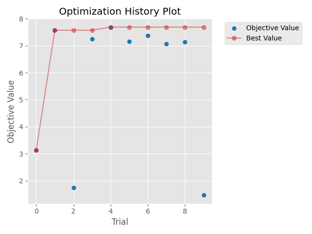
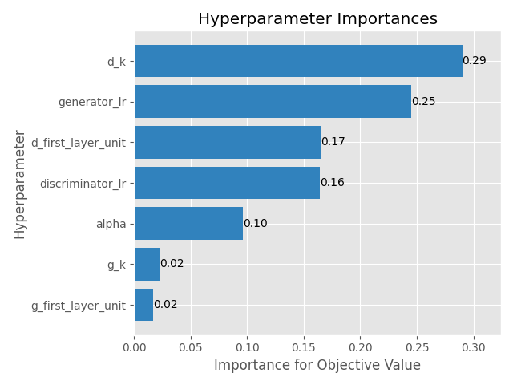

# [Day 21]Optuna的更多應用，最佳化生成對抗網路(GAN)(2/2)

- Day: 21
- Date: 2024-09-27 09:05:17
- Author: golucky_sir
- Source: https://ithelp.ithome.com.tw/articles/10359181
- Series: https://ithelp.ithome.com.tw/2020-12th-ironman/articles/7610
- Series Title: 調整AI超參數好煩躁？來試試看最佳化演算法吧！

## 前言

昨天花了一些時間來執行DCGAN的最佳化，在文章撰寫時我就在執行程式了，寫完文章後發現程式還沒跑完，還好當初有意識到所以將DCGAN最佳化分為兩天來介紹。睡醒之後發現程式跑完了，今天就來分析一下程式結果以及分享一下這類型模型的最佳化通常有甚麼大方向可以注意。

## DCGAN最佳化結果

昨天第7步驟以及第8步驟的結果如下：

- **第7步驟**：最佳參數以及最佳的適應值如下表

| 超參數名稱                     | 最佳超參數值          |
|--------------------------------|-----------------------|
| 生成器學習率                   | 0.00093               |
| 判別器學習率                   | 0.00089               |
| 生成器第一層卷積層的神經元數量 | 64                    |
| 判別器第一層卷積層的神經元數量 | 256                   |
| 生成器卷積核大小               | 5                     |
| 判別器卷積核大小               | 2                     |
| 判別器LaekyReLU斜率            | 0.15                  |
| **最佳適應值**                 | **7.688874050974846** |

結果看起來並不優秀，不過大概有幾個原因：

- **迭代次數不夠多**：因為節省時間所以試驗迭代次數只設定10次而已，原則上試驗次數再設定更多次或許會比較好。
- **訓練次數不足**：本例在迭代時每次訓練只設定訓練8000次，原則上設定次數大概要15000次以上效果才會比較好，但是如果真的照這樣訓練的話，光程式就會跑超過2天了，會造成我沒辦法完賽QQ。  
  所以為了節省時間本例暫時捨棄了追求最佳效果，若有需要的話可以設定完整一點下去跑，通常跑個幾天都是正常的，所以在**事前規劃才需要做的完善**，以免浪費了幾天的寶貴時間。
- **指標使用的不好**：因為MNIST手寫資料集長寬只有28且是灰階的，所以輸入到FID等指標中使用的神經網路會導致出錯誤，所以才使用PSNR與SSIM。  
  但DCGAN生成結果是隨機的，所以就算生成圖片長得很像真實數字，與資料集中的結果相比還是容易產生較低的分數。例如生成可以辨識的「0」與資料集中的「7」相比還是會有比較低的PSNR值。
- **GAN訓練不穩定**：雖然只訓練8000次，但姑且還是有跑出最佳解，各位可以使用看看上述最佳解代入並進行完整的訓練看看程式執行的效果如何。  
  **不過因為GAN的訓練不穩定，所以就算先以較少次數執行完最佳化，再帶入最佳解也可能因為後期訓練梯度消失或者梯度爆炸導致訓練失敗，所以在這部分需要注意一下！**

> 在實務應用上，需要注意若不確定最佳化程式是否有問題可以先使用較低迭代次數，與較低訓練次數，先以時間消耗少的方式完整跑過程式，沒問題之後再使用完整的設定來執行程式。

- **第8步驟**：昨天訓練完成之後，我將收斂結果圖與超參數重要關係圖也畫出來，如下圖。
  - 收斂結果圖：  
    
  - 超參數重要性關係圖，此部分我覺得應該要執行更多次試驗，結果或許才會比較準確：  
    

## 生成式AI模型最佳化

對於生成對抗網路，以及相關的最佳化模型，雖然截至目前為止，最佳化的方式五花八門目前並沒有一個完整的定論。

- 在NeurIPS 2023[(論文連結)](https://arxiv.org/abs/2305.18910)上有一篇研究是使用精確度(precision)與召回度(recall)的散度進行平衡以最佳化的方式，根據論文的說明，目前最先進的模型主要都是依賴最佳化啟發式方法，例如FID距離。  
  該論文提供了一種新的訓練方式，透過最佳化我們定義的精確度和召回率之間的權衡比率，來讓已有的生成對抗網路模型性能更進一步最佳化。

- 在IEEE Transactions on Neural Networks and Learning Systems期刊[(論文連結)](https://doi.org/10.1109/TNNLS.2020.2969327)上也有一篇研究使用一個「輔助模型」來幫助生成器進行最佳化，詳細內容該論文都有介紹，若各位有興趣也不妨參考看看該論文所提出的方法~

## 結語

今天分享了昨天程式的執行結果，也分享了一些這方面目前研究的趨勢與成果。  
明天開始要來進入另一個最佳化的應用了，與Optuna/TPE這種直接適用於超參數最佳化的演算法不同，MealPy是包含了許多啟發式演算法的模組，使用啟發式演算法進行最佳化也是一種選擇，明天開始我會來介紹MealPy的一些基本功能與API。
