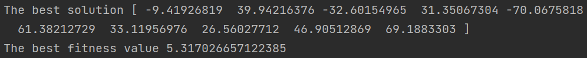
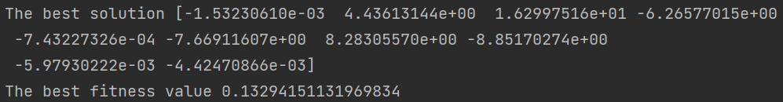

# [Day 22]無痛入門！淺談MealPy最佳化

- Day: 22
- Date: 2024-09-28 00:00:38
- Author: golucky_sir
- Source: https://ithelp.ithome.com.tw/articles/10359653
- Series: https://ithelp.ithome.com.tw/2020-12th-ironman/articles/7610
- Series Title: 調整AI超參數好煩躁？來試試看最佳化演算法吧！

## 前言

上個禮拜我介紹了Optuna的一些基礎API與進階用法等，希望各位有更加理解Optuna的使用方式。今天開始要來介紹另一個模組--MealPy。它是一個非常新的模組，大概是從去年才出現的。  
這個模組包含非常多啟發式演算法可以使用，入門難度也不會很高，是很適合需要快速上手的使用者用的模組，接下來幾天就來介紹MealPy以及實作一些應用吧！

  
圖. MealPy LOGO，來源於[官方Github](https://github.com/thieu1995/mealpy)

## 基本範例

要使用MealPy首先要pip下載：

    pip install mealpy

接著可以根據官方文檔中的30秒快速入門教學建立第一支MealPy的程式啦：  
要注意一下，在我看官網的時候我發現官網這樣寫：`"bounds": FloatVar(lb=[-100, ] * 30, ub=[100, ] * 30,)`，但後面其實要加一個逗號才對`"bounds": FloatVar(lb=[-100, ] * 30, ub=[100, ] * 30,),`，這樣子字典建立才不會有問題，如果是複製官網範例程式碼但發現執行錯誤的話糗可能是因為這微小的疏失喔~當初我也看了一陣子才恍然大悟。

    from mealpy import FloatVar, GA
    import numpy as np
    # 定義目標函數
    def objective_func(solution):
        # 回傳適應值
        return np.sum(solution**2)
    # 定義問題字典，在這之中要定義求解問題、代入解的定義域跟維度、最佳化方向
    problem_dict = {
        "obj_func": objective_func,
        "bounds": FloatVar(lb=[-100, ] * 30, ub=[100, ] * 30,),
        "minmax": "min",
    }

    # 定義最佳化演算法，以及該演算法的超參數
    optimizer = GA.BaseGA(epoch=100, pop_size=50, pc=0.85, pm=0.1)
    # 使用最佳化演算法去求最佳解
    optimizer.solve(problem_dict)

    # 將全局最佳解以及全局最佳適應值print出來
    print(optimizer.g_best.solution)
    print(optimizer.g_best.target.fitness)

這個程式分成了幾個片段，不過建立步驟與我[第14天](https://ithelp.ithome.com.tw/articles/10354688)提到的流程其實差不多，接下來我們來簡單介紹一下MealPy在程式撰寫上有甚麼流程需要注意的！

## MealPy開發注意事項

在這幾天撰寫文章的時候我也在思考，似乎可以把之前提到的流程再進行改良一下，所以在今天我打算以新的流程來向各位分享撰寫這類型的程式可以怎麼做。

1.  **定義目標函數**：這部分與之前提到的類似，但其實應該可以在這步驟多做一點事情，才不會像之前提到的只是定義名稱而已。  
    1-1. **定義目標函數中的計算**：接著需要定義在目標函數中的計算，這步驟會實際將**解代入問題**，並進行計算，算出來的最終結果即為適應值。  
    1-2. **完善其他功能**：這步驟我們需要將一些功能給完善，基本上就是著重於保留該次試驗的資料，實際上我們只需要做一些事情就好：

    - 新增該次試驗的資料夾，可以用來儲存該次試驗的檔案。
    - 該次試驗的**代入解**，以及**適應值**、該次**試驗花費的時間**等可以透過csv、json、txt等格式儲存起來。
    - 若有試驗中**產生的圖表**，也要進行儲存，例如在最佳化模型中的損失函數圖等。
    - 其他類型的檔案，例如深度學習最佳化時可以儲存**每次試驗的模型權重檔案**、儲存**模型訓練期間產生的歷史資料(每一個epoch的損失、誤差等)**。
    - 除了儲存檔案以外若有其他需求也都可以根據需求來完善功能，例如最佳化的**提早結束功能**等。

    1-3. **定義回傳適應值**：最後將**適應值回傳**，回傳後接著就給最佳化演算法做後續的計算了。

2.  **定義試驗**：在此步驟需要注意以下事項：  
    2-1. **選擇一個或者多個最佳化演算法**來使用或比較，此步驟需要定義使用的演算法以及他們的超參數，並且設定問題的**求解方向**，看要求最大值或者最小值。  
    2-2. 另外也要定義**要帶入目標函數的變數**，這部分和之前一樣，**定義要帶入的解，以及這些解的搜索空間**，定義完成後可以確認1-2步驟將目標函數中的計算是否有完善，代入是否沒問題。  
    2-3. **根據其他需求進行設定**：像Optuna有自己設定的一些程式格式需要撰寫、MealPy也有相關的功能需要設定，這部分就要依照使用的模組來進行設定了。

3.  **執行試驗進行最佳化**：這部分其實也和之前介紹得差不多，這步驟需要讓我們設定的演算法開始進行最佳解的求解。

4.  **後續處理與分析**：之前只提到說這部分就print最佳解，但後來實作了更多範例與閱讀更多相關資訊後，這步驟我覺得可以再改良一下，具體來說可以做這些事情：  
    4-1. **print最佳解**：當試驗執行完之後當然要把球道的**最佳解給print出來**啦。  
    4-2. **產生視覺化圖表**：跟之前一樣，產生視覺化圖表有時可以**幫助我們釐清這次最佳化的過程以及結果**，這樣可以協助改良下次實驗的精度。  
    4-3. **儲存試驗**：這裡也可以儲存試驗，若下次最佳化需要**繼承這次最佳化的一些資料**並繼續最佳化的話就可以使用。

5.  **分析最佳化結果**：此步驟根據產生的圖表並規劃下次最佳化的設定，例如**刪除不重要的變數**、**將重要的變數搜索範圍調整大一點**、**新增其他變數**、**更換演算法**、**修改適應值計算方式**等等。

> - 若擔心程式會到中途噴錯誤的話，不妨先以較小的試驗次數先**快速**完整執行程式確認沒有噴錯誤，也有得到理想的結果之後，再完整執行程式即可。
> - 常常會發生模型最佳化跑了一兩天才發現有東西沒加到，或者跑到一半程式出現錯誤，為了不浪費時間，**小規模測試程式**是一個很重要的技巧喔
> - 另外執行深度學習的最佳化尤其是參數量大模型常常會因為**記憶體不足導致錯誤發生**，所以會希望各位將每次試驗的結果儲存，以免程式出錯完全沒有資料留下來就得不償失了，在程式中對記憶體的維護也會變得重要。

## 實戰演練

以上重新介紹了新改良過後的程式設計流程以及一些注意事項，未來各位在撰寫此類程式時可以回頭來看看程式是否有遺漏的部分喔。  
接下來我會用以上的新流程帶各位建立起MealPy程式，並在建立過程中向各位分享一些MealPy的基本API。

> 這次我們來用[雜草演算法(IWO)]()來執行最佳化吧，最佳化的目標是[第5天](https://ithelp.ithome.com.tw/articles/10349247)提到的Griewank Function。  
> Griewank Function輸入的未知數數量不限；解空間元素值建議範圍為-600~600；最佳解為解空間元素皆為0；此時最佳適應值為0。

1.  **定義目標函數**：Griewank Function的程式碼在[第8天](https://ithelp.ithome.com.tw/articles/10350219)的時候有介紹，這邊就直接拿來用了，以下定義了目標函數的計算、定義回傳適應值，其他部分只有將輸入轉換為`np.ndarray`陣列格式。  
    在MealPy中目標函數必須要設定一個輸入參數，用於將解作為該參數傳遞進去。

        from typing import Union
        def griewank_function(x: Union[np.ndarray, list]):
            # 將輸入x轉換為numpy陣列的形式
            x = np.array(x)
            # 定義目標函數的計算
            i = np.arange(1, len(x)+1)
            x1 = np.sum(x**2 / 4000)
            x2 = -np.prod(np.cos(x/np.sqrt(i)))
            return x1 + x2 + 1  # 定義回傳適應值

2.  **定義試驗**：接著來定義試驗，MealPy需要設定一個求解問題字典`problem_dict`，此字典中要建立的key有以下：

    - `obj_func`：這是用於建立求解問題的部分，在此需要傳遞目標函數進去，這部分有兩個寫法如下：

      1.  沒有其他參數的傳遞：若沒有其他參數需要傳遞則直接將函數名稱**不用括號**作為value即可。

              "obj_func": griewank_function,

      2.  有其他參數的傳遞：若有其他參數需要傳遞則需要使用匿名函數`lambda`來進行傳遞。

              "obj_func": lambda x : griewank_function(x, 其他參數1, 其他參數2),

    - `bounds`：這是用來設定帶入參數的資料類型，有許多資料類型可以使用，根據文檔提供的變數種類有：`FloatVar、BoolVar、StringVar、IntegerVar、PermutationVar、BinaryVar、MixedSetVar`。  
      雖然提供了很多種類，但最常用的還是FloatVar、IntegerVar，這兩樣的設定都需要設定`lb`與`ub`參數，這兩個參數都是以list作為輸入，分別設定**每一個解**的上下限，不同解的上下限可以不同。  
      根據我的實測使用StringVar在代入解時會帶入的是索引值並非實際內容，所以希望在未來可以修正成直接將字串內容帶入到目標函數中，就不用再進行額外處理了。  
      另外使用IntegerVar在代入解時仍然是帶入浮點數，希望在未來也能一併改良吧，畢竟這個模組是比較新的模組，有一些bug是難免的。

    - `minmax`：設定最佳化目標是要求最大值還是最小值，設定最大值則`value="max"`；設定最小值則`value="min"`。

    - `log_to`：這個可以**不用設定**，預設是將最佳化過程顯示在IDE的互動視窗上，若設定為`"file"`，則代表將最佳化過程儲存到指定檔案，需要連下一項key一起設定。

    - `log_file`：儲存的檔案名稱，副檔名以.log結尾，預設是`"mealpy.log"`。  
      程式設定上如下，使用了向量長度是10的-600~600的代入解去求`griewank_function`的最小值。

    <!-- -->

        from mealpy import FloatVar
        problem_dict = {
        "obj_func": griewank_function,
        "bounds": FloatVar(lb=[-600, ] * 10, ub=[600, ] * 10),  # 用為10的List設定搜索空間
        "minmax": "min",
        }

    問題字典建立完成後就要來正式定義雜草演算法了，若對IWO演算法可用參數以及設定方式等不熟悉請**務必**要查詢[官方文檔](https://mealpy.readthedocs.io/en/latest/pages/models/mealpy.bio_based.html?highlight=IWO#mealpy.bio_based.IWO.OriginalIWO)的說明(觀看文檔時才發現IWO的範例程式寫成EOA的了XD)  
    IWO的初始化定義範例如下，文檔會給出一些建議值，可以根據程式執行結果再慢慢調整，這邊我們設定試驗(迭代)次數為1000次。

        optimizer = IWO.OriginalIWO(epoch=1000, pop_size=50,
                                    seed_min=2, seed_max=10, exponent=2,
                                    sigma_start=1.0, sigma_end=0.01)

3.  **執行試驗進行最佳化**：接著就要來執行最佳化了，程式碼如下：

        optimizer.solve(problem_dict)

4.  **後續處理與分析**：這裡我們就直接print最佳解即可，視覺化等其他功能將在之後介紹。

        print('The best solution', optimizer.g_best.solution)
        print('The best fitness value', optimizer.g_best.target.fitness)

5.  **分析最佳化結果**：根據上一步的結果我們發現，帶入的解普遍都離0有一定的距離，如下圖。  
      
    所以我們可以再讓迭代次數增加試試看，接下來設定迭代次數為20000次，看到結果發現確實有變得更優秀了，數值都變小了，fitness value也變成約0.13，如下圖。  
    

## 結語

今天初步的帶各位建立一個MealPy的程式，雖然做為新的模組MealPy還有很多要改進的部分，不過模組的完整性與功能的多樣性的確非常優秀，明天要帶各位認識更多MealPy的API，讓各位更了解這個模組的功能以及多樣性。

## 附錄：完整程式

    from mealpy import FloatVar, IWO
    import numpy as np
    from typing import Union

    def griewank_function(x: Union[np.ndarray, list]):
        # 其他處理，將輸入x轉換為numpy陣列的形式
        x = np.array(x)
        # 定義目標函數的計算
        i = np.arange(1, len(x)+1)
        x1 = np.sum(x**2 / 4000)
        x2 = -np.prod(np.cos(x/np.sqrt(i)))
        return x1 + x2 + 1  # 定義回傳適應值

    problem_dict = {
        "obj_func": griewank_function,
        "bounds": FloatVar(lb=[-600, ] * 10, ub=[600, ] * 10),  # 用為10的List設定搜索空間
        "minmax": "min",
        }

    optimizer = IWO.OriginalIWO(epoch=20000, pop_size=50,
                                seed_min=2, seed_max=10, exponent=2,
                                sigma_start=1.0, sigma_end=0.01)

    optimizer.solve(problem_dict)

    print('The best solution', optimizer.g_best.solution)
    print('The best fitness value', optimizer.g_best.target.fitness)
