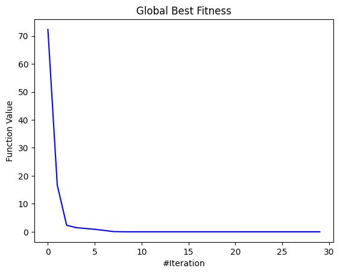
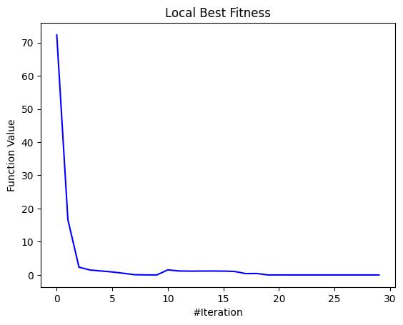
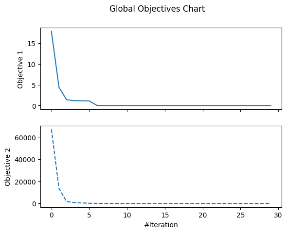
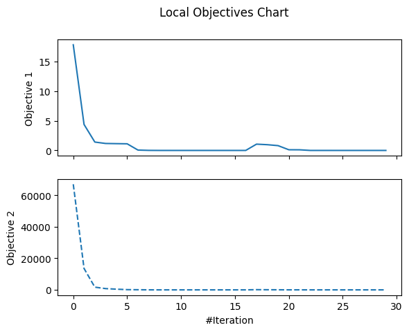
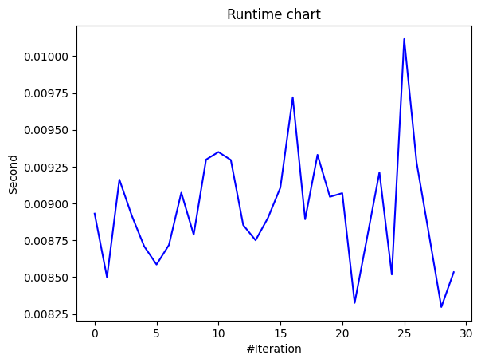
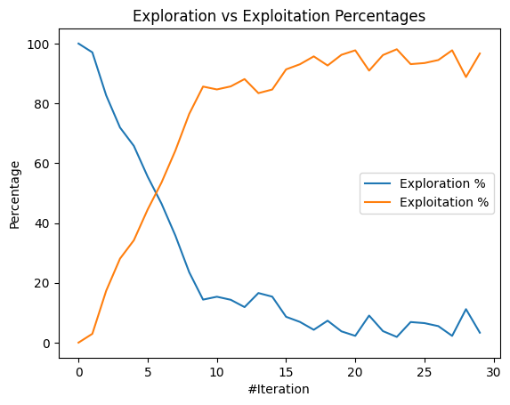
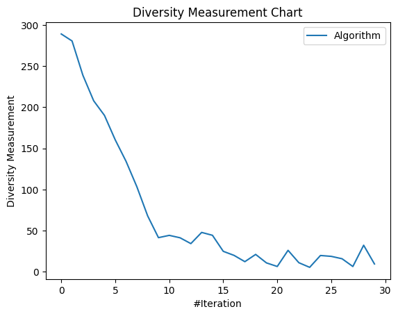

# [Day 23]由淺入深！介紹更多MealPy的API (1/2)

- Day: 23
- Date: 2024-09-29 01:51:33
- Author: golucky_sir
- Source: https://ithelp.ithome.com.tw/articles/10360297
- Series: https://ithelp.ithome.com.tw/2020-12th-ironman/articles/7610
- Series Title: 調整AI超參數好煩躁？來試試看最佳化演算法吧！

## 前言

昨天初步帶各位入門了MealPy，不知道各位體驗的如何？今天要繼續帶各位來學習MealPy的一些進階用法，這個部分預計會用兩天的時間來詳細介紹大部分常用的用法。

## MealPy其他進階功能

### 定義多目標最佳化

在MealPy使用多目標最佳化並不難，在目標函數中定義所有要回傳的部分然後在問題字典中再定義每個目標的權重即可，我使用範例的程式碼來進行講解。

1.  在目標函數中可以再定義更多副程式用於計算每個目標的適應值`booth(x, y)`、`bukin(x, y)`、`matyas(x, y)`。
2.  接著在問題字典`problem_multi`中需要定義一個key為`obj_weights`，這代表多目標中每個目標的加權比例，以本例子來說加權比例為`[0.4, 0.1, 0.5]`代表第一個目標`booth(x, y)`的結果要乘以0.4；第二個目標`bukin(x, y)`的結果要乘以0.1；第三個目標`matyas(x, y)`的結果要乘以0.5。
3.  目前我看了一下官方文檔的說明，目前尚無法個別定義每個目標的最佳化方向，例如準確率提高(`max`)、計算時間降低(`min`)，不過可以透過權重來將**相反的目標乘上一個負數**，這做法是目前現階段較可行的方式了。  
    例如在訓練分類模型時，問題字典中`"minmax": "max"`，準確率目標的權重就是1，但消耗時間的權重可以設定為-1，當使用的時間越多，那受加權計算後結果就會越低，最佳化時就會考慮讓時間減少以進一步提升最終的適應值。

<!-- -->

    import numpy as np
    from mealpy import PSO, FloatVar

    def objective_multi(solution):
        # 定義三種目標函數進行多目標最佳化
        def booth(x, y):
            return (x + 2*y - 7)**2 + (2*x + y - 5)**2
        def bukin(x, y):
            return 100 * np.sqrt(np.abs(y - 0.01 * x**2)) + 0.01 * np.abs(x + 10)
        def matyas(x, y):
            return 0.26 * (x**2 + y**2) - 0.48 * x * y
        return [booth(solution[0], solution[1]), bukin(solution[0], solution[1]), matyas(solution[0], solution[1])]

    problem_multi = {
        "obj_func": objective_multi,
        "bounds": FloatVar(lb=[-10, -10], ub=[10, 10]),
        "minmax": "min",  # 查看相關教學與官方文檔，目前僅支持一種最佳化方向，無法
        # 在問題字典中定義每個目標的權重，預設所有目標權重都為1
        "obj_weights": [0.4, 0.1, 0.5]
    }

    model = PSO.OriginalPSO(epoch=1000, pop_size=50)
    model.solve(problem=problem_multi)

### 視覺化求解過程

MealPy同時支持視覺化最佳化過程的一些功能，我們使用[黏菌最佳化演算法(Slime Mould Algorithm, SMA)](https://doi.org/10.1016/j.future.2020.03.055)來進行Griewank Function的最佳化，求解最佳化部分程式碼如下，SMA在面對此測試函數在不到50次迭代就能找到全局最佳解，相當厲害。

    from mealpy import FloatVar, SMA
    import numpy as np
    from typing import Union

    def griewank_function(x: Union[np.ndarray, list]):
        # 其他處理，將輸入x轉換為numpy陣列的形式
        x = np.array(x)
        # 定義目標函數的計算
        i = np.arange(1, len(x)+1)
        x1 = np.sum(x**2 / 4000)
        x2 = -np.prod(np.cos(x/np.sqrt(i)))
        return x1 + x2 + 1  # 定義回傳適應值

    problem_dict = {
        "obj_func": griewank_function,
        "bounds": FloatVar(lb=[-600, ] * 10, ub=[600, ] * 10),  # 用為10的List設定搜索空間
        "minmax": "min",
        }

    optimizer = SMA.OriginalSMA(epoch=30, pop_size=50, pr=0.03)
    optimizer.solve(problem_dict)

接著以此例子來解釋MealPy繪圖功能的API，具體功能有：

1.  **繪製全局最佳解與局部最佳解**：這個功能顧名思義，全局最佳解代表的是**最佳化過程中的歷史最佳解**；局部最佳解通常代表的是**當前試驗中的群體最佳解**。不過因應演算法不同所以好像有時全局最佳解取代掉局部最佳解，導致兩張圖表的內容會是相同的。  
    程式碼範例為，其中需要指定儲存的檔案路徑，若路徑為`"result/test"`的話就會在相同路徑下新增一個資料夾並將結果圖命名為test並同時儲存.pdf與.png檔案：

        # 繪製全局最佳解收斂過程
        optimizer.history.save_global_best_fitness_chart(filename="儲存檔案路徑")
        # 繪製局部最佳解收斂過程
        optimizer.history.save_local_best_fitness_chart(filename="儲存檔案路徑")

    程式執行後可以看到指定路徑下有儲存為圖片與PDF檔案，下圖為全局最佳收斂圖，可以看到SMA在面對這兩個測試函數的搜索最佳解能力非常好，都有精確搜索到最佳的代入解，最後適應值也成功收斂到0：  
      
    以及局部最佳收斂圖如下：  
    

2.  **繪製所有目標的全局最佳值與局部最佳值**：與上個功能不同，這個功能是在多目標最佳化時用到的，他會繪製所有目標函數的收斂過程，其餘基本上與上個功能差不多。  
    因為這個例子是使用一個目標的最佳化，所以這邊我將目標變成求解Griewank Function與Rastrigin Function相加後的適應值，所以目標修改後的程式碼如下：

        from mealpy import FloatVar, SMA
        import numpy as np
        from typing import Union
        def objective_multi(solution):
            def griewank_function(x: Union[np.ndarray, list]):
                # 其他處理，將輸入x轉換為numpy陣列的形式
                x = np.array(x)
                # 定義目標函數的計算
                i = np.arange(1, len(x)+1)
                x1 = np.sum(x**2 / 4000)
                x2 = -np.prod(np.cos(x/np.sqrt(i)))
                return x1 + x2 + 1  # 定義回傳適應值

            def rastrigin_function(x: Union[np.ndarray, list]):
                x = np.array(x)
                return 10*len(x) + np.sum(x**2 - 10*np.cos(2*np.pi*x))

            return [griewank_function(solution), rastrigin_function(solution)]

        problem_dict = {
            "obj_func": objective_multi,
            "bounds": FloatVar(lb=[-600, ] * 10, ub=[600, ] * 10),  # 用為10的List設定搜索空間
            "minmax": "min",
            "obj_weights": [1, 1]  # 多目標問題需要設定權重
            }

        optimizer = SMA.OriginalSMA(epoch=30, pop_size=50, pr=0.03)
        optimizer.solve(problem_dict)

    接著繪製多目標的全局最佳收斂圖與局部最佳收斂圖程式如下：

        # 繪製多目標全局最佳解收斂過程
        optimizer.history.save_global_objectives_chart(filename="儲存檔案路徑")
        # 繪製多目標局部最佳解收斂過程
        optimizer.history.save_local_objectives_chart(filename="儲存檔案路徑")

    多目標全局最佳解收斂過程的結果圖如下圖：  
      
    另外，多目標局部最佳解收斂過程的結果圖如下圖：  
    

3.  **繪製試驗時間圖**：這個功能可以繪製每次試驗時所花費的時間，在後續分析中也能有不錯的用途。

        # 繪製試驗時間圖
        optimizer.history.save_runtime_chart(filename="儲存檔案路徑")

    繪製結果如下，每次試驗時間都非常短，不過在之後用於深度學習模型訓練時就會體現出不同超參數設定造成的不同訓練時長了。  
    

4.  **繪製Exploration與Exploitation百分比圖**：這個概念在最佳化演算法代表的是演算法搜索最佳解的一些行為，Exploration針對的是**全局搜索**，得到的解空間範圍越大越好；而Exploitation代表在較佳的**局部範圍**內進行更精細的搜索。  
    所以整個概念可以解釋成 **往其他新的區域探索能得到更好的解(Exploration)** 與 **用現有的一些結果再更精細的去搜索最佳解(Exploitation)** 之間的比例，通常到了迭代後期都會傾向於從現有的解再去搜索更精確的最佳解。  
    要繪製這個圖的程式碼如下：

        # 繪製Exploration與Exploitation百分比圖
        optimizer.history.save_exploration_exploitation_chart(filename="儲存檔案路徑")

    結果圖會長這樣：  
    

5.  **繪製群體多樣性圖**：在最佳化演算法開發分析時常常會使用這個圖來分析最佳化過程中解的多樣性。  
    若多樣性低通常代表該演算法有比較好的開發能力，比較容易收斂到最佳解附近；如果多樣性起伏不定的話且多樣性較高的話代表搜索解是落在較廣範圍的，演算法可能會有比較好的全局搜索能力。  
    這個圖適用於**分析最佳化演算法的性能以及特性的**，與之後的深度學習模型最佳化比較沒有關係，程式碼如下：

        # 繪製群體多樣性圖
        optimizer.history.save_diversity_chart(filename="儲存檔案路徑")

    結果圖如下，可以看到SMA這演算法搜索能力還是比較不錯的。  
    

以上就是目前MealPy支援的輸出圖片類型了，最後還有一個軌跡圖，我還不太了解如何使用，[文檔教學](https://mealpy.readthedocs.io/en/latest/pages/general/visualization.html)也沒有說得特別清楚，有知道如何使用的也歡迎在底下留言告訴我喔，謝謝！

## 結語

今天向各位介紹了MealPy的其他API以及進階應用，雖然目前模組的功能性沒有到很完善，不過都還是可以轉個彎達成目的，希望在未來模組持續更新後能為我們帶來更完整的功能。  
明天會繼續介紹MealPy的其他功能還有實用技巧，接下來就要來進入實作的部分了。

## 附錄：完整程式(最佳化試驗視覺化)

    from mealpy import FloatVar, SMA
    import numpy as np
    from typing import Union

    def griewank_function(x: Union[np.ndarray, list]):
        # 其他處理，將輸入x轉換為numpy陣列的形式
        x = np.array(x)
        # 定義目標函數的計算
        i = np.arange(1, len(x) + 1)
        x1 = np.sum(x ** 2 / 4000)
        x2 = -np.prod(np.cos(x / np.sqrt(i)))
        return x1 + x2 + 1  # 定義回傳適應值

    def objective_multi(solution):
        def griewank_function(x: Union[np.ndarray, list]):
            x = np.array(x)
            i = np.arange(1, len(x)+1)
            x1 = np.sum(x**2 / 4000)
            x2 = -np.prod(np.cos(x/np.sqrt(i)))
            return x1 + x2 + 1

        def rastrigin_function(x: Union[np.ndarray, list]):
            x = np.array(x)
            return 10*len(x) + np.sum(x**2 - 10*np.cos(2*np.pi*x))

        return [griewank_function(solution), rastrigin_function(solution)]
    # 單一目標最佳化的問題字典
    problem_dict_gf = {
        "obj_func": griewank_function,
        "bounds": FloatVar(lb=[-600, ] * 10, ub=[600, ] * 10),  # 用為10的List設定搜索空間
        "minmax": "min",
        }

    # 多目標最佳化的問題字典
    problem_dict = {
        "obj_func": objective_multi,
        "bounds": FloatVar(lb=[-600, ] * 10, ub=[600, ] * 10),  # 用為10的List設定搜索空間
        "minmax": "min",
        "obj_weights": [1, 1]  # 多目標問題需要設定權重
        }

    optimizer = SMA.OriginalSMA(epoch=30, pop_size=50, pr=0.03)
    # optimizer.solve(problem_dict_gf)  # 單一目標最佳化求解
    optimizer.solve(problem_dict)  # 多目標最佳化求解

    # 輸出最佳解與最佳適應值
    print('The best solution', optimizer.g_best.solution)
    print('The best fitness value', optimizer.g_best.target.fitness)

    # 繪製最佳化實驗結果圖
    # 繪製多目標全局最佳解收斂過程
    optimizer.history.save_global_objectives_chart(filename="result/goc")
    # 繪製多目標局部最佳解收斂過程
    optimizer.history.save_local_objectives_chart(filename="result/loc")
    # 繪製全局最佳解收斂過程
    optimizer.history.save_global_best_fitness_chart(filename="result/gbfc")
    # 繪製局部最佳解收斂過程
    optimizer.history.save_local_best_fitness_chart(filename="result/lbfc")
    # 繪製試驗時間圖
    optimizer.history.save_runtime_chart(filename="result/rtc")
    # 繪製Exploration與Exploitation百分比圖
    optimizer.history.save_exploration_exploitation_chart(filename="result/eec")
    # 繪製群體多樣性圖
    optimizer.history.save_diversity_chart(filename="result/dc")
