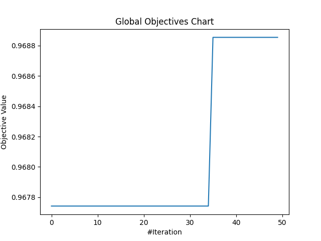

# [Day 25]打鐵趁熱！來試著使用MealPy解決問題吧

- Day: 25
- Date: 2024-10-01 00:03:16
- Author: golucky_sir
- Source: https://ithelp.ithome.com.tw/articles/10361394
- Series: https://ithelp.ithome.com.tw/2020-12th-ironman/articles/7610
- Series Title: 調整AI超參數好煩躁？來試試看最佳化演算法吧！

## 前言

這三天花了一些時間來介紹MealPy的相關功能，今天要來使用他進行最佳化模型的範例。  
這次我們一樣使用機器學習中的SVC，基本上大部分問題類型都與[第17天](https://ithelp.ithome.com.tw/articles/10355938)介紹的一樣，只是將Optuna改成使用MealPy來進行最佳化而已，那就直接進入程式的部分囉！

> 今天大部分的內容都來自於[第17天](https://ithelp.ithome.com.tw/articles/10355938)介紹的部分，所以今天介紹的會比較簡短，如果想完整了解的可以配合那天介紹的文章一起讀喔！若沒看過第17天的文章也強烈建議**先看過一次那篇文章中關於程式以外的部分**。

## 最佳化機器學習模型

和之前介紹的一樣，我們先來做個**重複的**情境假設，今天需要做的任務是：使用機器學習的**SVC模型**，進行**手寫數字辨識**的任務，目標是**準確率有超過95%**。接下來就來構思問題跟釐清思路吧。

### 構思問題

接著問題的行我們就將之設定為完全一樣，各位可以直接參考我之前的問題假設，接下來就按照[第22天](https://ithelp.ithome.com.tw/articles/10359653)介紹的新流程來撰寫程式吧！

| 5W1H  | 規劃內容                                                                                                    |
|-------|-------------------------------------------------------------------------------------------------------------|
| Why   | 最佳化ML的SVC模型，目標為準確率超過97%                                                                      |
| What  | 最佳化問題是手寫數字辨識的分類任務，以準確率作為適應值                                                      |
| Who   | 預計對SVC中的kernel選擇與gamma參數進行最佳化                                                                |
| Where | 預計SVC的gamma參數設定值為0.0001 ~ 0.01；將所有可用的kernel都拿來使用看看(`kernel='precomputed'`是不可用的) |
| When  | 實現混淆矩陣、分類報告以及計算準確率後進行最佳化                                                            |
| How   | 使用MealPy的[黏菌最佳化演算法(Slime Mould Algorithm, SMA)](https://doi.org/10.1016/j.future.2020.03.055)    |

### 撰寫程式

這邊程式首先我們先完成SVC的基本部分後再來進行最佳化，基本部分的程式如下，第17天有說明程式碼內容，詳細說明可以看看那天的內容，今天就單純展示程式：

    import numpy as np
    import matplotlib.pyplot as plt
    from sklearn import datasets, metrics, svm
    from sklearn.model_selection import train_test_split

    def plot_data(img: np.ndarray, 
                  target: np.ndarray, 
                  title: str):
        """
        將圖片、類別、圖表標題輸入並繪製出圖片資料的預覽圖片。
        
        :param img: 輸入的圖片資料
        :param target: 輸入的類別(真實類別或者預測類別)
        :param title: 圖片的標題(訓練資料或者預測資料)
        :return: None
        """
        _, axes = plt.subplots(nrows=1, ncols=4, figsize=(10, 3))
        for ax, image, label in zip(axes, img, target):
            ax.set_axis_off()
            image = image.reshape(8, 8)
            ax.imshow(image, cmap=plt.cm.gray_r, interpolation="nearest")
            ax.set_title(f"{title}: %i" % label)
    def plot_confusion_matrix(true_label: np.ndarray, 
                              predict_label: np.ndarray):
        """
        取得混淆矩陣中的資料，並繪製混淆矩陣圖繪製出來。

        :param true_label: 真實的類別
        :param predict_label: 預測的類別
        :return: None
        """

        disp = metrics.ConfusionMatrixDisplay.from_predictions(true_label, predict_label)
        disp.figure_.suptitle("Confusion Matrix")
        print(f"Confusion matrix:\n{disp.confusion_matrix}")
        plt.show()

    def print_classfication_report(true_label: np.ndarray, 
                                   predict_label: np.ndarray):
        """
        將混淆矩陣資料作為輸入，並進一步計算準確率作為回傳值。

        :param true_label: 真實的類別
        :param predict_label: 預測的類別
        :return: 預測資料的準確率。
        """

        print("Classification report rebuilt from confusion matrix:\n"
              f"{metrics.classification_report(true_label, predict_label)}\n")
        accuracy = metrics.accuracy_score(true_label, predict_label)
        return accuracy

    # 載入訓練資料
    digits = datasets.load_digits()
    # 將資料內容進行可視化，每張圖片都是8*8大小的，共1797張圖片
    plot_data(digits.images, digits.target, 'Training')

    # 將二維圖片資料展開為一維度的向量
    n_samples = len(digits.images)
    data = digits.images.reshape((n_samples, -1))  # shape=(1797, 64)

    # 把資料拆成一半訓練集一半測試集
    X_train, X_test, y_train, y_test = train_test_split(data, digits.target, test_size=0.5, shuffle=False)

    # 建立SVC模型
    clf = svm.SVC(gamma=0.05, kernel='poly')

    # 訓練SVC模型
    clf.fit(X_train, y_train)
    # 用測試集來預測資料
    predicted = clf.predict(X_test)

    # 將測試資料與預測的類別畫出來
    plot_data(X_test, predicted, 'Prediction')

    # 建立混淆矩陣並輸出圖片
    plot_confusion_matrix(y_test, predicted)

    # 產生分類報告，包含每個類別各自預測的情況以及各項指標
    acc = print_classfication_report(y_test, predicted)

### 實現MealPy最佳化

接著我們要將這些**程式修改改成一個問題類別**。

1.  **定義目標函數**：首先先來定義問題類別，記得要繼承`Problem`喔。以及定義初始化方法：

    - **初始化方法**：我們先來初始化方法，在此會定義演算法的**搜索空間**、**最佳化目標**。除此之外我也會在此初始化這次的訓練資料。

          def __init__(self, minmax, bounds=None, name="", **kwargs):  # 可以根據需求自定義其他參數
              self.name = name
              # 設定其他參數，或者進行其他初始化
              self.kernel = ["linear", "poly", "rbf", "sigmoid"]  # 定義核函數選擇的串列
              self.init_data()  # 初始化訓練資料
              super().__init__(bounds, minmax, **kwargs)

          def init_data(self):
              # 載入訓練資料
              digits = datasets.load_digits()
              # 將二維圖片資料展開為一維度的向量
              n_samples = len(digits.images)
              data = digits.images.reshape((n_samples, -1))  # shape=(1797, 64)
              # 把資料拆成一半訓練集一半測試集
              self.X_train, self.X_test, self.y_train, self.y_test = train_test_split(data, digits.target, test_size=0.5, shuffle=False)

    - **定義目標函數中的計算**：接著來定義適應值計算的方式，這部分就是執行SVC的訓練。  
      這邊要注意我們要將解分成兩個部分，第一個是SVC的gamma；第二個是核函數的選擇。因為MealPy的一些缺陷，雖然在指定搜索空間時會指定文字搜索(`StringVar`)，但解生成實際還是生成數字資料，所以我們必須將之轉化為索引值，並在初始化問題時再重新定義一次核函數選擇的`list`，並將生成的索引值再挑出對應的核函數帶入。

          def obj_func(self, x):
              gamma = x[0]
              idx = int(x[1])
              kernel = self.kernel[idx]
              # 建立SVC模型
              clf = svm.SVC(gamma=gamma, kernel=kernel)
              # 訓練SVC模型
              clf.fit(self.X_train, self.y_train)
              # 用測試集來預測資料
              predicted = clf.predict(self.X_test)
              # 將測試資料與預測的類別畫出來
              # self.plot_data(self.X_test, predicted, 'Prediction')  #可以根據需求更改
              # 建立混淆矩陣並輸出圖片
              # self.plot_confusion_matrix(self.y_test, predicted)  #可以根據需求更改
              # 產生分類報告，包含每個類別各自預測的情況以及各項指標
              acc = self.print_classfication_report(self.y_test, predicted)  #適應值回傳
              return acc

    - **完善其他功能**：然後將剛剛範例程式中的其他功能(`print_classfication_report()`)、(`plot_data()`)也改為此類別中的方法，各位若有要使用可以再自己去使用看看這些方法。

          def plot_data(self,
                        img: np.ndarray,
                        target: np.ndarray,
                        title: str):
              """
              將圖片、類別、圖表標題輸入並繪製出圖片資料的預覽圖片。

              :param img: 輸入的圖片資料
              :param target: 輸入的類別(真實類別或者預測類別)
              :param title: 圖片的標題(訓練資料或者預測資料)
              :return: None
              """
              _, axes = plt.subplots(nrows=1, ncols=4, figsize=(10, 3))
              for ax, image, label in zip(axes, img, target):
                  ax.set_axis_off()
                  image = image.reshape(8, 8)
                  ax.imshow(image, cmap=plt.cm.gray_r, interpolation="nearest")
                  ax.set_title(f"{title}: %i" % label)

          def plot_confusion_matrix(self,
                                    true_label: np.ndarray,
                                    predict_label: np.ndarray):
              """
              取得混淆矩陣中的資料，並將混淆矩陣圖繪製出來。

              :param true_label: 真實的類別
              :param predict_label: 預測的類別
              :return: None
              """

              disp = metrics.ConfusionMatrixDisplay.from_predictions(true_label, predict_label)
              disp.figure_.suptitle("Confusion Matrix")
              print(f"Confusion matrix:\n{disp.confusion_matrix}")
              plt.show()

    - **定義回傳適應值**：最後我們將測試資料輸入到訓練好的SVC中並計算準確率，接著將準確率回傳作為最後的適應值。

          def print_classfication_report(self,
                                         true_label: np.ndarray,
                                         predict_label: np.ndarray):
              """
              將混淆矩陣資料作為輸入，並進一步計算準確率作為回傳值。

              :param true_label: 真實的類別
              :param predict_label: 預測的類別
              :return: 預測資料的準確率。
              """

              # print("Classification report rebuilt from confusion matrix:\n"
              #       f"{metrics.classification_report(true_label, predict_label)}\n")
              accuracy = metrics.accuracy_score(true_label, predict_label)
              return accuracy

2.  **定義試驗**：接著就來定義試驗吧，以下有一些注意事項也要留意一下。

    - **選擇一個最佳化演算法**：今天我們使用[黏菌最佳化演算法(Slime Mould Algorithm, SMA)](https://doi.org/10.1016/j.future.2020.03.055)來尋找最佳解喔，首先設定一下最佳化的演算法。

          optimizer = SMA.OriginalSMA(epoch=50, pop_size=80, pr=0.03)

    - **設定要帶入目標函數的變數**：接著來定義問題的搜索空間以及最佳化目標，基本上設定沒什麼變動，可以參考上面提到的表格，最佳化目標是尋找準確率的**最大值**。

          problem=Optimize_SVC(bounds=[FloatVar(lb=[0.0001], ub=[0.01]),
                                       StringVar(valid_sets=("linear", "poly", "rbf", "sigmoid"))],
                               name="SVC_optimizer", minmax="max")

    - **根據其他需求進行設定**：今天的例子就無需進行其他設定了~接下來可以直接求解了。

3.  **執行試驗進行最佳化**：就直接執行試驗吧！如果程式中每次迭代都有print東西或者繪製圖片的話，互動視窗可能會很混亂，所以在這個範例中我就暫時把這些部分註解掉了，如果有興趣或者好奇的話可以取消註解看看程式執行過程的所有訓練結果。

        optimizer.solve(problem=problem)

4.  **後續處理與分析**：接下來訓練完成後有一些後續分析需要處理。  
    **print最佳解**：不多說，程式碼如下。

         ```python
         print(f"Best solution: {optimizer.g_best.solution}")
         print(f"Best fitness: {optimizer.g_best.target.fitness}")
         ```

    **產生視覺化圖表**：這邊繪製收斂曲線，程式碼如下：

         ```python
         optimizer.history.save_global_objectives_chart(filename="result/global objectives chart")
         ```

5.  **分析最佳化結果**：來看看程式執行完成的最終結果，我執行的時候可以看到最佳解為`gamma=1.29384594e-03`；而`kernel=2`，對照到核函數的串列可以得知是核函數的串列可以得知是`rbf`。最佳適應值約為：**0.9689**，也是逼近97%，算是有達成任務。  
    接著最佳化的收斂過程如下圖所示，可以看到第一次迭代找到不錯的解，之後到了30幾次迭代後才有更優秀的解。每次程式執行的結果或多或少會有不相同的部分，請以自己程式碼的結果為準！  
    

## 結語

今天向各位展示了使用MealPy來進行機器學習最佳化的應用，接著明後天會再向各位進行其他應用的範例，我會將之前介紹過的那些使用Optuna的部分直接改成使用MealPy，所以一些程式碼細節就不會再提起(主要是現在開學後真的沒什麼時間了QQ)，若各位有問題可以直接看看之前介紹的內容喔~

## 附錄：完整程式

    from mealpy import FloatVar, Problem, SMA, StringVar
    import numpy as np
    import matplotlib.pyplot as plt
    from sklearn import datasets, metrics, svm
    from sklearn.model_selection import train_test_split

    class Optimize_SVC(Problem):
        def __init__(self, minmax, bounds=None, name="", **kwargs):  # 可以根據需求自定義其他參數
            self.name = name
            # 設定其他參數，或者進行其他初始化
            self.kernel = ["linear", "poly", "rbf", "sigmoid"]
            self.init_data()  # 初始化訓練資料
            super().__init__(bounds, minmax, **kwargs)

        def init_data(self):
            # 載入訓練資料
            digits = datasets.load_digits()
            # 將二維圖片資料展開為一維度的向量
            n_samples = len(digits.images)
            data = digits.images.reshape((n_samples, -1))  # shape=(1797, 64)
            # 把資料拆成一半訓練集一半測試集
            self.X_train, self.X_test, self.y_train, self.y_test = train_test_split(data, digits.target, test_size=0.5, shuffle=False)

        def plot_data(self,
                      img: np.ndarray,
                      target: np.ndarray,
                      title: str):
            """
            將圖片、類別、圖表標題輸入並繪製出圖片資料的預覽圖片。

            :param img: 輸入的圖片資料
            :param target: 輸入的類別(真實類別或者預測類別)
            :param title: 圖片的標題(訓練資料或者預測資料)
            :return: None
            """
            _, axes = plt.subplots(nrows=1, ncols=4, figsize=(10, 3))
            for ax, image, label in zip(axes, img, target):
                ax.set_axis_off()
                image = image.reshape(8, 8)
                ax.imshow(image, cmap=plt.cm.gray_r, interpolation="nearest")
                ax.set_title(f"{title}: %i" % label)

        def plot_confusion_matrix(self,
                                  true_label: np.ndarray,
                                  predict_label: np.ndarray):
            """
            取得混淆矩陣中的資料，並將混淆矩陣圖繪製出來。

            :param true_label: 真實的類別
            :param predict_label: 預測的類別
            :return: None
            """

            disp = metrics.ConfusionMatrixDisplay.from_predictions(true_label, predict_label)
            disp.figure_.suptitle("Confusion Matrix")
            print(f"Confusion matrix:\n{disp.confusion_matrix}")
            plt.show()

        def print_classfication_report(self,
                                       true_label: np.ndarray,
                                       predict_label: np.ndarray):
            """
            將混淆矩陣資料作為輸入，並進一步計算準確率作為回傳值。

            :param true_label: 真實的類別
            :param predict_label: 預測的類別
            :return: 預測資料的準確率。
            """

            # print("Classification report rebuilt from confusion matrix:\n"
            #       f"{metrics.classification_report(true_label, predict_label)}\n")
            accuracy = metrics.accuracy_score(true_label, predict_label)
            return accuracy

        def obj_func(self, x):
            gamma = x[0]
            idx = int(x[1])
            kernel = self.kernel[idx]
            # 建立SVC模型
            clf = svm.SVC(gamma=gamma, kernel=kernel)
            # 訓練SVC模型
            clf.fit(self.X_train, self.y_train)
            # 用測試集來預測資料
            predicted = clf.predict(self.X_test)
            # 將測試資料與預測的類別畫出來
            # self.plot_data(self.X_test, predicted, 'Prediction')  #可以根據需求不使用或者更改
            # 建立混淆矩陣並輸出圖片
            # self.plot_confusion_matrix(self.y_test, predicted)  #可以根據需求不使用或者更改
            # 產生分類報告，包含每個類別各自預測的情況以及各項指標
            acc = self.print_classfication_report(self.y_test, predicted)
            return acc

    if __name__ == '__main__':
        # 新增最佳化試驗
        # 設定問題，問題中的設定會作為初始化參數傳遞進去。
        problem=Optimize_SVC(bounds=[FloatVar(lb=[0.0001], ub=[0.01]),
                                     StringVar(valid_sets=("linear", "poly", "rbf", "sigmoid"))],
                             name="SVC_optimizer", minmax="max")
        # 求解問題
        optimizer = SMA.OriginalSMA(epoch=50, pop_size=80, pr=0.03)
        optimizer.solve(problem=problem)
        # 輸出歷史最佳解以及歷史最佳適應值
        print(f"Best solution: {optimizer.g_best.solution}")
        print(f"Best fitness: {optimizer.g_best.target.fitness}")
        # 繪製收斂曲線
        optimizer.history.save_global_objectives_chart(filename="result/global objectives chart")
