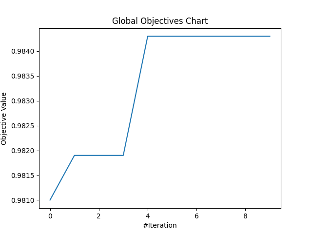

# [Day 26]打鐵趁熱！來試著MealPy的更多應用，最佳化MLP與CNN網路

- Day: 26
- Date: 2024-10-02 00:07:11
- Author: golucky_sir
- Source: https://ithelp.ithome.com.tw/articles/10361957
- Series: https://ithelp.ithome.com.tw/2020-12th-ironman/articles/7610
- Series Title: 調整AI超參數好煩躁？來試試看最佳化演算法吧！

## 前言

昨天介紹了使用MealPy進行機器學習模型超參數的最佳化，今天再來看看深度學習的部分吧。  
一樣我們來針對多層感知器(MLP)與卷積神經網路(CNN)進行最佳化。

> 今天的內容與[第19天](https://ithelp.ithome.com.tw/articles/10357912)介紹的差不多，但是一樣是改成使用MealPy以及使用[第22天](https://ithelp.ithome.com.tw/articles/10359653)介紹的新流程來有效率的開發程式。

## 問題假設

今天的問題假設我們一樣使用**MLP和CNN**來進行**MNIST的手寫數字辨識**，並且設定目標是**測試資料準確率超過97%**，關於Keras模型建立與訓練的部分就不贅述了，各位可以從網路上找到非常多相關教學。

## 最佳化MLP

首先我們還是以MLP來當作第一個例子，使用MLP進行MNIST手寫數字的辨識目前網路上與Youtube都有非常多相關教學，各大深度學習套件官方網站也有相關資源，各位若還不熟悉深度學習模型的部分可以先去參考看看。若沒問題的話，接下來我會帶各位一步一步最佳化MLP模型。

### MLP程式碼

老樣子，MLP程式主要分為資料前處理，模型建立，訓練模型，最後回傳測試資料集的準確率。為了使程式看起來比較完整，我會使用[第19天底下附錄](https://ithelp.ithome.com.tw/articles/10357912)的程式碼進行修改，此程式會順便把CNN的部份給搞定，所以待會CNN的部分就會精簡許多。

> 以下程式碼單純只是提供給各位MLP訓練的範例，此程式的修該方式有在第19天介紹了，不過基本上就只是將定義的方法等再稍微整理一下而已！

    from tensorflow.keras.datasets.mnist import load_data
    from tensorflow.keras.models import Sequential
    from tensorflow.keras.layers import Input, Conv2D, MaxPooling2D, Flatten, Dropout, Dense
    from tensorflow.keras.utils import to_categorical
    import numpy as np

    def get_MLP_model(layer_num:int = 2,
                      first_layer_unit:int = 128):
        """
        中間隱藏層數量建議設定在2~4層
        第一層神經元數量為first_layer_unit / 2^0=128
        第二層神經元數量為first_layer_unit / 2^1=64
        以此類推，到第四層只剩16個神經元。
        Args:
            layer_num: 模型的中間隱藏層數
            first_layer_unit: 第一層的神經元數量

        Returns: keras的模型。
        """
        model = Sequential()
        model.add(Input(shape=(28, 28, 1)))
        model.add(Flatten())
        for i in range(layer_num):
            model.add(Dense(int(first_layer_unit / 2**i), activation="relu"))
        model.add(Dense(10, activation="softmax"))
        # model.summary()
        model.compile(loss="categorical_crossentropy", optimizer="adam", metrics=["accuracy"])
        return model

    def training_and_evaluating_model(model, X_train, y_train, X_test, y_test,
                       batch_size:int = 128,
                       epochs:int = 10):
        """
        訓練模型並將測試資料集的準確率作為輸出。
        Args:
            batch_size: 每次訓練一批的資料量
            epochs: 訓練次數

        Returns: 測試資料集的準確率，作為適應值回傳。
        """
        model.fit(X_train, y_train, batch_size=batch_size, epochs=epochs, validation_split=0.1)
        score = model.evaluate(X_test, y_test, verbose=0)
        return score[1]

    if __name__ == '__main__':
        (X_train, y_train), (X_test, y_test) = load_data()
        # shape = (60000, 28, 28) 標準化圖片像素到0~1之間
        X_train = X_train.astype("float32") / 255
        X_test = X_test.astype("float32") / 255
        # shape = (60000, 28, 28, 1) 加入通道維度
        X_train = np.expand_dims(X_train, -1)
        X_test = np.expand_dims(X_test, -1)
        # 將類別進行one-hot轉換
        y_train = to_categorical(y_train, 10)
        y_test = to_categorical(y_test, 10)

        # 取得模型
        model = get_MLP_model(layer_num=3, first_layer_unit=64)
        # 訓練模型
        acc = training_and_evaluating_model(model, X_train, y_train, X_test, y_test, batch_size=64, epochs=5)
        print(acc) # 0.9684000015258789

### 構思問題

我們的目標是希望能夠再將準確率提高一些(高於97%)，接著來稍微規劃一下接下來程式的大方向吧，這個表格基本上也跟我之前介紹Optuna實作的表格幾乎相同，若各位對Optuna也有興趣的話歡迎去看看我在這系列的[第19天](https://ithelp.ithome.com.tw/articles/10357912)的文章喔。

| 5W1H  | 規劃內容                                                                                                                                                                              |
|-------|---------------------------------------------------------------------------------------------------------------------------------------------------------------------------------------|
| Why   | 最佳化MLP模型，目標為準確率超過97%                                                                                                                                                    |
| What  | 最佳化問題是手寫數字辨識的分類任務，以準確率作為適應值                                                                                                                                |
| Who   | 預計對MLP中的**隱藏層數量**、第一層隱藏層的**神經元數量**、**訓練批次量**、**訓練次數**進行最佳化                                                                                     |
| Where | 隱藏層數量為2~4層、第一層神經元數量從\[64, 128, 256, 512\]中選擇，批次量從\[32, 64, 128\]中選擇，訓練次數為5~50次(次數為5的倍數)                                                      |
| When  | 計算完測試資料準確率後進行最佳化                                                                                                                                                      |
| How   | 使用MealPy的[黏菌最佳化演算法(Slime Mould Algorithm, SMA)](https://mealpy.readthedocs.io/en/latest/pages/models/mealpy.bio_based.html?highlight=SMA#mealpy.bio_based.SMA.OriginalSMA) |

### 實現MealPy最佳化

接下來來照著[第22天提到的新SOP](https://ithelp.ithome.com.tw/articles/10359653)來建立最佳化試驗吧，有不理解的內容歡迎回去複習一下那天提到的東西喔。程式範例是使用上次[第19天](https://ithelp.ithome.com.tw/articles/10357912)結尾的附錄程式碼，在今天我會帶各位稍微修改一下。

1.  **定義目標函數**：首先要來創建這次的應用，我想將MLP跟CNN的最佳化都統整到一個類別中，使用者可以在設定問題時設定要使用MLP或者使用CNN，所以初始化方法中會設定`used_model`提供使用者選擇要最佳化的模型。  
    首先先幫這個問題類別取名吧，記得類別要繼承自`Problem`喔：

        from mealpy import Problem
        class Optimize_DLModel(Problem):

    - **初始化方法**：這裡可以看到我們使用`self.used_model`來設定要最佳化的模型。  
      然後由於MealPy的一些缺陷，之後最佳化時演算法產生的解會是一個 **整數(索引值)** ，所以在設定選擇模型第一層的神經元數量時我們需要定義一個`list`來存放所有可能的值，之後再直接用索引值去取出特定的值。  
      此外我也將初始化資料的方式額外定義成一個方法`init_data(self)`可供調用，這樣程式碼分割較清楚會比較容易閱讀。

          def __init__(self, minmax, bounds=None, used_model=None, name="", **kwargs):  # 可以根據需求自定義其他參數
              self.name = name
              # 設定其他參數，或者進行其他初始化
              self.used_model = used_model  # 設定要最佳化的模型
              self.MLP_first_layer_unit_lst = [64, 128, 256, 512]  # MLP的第一隱藏層層數搜索空間串列
              self.CNN_first_layer_unit_lst = [16, 32, 64, 128, 256]  # CNN的第一隱藏層層數搜索空間串列
              self.batch_size_lst = [32, 64, 128]  # 訓練批次搜索空間串列

              self.init_data()  # 初始化訓練資料
              super().__init__(bounds, minmax, **kwargs)

          def init_data(self):
              (X_train, y_train), (X_test, y_test) = load_data()
              # 標準化圖片像素到0~1之間，此時shape = (60000, 28, 28)
              X_train = X_train.astype("float32") / 255
              X_test = X_test.astype("float32") / 255
              # 加入通道維度，此時shape = (60000, 28, 28, 1)
              self.X_train = np.expand_dims(X_train, -1)
              self.X_test = np.expand_dims(X_test, -1)
              # 將類別進行one-hot轉換
              self.y_train = to_categorical(y_train, 10)
              self.y_test = to_categorical(y_test, 10)

    - **定義目標函數中的計算**：目標函數中會根據使用的模型名稱來決定要訓練哪個模型，基本上就是定義訓練方法，並在`obj_func(x)`(這方法是繼承自`Problem`類別的，必須定義且名稱不可更改)方法中根據情況選擇呼叫特定方法即可，為了多一層保障順便寫一段程式拋出參數錯誤的例外。  
      也要定義MLP模型的訓練部分`self.objective_MLP(x)`。

          def obj_func(self, x):
              if self.used_model == 'mlp':
                  return self.objective_MLP(x)
              elif self.used_model == 'cnn':
                  return self.objective_CNN(x)
              else:
                  raise ValueError('初始化參數used model必須為"mlp"或者"cnn"!')
          def objective_MLP(self, x):
              """
              MLP 網路訓練的最佳化。
              """
              # MealPy因為就算設定搜索空間為IntegerVar輸入還會是浮點數資料，所以需要指定成整數資料。
              # 為了使程式碼較簡單明瞭，這邊會將帶入解進行初步處理，使各位知道解中每個位置對應的意思!
              x = x.astype(int)
              layer_num = x[0]
              epochs = x[1] * 5
              first_layer_unit = self.MLP_first_layer_unit_lst[x[2]]
              batch_size = self.batch_size_lst[x[3]]

              # 取得模型，這邊會把生成的解代入方法中並進行該次試驗的計算。
              model = self.get_MLP_model(layer_num=layer_num, first_layer_unit=first_layer_unit)
              # 訓練模型，並回傳適應值。
              acc = self.training_and_evaluating_model(model, batch_size=batch_size, epochs=epochs)
              # print(acc)

              return acc

    - **完善其他功能**：這邊需要定義MLP模型的建立，一些相關的超參數設定要注意一下，之後演算法生成的解(超參數設定)會傳入這些方法中以定義該次試驗的模型，所以別忘了建立囉。

          def get_MLP_model(self,
                            layer_num: int = 2,
                            first_layer_unit: int = 128):
              """
              中間隱藏層數量建議設定在2~4層
              第一層神經元數量為first_layer_unit / 2^0=128
              第二層神經元數量為first_layer_unit / 2^1=64
              以此類推，到第四層只剩16個神經元。
              Args:
                  layer_num: 模型的中間隱藏層數
                  first_layer_unit: 第一層的神經元數量

              Returns: keras的模型。
              """
              model = Sequential()
              model.add(Input(shape=(28, 28, 1)))
              model.add(Flatten())
              for i in range(layer_num):
                  model.add(Dense(int(first_layer_unit / 2 ** i), activation="relu"))
              model.add(Dense(10, activation="softmax"))
              # model.summary()
              model.compile(loss="categorical_crossentropy", optimizer="adam", metrics=["accuracy"])
              return model

    - **定義回傳適應值**：這邊一樣使用測試資料計算準確率並回傳適應值，MLP與CNN使用同一個方法。

          def training_and_evaluating_model(self, model,
                                            batch_size: int = 128,
                                            epochs: int = 10):
              """
              訓練模型並將測試資料集的準確率作為輸出。
              Args:
                  batch_size: 每次訓練一批的資料量
                  epochs: 訓練次數

              Returns: 測試資料集的準確率，作為適應值回傳。
              """
              model.fit(self.X_train, self.y_train, batch_size=batch_size, epochs=epochs, validation_split=0.1)
              score = model.evaluate(self.X_test, self.y_test, verbose=0)
              return score[1]

2.  **定義試驗**：接著就來定義試驗吧，以下有一些注意事項也要留意一下。

    - **選擇一個最佳化演算法**：今天我們使用[黏菌最佳化演算法(Slime Mould Algorithm, SMA)](https://doi.org/10.1016/j.future.2020.03.055)來尋找最佳解喔，首先設定一下最佳化的演算法。

          # 求解問題，考慮到程式執行時間就先用10個epoch、5個pop_size就好了。
          optimizer = SMA.OriginalSMA(epoch=10, pop_size=5, pr=0.03)

    - **設定要帶入目標函數的變數**：接著來定義問題的搜索空間以及最佳化目標，基本上設定沒什麼變動，可以參考上面提到的表格，最佳化目標是尋找準確率的**最大值**。

      這邊使用`MixedSetVar`來定義指定集合的搜索空間，例如第一層的神經元數量與訓練批次。為了使程式比較明瞭所以我把所有超參數都**分開定義**，並指定了名稱`name`，這樣就可以一目瞭然這些參數的定義域以及意義。

          problem = Optimize_DLModel(bounds=[IntegerVar(lb=2, ub=4, name="layer_num"),
                                     # epochs搜索空間使用1~10並在程式內再乘以5等同於5~50，且公差為5的數列選擇。
                                            IntegerVar(lb=1, ub=10, name="epochs"),
                                            MixedSetVar(valid_sets=(64, 128, 256, 512), name="first_layer_unit"),
                                            MixedSetVar(valid_sets=(32, 64, 128), name="batch_size")],
                                    used_model='mlp',
                                    name="MLP_optimizer", minmax="max")

    - **根據其他需求進行設定**：今天也沒有設定其他東西，若有需要可以再自己新增。

3.  **執行試驗進行最佳化**：接著就來進行最佳化吧。

        optimizer.solve(problem=problem)

4.  **後續處理與分析**：這裡也是加上了輸出歷史最佳解以及歷史最佳適應值，以及繪製收斂曲線。

    - **print最佳解**：

          print(f"Best solution: {optimizer.g_best.solution}")
          print(f"Best fitness: {optimizer.g_best.target.fitness}")

    - **產生視覺化圖表**：

          optimizer.history.save_global_objectives_chart(filename="result/global objectives chart")

5.  **分析最佳化結果**：這次只跑10次迭代且每次只跑了5個粒子(`pop_size`)，因迭代數少所以可能不會是最佳解，不過結果也還不錯，根據這些內容當中找到的最佳解為：1層隱藏神經層；訓練50個epochs；第一層隱藏層的神經元數量為256；訓練批次量為64。  
    這個設定訓練的測試資料的準確率有達到98.43%，有成功達成任務，好耶~  
    以下是收斂的曲線圖，可以看到就有慢慢提升XD正常發揮：  
    

    > 有時候可以用**K-Fold Cross-Validation**來更平均的統整模型的訓練情形，得到的結果會比較有統計上的意義。  
    > 因為只訓練一次的話隨機性較高，訓練多次再將結果取平均有時會是比較嚴謹的好作法，但缺點一樣是時間問題。

## 最佳化CNN

基本上最佳化CNN與MLP的流程完全相同，只有一點點部分要更改而已，完整流程都在上面提及到了，我會在底下附錄附上完整的程式碼，裡面也有CNN的部分。

各位可以根據上面的流程說明，以及底下的完整程式中CNN的部分來了解使用MealPy最佳化CNN喔，另外完整程式都附有註解說明，倘若還是不理解的話也可以在底下留言處詢問我。

## 結語

今天介紹了MealPy如何最佳化MLP的詳細說明，以及應用到CNN的範例程式。基本上無論是怎樣的類神經網路流程都大同小異，只要將**最佳化模型類型**以及**超參數搜索空間**等規劃好了之後再將之寫為程式就好了。  
明後天一樣會來討論如何使用MealPy來最佳化生成對抗網路(Generative Adversarial Network, GAN)不過要考慮到群體粒子以及迭代數的話那勢必程式會執行非常久XD不管怎樣明天的事明天再說吧！

## 附錄：完整程式

    from tensorflow.keras.datasets.mnist import load_data
    from tensorflow.keras.models import Sequential
    from tensorflow.keras.layers import Input, Conv2D, MaxPooling2D, Flatten, Dropout, Dense
    from tensorflow.keras.utils import to_categorical
    import numpy as np
    from mealpy import FloatVar, Problem, SMA, StringVar, IntegerVar, MixedSetVar
    import matplotlib.pyplot as plt

    class Optimize_DLModel(Problem):
        def __init__(self, minmax, bounds=None, used_model=None, name="", **kwargs):  # 可以根據需求自定義其他參數
            self.name = name
            # 設定其他參數，或者進行其他初始化
            self.used_model = used_model  # 設定要最佳化的模型
            self.MLP_first_layer_unit_lst = [64, 128, 256, 512]  # MLP的第一隱藏層層數搜索空間串列
            self.CNN_first_layer_unit_lst = [16, 32, 64, 128, 256]  # CNN的第一隱藏層層數搜索空間串列
            self.batch_size_lst = [32, 64, 128]  # 訓練批次搜索空間串列

            self.init_data()  # 初始化訓練資料
            super().__init__(bounds, minmax, **kwargs)

        def init_data(self):
            (X_train, y_train), (X_test, y_test) = load_data()
            # 標準化圖片像素到0~1之間，此時shape = (60000, 28, 28)
            X_train = X_train.astype("float32") / 255
            X_test = X_test.astype("float32") / 255
            # 加入通道維度，此時shape = (60000, 28, 28, 1)
            self.X_train = np.expand_dims(X_train, -1)
            self.X_test = np.expand_dims(X_test, -1)
            # 將類別進行one-hot轉換
            self.y_train = to_categorical(y_train, 10)
            self.y_test = to_categorical(y_test, 10)

        def get_CNN_model(self,
                          k: int = 3,
                          layer_num: int = 2,
                          first_layer_unit: int = 32):
            """
            中間隱藏層數量建議設定在1~3層。
            每次迴圈會使用MaxPooling2D
            第一層MaxPooling2D會讓圖片長寬變(14, 14)
            第二層MaxPooling2D會讓圖片長寬變(7, 7)
            第三層MaxPooling2D會讓圖片長寬變(3, 3)
            Args:
                k: 卷積層中的卷積核大小
                layer_num: 中間隱藏層數量，每層中包括一個卷積跟一層最大池化
                first_layer_unit: 第一層網路的神經元數量

            Returns: CNN 模型
            """
            model = Sequential()
            model.add(Input(shape=(28, 28, 1)))
            for i in range(1, layer_num + 1):
                model.add(Conv2D(first_layer_unit * i, kernel_size=(k, k), activation="relu", padding='same'))
                model.add(MaxPooling2D(pool_size=(2, 2)))
            model.add(Flatten())
            model.add(Dropout(0.5))
            model.add(Dense(10, activation="softmax"))
            # model.summary()
            model.compile(loss="categorical_crossentropy", optimizer="adam", metrics=["accuracy"])
            return model

        def get_MLP_model(self,
                          layer_num: int = 2,
                          first_layer_unit: int = 128):
            """
            中間隱藏層數量建議設定在2~4層
            第一層神經元數量為first_layer_unit / 2^0=128
            第二層神經元數量為first_layer_unit / 2^1=64
            以此類推，到第四層只剩16個神經元。
            Args:
                layer_num: 模型的中間隱藏層數
                first_layer_unit: 第一層的神經元數量

            Returns: keras的模型。
            """
            model = Sequential()
            model.add(Input(shape=(28, 28, 1)))
            model.add(Flatten())
            for i in range(layer_num):
                model.add(Dense(int(first_layer_unit / 2 ** i), activation="relu"))
            model.add(Dense(10, activation="softmax"))
            # model.summary()
            model.compile(loss="categorical_crossentropy", optimizer="adam", metrics=["accuracy"])
            return model

        def training_and_evaluating_model(self, model,
                                          batch_size: int = 128,
                                          epochs: int = 10):
            """
            訓練模型並將測試資料集的準確率作為輸出。
            Args:
                batch_size: 每次訓練一批的資料量
                epochs: 訓練次數

            Returns: 測試資料集的準確率，作為適應值回傳。
            """
            model.fit(self.X_train, self.y_train, batch_size=batch_size, epochs=epochs, validation_split=0.1)
            score = model.evaluate(self.X_test, self.y_test, verbose=0)
            return score[1]

        def obj_func(self, x):
            if self.used_model == 'mlp':
                return self.objective_MLP(x)
            elif self.used_model == 'cnn':
                return self.objective_CNN(x)
            else:
                raise ValueError('初始化參數used model必須為"mlp"或者"cnn"!')
        def objective_MLP(self, x):
            """
            MLP 網路訓練的最佳化。
            """
            # MealPy因為就算設定搜索空間為IntegerVar輸入還會是浮點數資料，所以需要指定成整數資料。
            # 為了使程式碼較簡單明瞭，這邊會將帶入解進行初步處理，使各位知道解中每個位置對應的意思!
            x = x.astype(int)
            layer_num = x[0]
            epochs = x[1] * 5
            first_layer_unit = self.MLP_first_layer_unit_lst[x[2]]
            batch_size = self.batch_size_lst[x[3]]

            # 取得模型，這邊會把生成的解代入方法中並進行該次試驗的計算。
            model = self.get_MLP_model(layer_num=layer_num, first_layer_unit=first_layer_unit)
            # 訓練模型，並回傳適應值。
            acc = self.training_and_evaluating_model(model, batch_size=batch_size, epochs=epochs)
            # print(acc)

            return acc

        def objective_CNN(self, x):
            """
            CNN 網路訓練的最佳化。

            """
            # MealPy因為就算設定搜索空間為IntegerVar輸入還會是浮點數資料，所以需要指定成整數資料。
            # 為了使程式碼較簡單明瞭，這邊會將帶入解進行初步處理，使各位知道解中每個位置對應的意思!
            x = x.astype(int)
            k = x[0]
            layer_num = x[1]
            epochs = x[2] * 5
            first_layer_unit = self.CNN_first_layer_unit_lst[x[3]]

            # 取得模型，這邊會把生成的解代入方法中並進行該次試驗的計算。
            model = self.get_CNN_model(k=k, layer_num=layer_num, first_layer_unit=first_layer_unit)
            # 訓練模型，並回傳適應值。
            acc = self.training_and_evaluating_model(model, batch_size=128, epochs=epochs)
            # print(acc)

            return acc

    if __name__ == '__main__':
        # 新增最佳化試驗
        # 設定問題，問題中的設定會作為初始化參數傳遞進去。
        # 建立最佳化MLP問題
        problem = Optimize_DLModel(bounds=[IntegerVar(lb=2, ub=4, name="layer_num"),
                                           # epochs搜索空間使用1~10並在程式內再乘以5等同於5~50，且公差為5的數列選擇。
                                           IntegerVar(lb=1, ub=10, name="epochs"),
                                           MixedSetVar(valid_sets=(64, 128, 256, 512), name="first_layer_unit"),
                                           MixedSetVar(valid_sets=(32, 64, 128), name="batch_size")],
                                   used_model='mlp',
                                   name="MLP_optimizer", minmax="max")
        
        # 建立最佳化CNN問題
        # problem = Optimize_DLModel(bounds=[IntegerVar(lb=2, ub=5, name="kernel size"),
        #                                    IntegerVar(lb=1, ub=3, name="kernel layer_num"),
        #                                    # epochs搜索空間使用1~10並在程式內再乘以5等同於5~50，且公差為5的數列選擇。
        #                                    IntegerVar(lb=1, ub=10, name="epochs"),
        #                                    MixedSetVar(valid_sets=(16, 32, 64, 128, 256), name="first_layer_unit")],
        #                            used_model='cnn',
        #                            name="CNN_optimizer", minmax="max")

        # 求解問題，考慮到程式執行時間就先用10個epoch就好了。
        optimizer = SMA.OriginalSMA(epoch=10, pop_size=5, pr=0.03)
        optimizer.solve(problem=problem)
        # 輸出歷史最佳解以及歷史最佳適應值
        print(f"Best solution: {optimizer.g_best.solution}")
        print(f"Best fitness: {optimizer.g_best.target.fitness}")
        # 繪製收斂曲線
        optimizer.history.save_global_objectives_chart(filename="result/global objectives chart")
