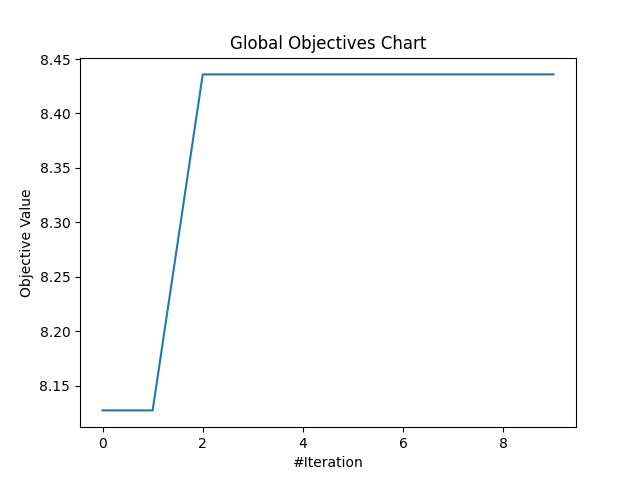

# [Day 28]MealPy的更多應用，最佳化生成對抗網路(GAN)(2/2)

- Day: 28
- Date: 2024-10-04 00:02:07
- Author: golucky_sir
- Source: https://ithelp.ithome.com.tw/articles/10363068
- Series: https://ithelp.ithome.com.tw/2020-12th-ironman/articles/7610
- Series Title: 調整AI超參數好煩躁？來試試看最佳化演算法吧！

## 前言

昨天帶各位使用MaelPy來針對DCGAN進行超參數的最佳化並執行了程式，今天就來看看結果吧！

## DCGAN最佳化結果

昨天的程式執行結果如下表所示：

| 超參數名稱                     | 最佳超參數值      |
|--------------------------------|-------------------|
| 生成器學習率                   | 2.95685686e-04    |
| 判別器學習率                   | 3.80815357e-04    |
| 生成器第一層卷積層的神經元數量 | 32                |
| 判別器第一層卷積層的神經元數量 | 64                |
| 生成器卷積核大小               | 3                 |
| 判別器卷積核大小               | 4                 |
| 判別器LaekyReLU斜率            | 0.25              |
| **最佳適應值**                 | 8.435876443982124 |

另外以下是最佳化的收斂曲線：  

結果看起來和之前一樣還是差不多，其實並不優秀，不過大概有幾個原因，這部分就跟[第21天文章](https://ithelp.ithome.com.tw/articles/10359181)介紹的相同，因為雖然更換了使用的模組與演算法，不過訓練結果的問題通常不會差太多，但使用啟發式演算法也有可能會有演算法參數設定的問題：

- **啟發式演算法參數設定問題**：啟發式演算法通常也會需要進行初始化，並設定相關的超參數，不過為了再調整最佳化演算法的超參數再套最佳化的話就會變得像無限的俄羅斯娃娃一樣了，我覺得並非好主意。  
  另外有些研究會去尋找最佳的啟發式演算法超參數，但通常都是在 **問題簡單，可以快速求解** 的時候才比較有機會可以使用，像類神經網路的最佳化這種執行時間動不動就要一段時間的應用，其實再針對最佳化演算法的超參數再最佳化已經沒什麼意義了。
- **迭代次數不夠多**：因為節省時間所以試驗迭代次數只設定10次而已，以及群數量只有5而已，原則上試驗次數再設定更多次或許會比較好。
- **訓練次數不足**：本例在迭代時每次訓練只設定訓練5000次，原則上設定次數大概要15000次以上效果才會比較好，但是如果真的照這樣訓練的話，光程式連續執行就好幾天就過去了，電費哭哭。  
  之前找了一天用實驗室的電腦測試使用Optuna每次迭代時DCGAN訓練20000次，大概跑了170小時，在寫這段文字的前幾小時，Optuna才執行完程式。  
  所以為了節省時間本例暫時捨棄了追求最佳效果，若有需要的話可以設定完整一點再執行程式，通常跑個幾天都是正常的，所以在 **事前規劃才需要做的完善** ，以免浪費了幾天的寶貴時間。
- **指標使用的不好**：因為MNIST手寫資料集長寬只有28且是灰階的，所以輸入到FID等指標中使用的神經網路會導致出錯誤，所以才使用PSNR與SSIM。  
  但DCGAN生成結果是隨機的，所以就算生成圖片長得很像真實數字，與資料集中的結果相比還是容易產生較低的分數。例如生成可以辨識的「0」與資料集中的「7」相比還是會有比較低的PSNR值。
- **GAN訓練不穩定**：雖然只訓練8000次，但姑且還是有跑出最佳解，各位可以使用看看上述最佳解代入並進行完整的訓練看看程式執行的效果如何。  
  **不過因為GAN的訓練不穩定，所以就算先以較少次數執行完最佳化並找出最佳訓練參數後，再帶入最佳解也可能因為後期訓練梯度消失或者梯度爆炸導致訓練失敗，所以在這部分需要注意一下！**

> 在實務應用上，需要注意若不確定最佳化程式是否有問題可以先使用較低迭代次數，與較低訓練次數，先以時間消耗少的方式完整跑過程式，沒問題之後再使用完整的設定來執行程式。

## 其他可以應用最佳化的模組

在[第9天](http://)我有介紹一些其他可以使用最佳化的模組，不過當時我漏掉了兩個，分別為以下的函式庫。這兩個都是機器學習與深度學習的大咖模組中提供的最佳化方式，在不了解其他演算法的情況下，只想趕快交差也可以使用看看這兩個函式庫來簡單的針對自己的模型進行最佳化。

- **scikit-learn**：sklearn提供了兩種方式來進行超參數的最佳化，分別為**GridSearchCV**與**RandomizedSearchCV**。前者是窮舉搜索，會考慮所有參數組合；後者為隨機從搜索空間中抽樣解並代入問題。  
  不過這兩種算法印象中並沒有最佳化的機制，單純只是窮舉跟隨積搜索而已。若各位對此有興趣可以來看看官方文檔對於[GridSearchCV](https://scikit-learn.org/stable/modules/generated/sklearn.model_selection.GridSearchCV.html#sklearn.model_selection.GridSearchCV)和[RandomizedSearchCV](https://scikit-learn.org/stable/modules/generated/sklearn.model_selection.RandomizedSearchCV.html#sklearn.model_selection.RandomizedSearchCV)。
- **Keras Tuner**：這是專用於Keras模型的超參數調整套件，這個套件也可以幫助各位自動找到最佳的參數組合，此套件有提供許多不同的最佳化方式，各位若有興趣也可以試試看，[官方教學在此](https://keras.io/keras_tuner/)。
- **MealPy Tuner**：這是MealPy中提供的一個簡單的超參數調整工具，不過他並不能調整深度學習模型的超參數，目前只能調整MealPy中包含的啟發式演算法的超參數而已，若要針對這些演算法的參數進行調整的話，可以考慮使用看看MealPy內建的調整套件，[官方教學在此](https://mealpy.readthedocs.io/en/latest/pages/general/tuner.html)。

目前也有許多人會使用[Pytorch](https://pytorch.org/)，不過我印象中Pytorch並沒有內建超參數最佳化的工具，若有需要使用的話可以參考我這系列前面的文章，使用**Optuna**或者**MealPy**來進行參數的最佳化。

## 結語

這次使用MealPy進行DCGAN的最佳化，啟發式演算法的差異就是除了迭代次數以外每次迭代都還需要完整跑完群體中所有成員的解，所以會造成程式執行的更久。不過通常這樣更廣泛的搜索最佳解時也會比較著重於尋找偏向全局最佳的地方，無論使用哪個模組，哪個演算法，基本上都還是有優缺點，所以就需要斟酌看看啦。

這次鐵人賽的程式介紹就到這邊為止，雖然還有許多可以提及的東西，不過30天一轉眼就即將結束了，最後兩天我會簡單的介紹最佳化演算法在AI模型的一些其他應用以及這次比賽的心得。接下來也要趕快去拯救我的課業了哈哈，希望未來還有時間跟機會可以整理我所學的程式技巧並向各位分享。
